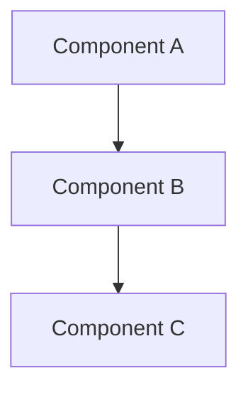
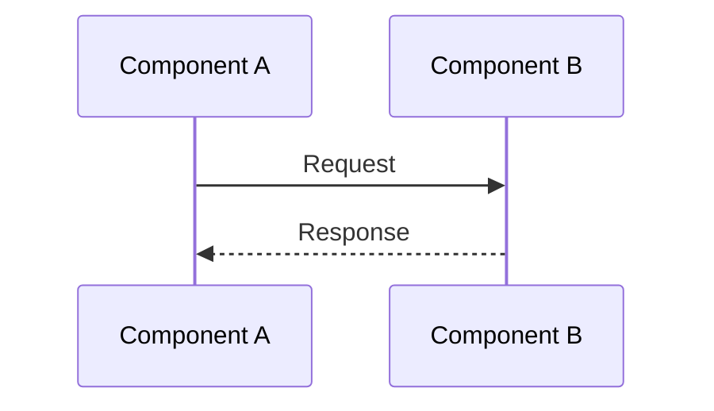

# doc-architecture - Architecture Documentation Skill

This skill is invoked by the Docs Agent Coordinator as a subagent. It produces and updates `.sdd/docs/architecture.md` with system overview, component diagrams, technology stack, design decisions, directory structure, and data flow descriptions. The skill reads the spec, WP, contract files, and the actual codebase to generate accurate architecture documentation.

## Input Contract (FR-005)

This skill receives the following 6 inputs via the coordinator's subagent prompt, as defined in `DOC-SKILL-CONTRACT.md`:

| # | Input | Type | Description |
|---|-------|------|-------------|
| 1 | `skill_path` | Path | Path to this SKILL.md file |
| 2 | `wp_path` | Path | Path to the approved WP file and its task list |
| 3 | `spec_path` | Path | Path to the spec file; includes contract files directory (`.sdd/plans/contracts/<WP-slug>/`) |
| 4 | `source_files` | List(Path) | Implementation source files modified by the WP |
| 5 | `docs_dir` | Path | Path to existing documentation directory (`.sdd/docs/`) for incremental updates |
| 6 | `patterns` | Text | Active doc-domain patterns to avoid (from `.sdd/reviews/doc-patterns.md`) |

## Output Contract

| Field | Value |
|-------|-------|
| **Target file** | `.sdd/docs/architecture.md` |
| **Action** | Create if missing; update incrementally if existing |
| **Content** | System overview, component diagram, technology stack, design decisions, directory structure, data flow |

## Execution Sequence (FR-006)

1. **Read SKILL.md** -- Load this file for documentation generation instructions
2. **Read existing docs** -- Read `.sdd/docs/architecture.md` if it exists to understand current content
3. **Read source material** -- Read the WP file, spec, contract files, and implementation source files for content
4. **Write documentation** -- Update or create `.sdd/docs/architecture.md` incrementally (do NOT recreate from scratch)

## Constraints

- Do NOT modify spec files, plan files, contract files, or implementation source files
- Do NOT recreate architecture.md from scratch on incremental updates -- preserve existing content
- Use plain ASCII only -- no em dashes, smart quotes, or curly apostrophes
- Follow the canonical section order defined below
- Directory structure MUST be derived from the actual codebase, NOT copied from the spec

---

## Section 1 -- System Overview (FR-010.1)

Generate the system overview section from the spec's architecture/overview section (typically Section 9.1 or Section 1).

### Instructions

1. Read the spec file at `spec_path`
2. Locate the system overview or architecture overview section
3. Write a concise system overview that describes:
   - What the system does (purpose and scope)
   - The high-level architecture pattern (e.g., skill-based coordinator, microservices, monolith)
   - Key architectural principles and design philosophy
4. Keep the overview to 2-4 paragraphs -- this is a summary, not a deep dive

### Output Format

```markdown
# Architecture

## System Overview

<system overview content>
```

---

## Section 2 -- Component Diagram (FR-010.2)

Generate a component diagram showing the major components and their relationships.

### Instructions

1. Read the spec for component descriptions and relationships
2. Read the actual codebase structure using `list_dir` and `file_search` to identify components
3. Produce a Mermaid diagram showing:
   - Major components (agents, skills, coordinators, data stores)
   - Relationships between components (invokes, reads, writes, depends on)
   - Data flow direction
4. If Mermaid is not appropriate for the project, use a prose-based component description with clear hierarchy

### Output Format

```markdown
## Component Diagram



<prose description of the diagram and key relationships>
```

---

## Section 3 -- Technology Stack (FR-010.3)

Generate the technology stack summary from the spec (typically Section 9.2).

### Instructions

1. Read the spec for technology stack information
2. Read the actual codebase to verify technologies in use (check `package.json`, `requirements.txt`, `go.mod`, `Cargo.toml`, or similar)
3. List each technology with its purpose
4. Group by category: languages, frameworks, tools, infrastructure

### Output Format

```markdown
## Technology Stack

| Category | Technology | Purpose |
|----------|-----------|---------|
| Language | <name> | <purpose> |
| Framework | <name> | <purpose> |
| Tool | <name> | <purpose> |
```

---

## Section 4 -- Design Decisions (FR-010.4)

Document key design decisions from the spec (typically Section 9.4 or Section 9.2).

### Instructions

1. Read the spec for design decisions, including rationale and alternatives considered
2. For each decision, document:
   - The decision made
   - Why it was chosen (rationale)
   - What alternatives were considered
   - Consequences and trade-offs
3. Order decisions by importance (most impactful first)

### Output Format

```markdown
## Design Decisions

### Decision 1: <Title>

- **Decision**: <what was decided>
- **Rationale**: <why this option was chosen>
- **Alternatives considered**: <other options evaluated>
- **Consequences**: <trade-offs and implications>
```

---

## Section 5 -- Directory Structure (FR-010.5)

Generate the directory structure from the **actual codebase**, NOT from the spec.

### Instructions

1. Use `list_dir` on the project root to discover the top-level structure
2. Recurse into key directories to show the full layout (2-3 levels deep)
3. Add brief annotations explaining the purpose of each directory
4. Do NOT copy directory structures from the spec -- the actual codebase is the source of truth
5. Exclude common non-project directories (e.g., `node_modules/`, `.git/`, `__pycache__/`, `dist/`, `build/`)

### Output Format

```markdown
## Directory Structure

```
project-root/
  src/                    # Source code
    components/           # UI components
    utils/                # Shared utilities
  tests/                  # Test files
  docs/                   # Documentation
  .sdd/                   # SDD pipeline artifacts
    specs/                # Specification files
    plans/                # Work packages and contracts
    docs/                 # Generated documentation
```
```

---

## Section 6 -- Data Flow (FR-010.6)

Describe how data flows through the system.

### Instructions

1. Read the spec for data flow descriptions (user flows, API flows, event flows)
2. Read the actual implementation to identify data paths
3. Document the primary data flows:
   - What triggers each flow
   - What components are involved
   - What data is passed between components
   - Where data is stored or transformed
4. Use Mermaid sequence diagrams or flowcharts where appropriate

### Output Format

```markdown
## Data Flow

### <Flow Name>

<description of the flow>


```

---

## Incremental Update Protocol (FR-011)

When `architecture.md` already exists with content from prior work packages, the skill SHALL update incrementally:

### Rules

1. **Read before write** -- Always read the existing `architecture.md` content before making any changes
2. **Identify sections by heading** -- Use the canonical heading hierarchy (## System Overview, ## Component Diagram, ## Technology Stack, ## Design Decisions, ## Directory Structure, ## Data Flow) to locate sections
3. **Update only affected sections** -- Determine which sections are affected by the current WP's changes:
   - If the WP adds new components, update Component Diagram and Directory Structure
   - If the WP introduces new design decisions, update Design Decisions
   - If the WP adds new data flows, update Data Flow
   - If the WP changes technology stack, update Technology Stack
4. **Preserve unaffected sections** -- Sections not related to the current WP's changes SHALL remain unchanged
5. **Merge, do not replace** -- Within affected sections, add new content alongside existing content rather than replacing it. For example:
   - In Component Diagram: add new components to the existing diagram
   - In Design Decisions: append new decisions after existing ones
   - In Data Flow: add new flow subsections after existing ones
6. **Directory Structure is always refreshed** -- The Directory Structure section is always regenerated from the actual codebase since any WP may add or remove files. This is the only section that may be fully rewritten on each update.
7. **Add WP attribution** -- When adding new content to a section, note which WP introduced it:
   ```markdown
   ### Decision 3: <Title> (WP03)
   ```

### Incremental Update Sequence

1. Read existing `architecture.md` into memory
2. Parse into sections by `##` headings
3. For each canonical section:
   a. If the section does not exist, create it with content from the current WP
   b. If the section exists and is affected by the current WP, merge new content
   c. If the section exists and is NOT affected, leave it unchanged
4. Write the updated content back to `architecture.md`
5. Verify no content from prior WPs was lost by comparing section counts before and after

### Error Handling

- If `architecture.md` does not exist, create it from scratch with all 6 sections
- If `architecture.md` exists but has non-standard headings, preserve non-standard content in an "Additional Notes" section at the end
- If parsing fails, log a warning and regenerate the full file (last resort)

---

## Quality Checklist

Before completing, verify:

- [ ] System overview is present and concise (2-4 paragraphs)
- [ ] Component diagram uses Mermaid or clear prose format
- [ ] Technology stack lists actual technologies from the codebase
- [ ] Design decisions include rationale and alternatives
- [ ] Directory structure reflects the actual codebase (not the spec)
- [ ] Data flow descriptions cover primary flows with diagrams
- [ ] Incremental updates preserve prior WP content
- [ ] No em dashes, smart quotes, or curly apostrophes in output
