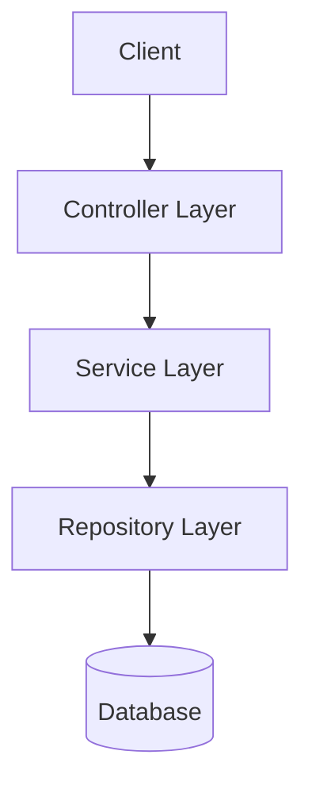
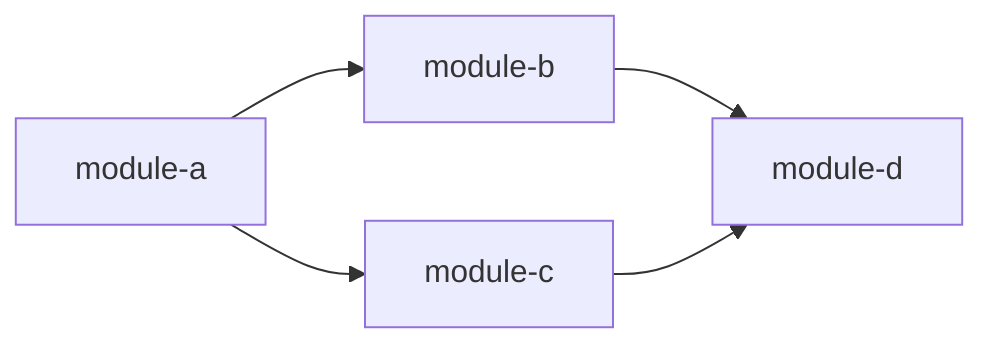

# retro-architecture -- Architecture Extraction Skill

This skill is invoked by the Retro-Spec Coordinator as the FIRST extraction skill (after discovery). It analyzes the legacy codebase to extract and document the system architecture, producing Section 9 (Architecture) of the specification and a dependency graph artifact.

## Input Contract

| # | Input | Description |
|---|-------|-------------|
| 1 | `skill_path` | Path to this SKILL.md file |
| 2 | `accumulator_path` | Path to the spec file being built |
| 3 | `artifacts_dir` | Path to companion artifacts directory |
| 4 | `discovery_manifest_path` | Path to the discovery manifest |
| 5 | `source_path` | Path to the legacy source code |
| 6 | `target_language` | Target language for artifacts |
| 7 | `project_name` | Name of the project being analyzed |
| 8 | `module_filter` | Modules to analyze |

## Execution Sequence

1. **Read this SKILL.md**
2. **Read discovery manifest** to understand project topology
3. **Read accumulator** (will be mostly empty at this point since this is the first extraction skill)
4. **Analyze architecture** via static source analysis. Use `#tool:search/searchSubagent` for broad codebase structure exploration and `#tool:search/usages` to trace component dependencies.
5. **Write Section 9** to the accumulator
6. **Produce artifacts**: `dependency-graph.md` in the artifacts directory

## Constraints

- NEVER execute or build legacy code
- NEVER modify legacy source files
- Do NOT write sections other than Section 9
- Use `[INFERRED: confidence]` for every architectural claim
- Cite source files as evidence for each component identification

---

## Extraction Procedure

### Step 1: Component Identification

Scan the project structure to identify architectural components:

1. **Read entry points** from the discovery manifest
2. **Trace imports/dependencies** from entry points outward:
   - Follow `import`/`require`/`use`/`include` statements
   - Map which modules depend on which
   - Identify the dependency direction (does module A import B, or B import A?)
3. **Identify component roles** based on naming and import patterns:
   - **Controllers/Handlers**: Modules that handle external requests
   - **Services/Use Cases**: Modules containing business logic
   - **Repositories/DAOs**: Modules that access data stores
   - **Models/Entities**: Data structure definitions
   - **Middleware**: Request/response interceptors
   - **Utilities/Helpers**: Shared utility functions
   - **Configuration**: App configuration and bootstrapping
4. **Detect architectural patterns**:
   - Layered architecture: controllers -> services -> repositories
   - Clean/Hexagonal: ports and adapters pattern
   - MVC: models + views + controllers
   - CQRS: separate read/write paths
   - Event-driven: event emitters and handlers
   - Microservices: inter-service communication (HTTP, gRPC, message queues)

### Step 2: Communication Pattern Analysis

For each identified component:

1. **Internal communication**: Function calls, method invocations, event emissions
2. **External communication**: HTTP clients, gRPC stubs, message queue publishers/consumers
3. **Data flow**: How data moves through the system (request -> controller -> service -> repo -> DB)
4. **Synchronous vs. asynchronous**: Identify async patterns (promises, callbacks, goroutines, tasks)

Search for:
```
grep: "fetch|axios|http|request|grpc|amqp|kafka|sqs|EventEmitter|emit\(|publish\(|subscribe\("
```

### Step 3: Deployment Topology

Analyze infrastructure configuration:

1. **Read Dockerfiles**: Extract base images, exposed ports, environment variables
2. **Read docker-compose.yml**: Map service dependencies, networks, volumes
3. **Read CI/CD configs**: Identify deployment targets and stages
4. **Read Kubernetes manifests** (if any): Extract services, deployments, ingress rules
5. **Read serverless configs** (serverless.yml, SAM template): Extract functions and triggers

### Step 4: Technology Stack Verification

Cross-reference discovery manifest with actual code usage:

1. **Read dependency manifests** (package.json, requirements.txt, etc.)
2. **Sample imports** in source files to verify which dependencies are actually used
3. **Identify frameworks** from middleware registration, decorator usage, base class inheritance
4. **Note version constraints** from lock files (package-lock.json, poetry.lock, go.sum)

---

## Section 9 Output Format

Write Section 9 to the accumulator following the SDD spec format:

```markdown
## 9. Architecture

### 9.1 System Design

<Paragraph describing the overall architecture pattern and rationale>
[INFERRED: confidence] Source: <evidence files>

**Components**:
| Component | Responsibility | Technology | Source Evidence |
|-----------|---------------|------------|-----------------|
| <name> | <role> | <tech> | <file:line range> |

**Component Interaction Diagram** (Mermaid):


### 9.2 Technology Stack

| Layer | Technology | Version | Rationale | Source |
|-------|-----------|---------|-----------|--------|
| Language | <lang> | <ver> | <inferred or stated> | <manifest file> |
| Framework | <fw> | <ver> | <evidence of usage> | <import evidence> |
| ...

[INFERRED: HIGH] -- Versions from lock files are factual; rationale is inferred.

### 9.3 Directory Structure

```
<actual directory tree of the project, annotated with component roles>
src/
  controllers/     # HTTP request handlers (Controller layer)
  services/        # Business logic (Service layer)
  models/          # Data entities (Model layer)
  repositories/    # Data access (Repository layer)
  middleware/      # Request interceptors
  utils/           # Shared utilities
  config/          # Configuration loaders
```

### 9.4 Deployment Topology

<Description of how the system is deployed>
[INFERRED: confidence] Source: <Dockerfile, docker-compose, CI config>

**Services**:
| Service | Image/Runtime | Ports | Dependencies |
|---------|--------------|-------|--------------|
| <name> | <base image> | <ports> | <linked services> |

### 9.5 Design Decisions

| # | Decision | Pattern | Evidence | Confidence |
|---|----------|---------|----------|------------|
| DD-01 | <what was decided> | <pattern name> | <code evidence> | [INFERRED: X] |
```

---

## Dependency Graph Artifact

Produce `dependency-graph.md` in the artifacts directory:

```markdown
# Dependency Graph -- <project-name>

> Generated by: retro-architecture skill (retro-spec)
> Source: <source_path>

## Module Dependencies



## Dependency Matrix

| Module | Depends On | Depended On By |
|--------|-----------|----------------|
| module-a | module-b, module-c | - |
| module-b | module-d | module-a |
| module-c | module-d | module-a |
| module-d | - | module-b, module-c |

## Circular Dependencies

<List any circular dependencies found, or "None detected">

## External Dependencies

| Module | External Dep | Type | Purpose |
|--------|-------------|------|---------|
| <module> | <package> | <npm/pip/etc.> | <what it is used for> |
```
