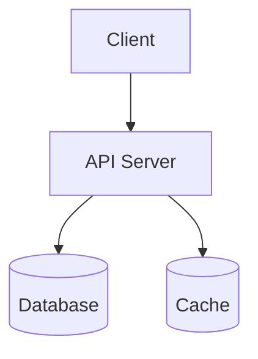

# spec-architecture - Architecture Skill

This skill is invoked by the Spec Architect Coordinator as a subagent. It produces Section 9 (Architecture) of the specification and the companion artifact `config-schema.<ext>`.

## Input Contract

This skill receives the following inputs via the coordinator's subagent prompt:

| # | Input | Description |
|---|-------|-------------|
| 1 | `skill_path` | Path to this SKILL.md file |
| 2 | `accumulator_path` | Path to the spec file being built |
| 3 | `artifacts_dir` | Path to the companion artifacts directory |
| 4 | `brief_path` | Path to the source ideation brief |
| 5 | `research_summary` | Key findings from the research phase |
| 6 | `section_numbers` | `9` |
| 7 | `patterns` | Active spec-domain patterns to avoid |
| 8 | `target_language` | Programming language for artifacts (TypeScript, Python, etc.) |

## Execution Sequence

1. **Read this SKILL.md** to load instructions and guidelines
2. **Read the accumulator** at `accumulator_path` to understand sections 1-8 (FRs, user stories, data model, API design)
3. **Read the brief** at `brief_path` for architecture preferences
4. **Write Section 9** to the accumulator by APPENDING after existing content
5. **Produce companion artifact** in `artifacts_dir`: `config-schema.<ext>`

## Constraints

- Do NOT modify sections 1 through 8 (earlier skills' sections)
- If you discover an inconsistency with a prior section, add: `[CROSS-REF ISSUE: <description>]`
- Use `[NEEDS CLARIFICATION: <reason>]` for any unresolved decisions
- Use plain ASCII only - no em dashes, smart quotes, or curly apostrophes
- Artifacts contain TYPE DEFINITIONS ONLY - no I/O, network, or filesystem operations

---

## Section 9 - Architecture (FR-043)

Write Section 9 with ALL five subsections. Derive architectural decisions from:
- Technology preferences in the brief
- Entity complexity from Section 7
- API surface from Section 8
- NFRs from Section 10 (performance, scalability)
- Research findings from the coordinator

### 9.1 System Design

Describe the high-level system architecture with components and their interactions.

```markdown
### 9.1 System Design

<One paragraph describing the overall architecture pattern (monolith, microservices, serverless, etc.) and why.>

**Components**:
| Component | Responsibility | Technology |
|-----------|---------------|------------|
| API Server | HTTP request handling, routing | Express/FastAPI/etc. |
| Database | Persistent storage | PostgreSQL/MongoDB/etc. |
| Cache | Session and query caching | Redis (if applicable) |

**Interaction Diagram** (Mermaid):

```

If a Mermaid diagram is not practical, use a prose description of component interactions.

### 9.2 Technology Stack

```markdown
### 9.2 Technology Stack

| Layer | Technology | Version | Rationale |
|-------|-----------|---------|-----------|
| Language | TypeScript | 5.x | Brief preference / team expertise |
| Runtime | Node.js | 20 LTS | Long-term support |
| Framework | Express | 4.x | Mature, widely supported |
| Database | PostgreSQL | 16 | Relational data model from Section 7 |
| ORM | Prisma | 5.x | Type-safe DB access |
| Testing | Vitest | 1.x | Fast, TypeScript-native |
```

**MANDATORY: Package isolation**:
- Python projects: MUST use venv, poetry, or conda. NEVER pip install without virtual environment.
- Node.js projects: MUST use local node_modules via npm/yarn/pnpm. NEVER `npm install -g` for project dependencies.
- Other languages: equivalent isolation mechanism required.

Global package installation is PROHIBITED for project dependencies.

### 9.3 Directory & Module Structure

```markdown
### 9.3 Directory & Module Structure

<project-root>/
  src/
    config/          # Configuration loading and validation
    models/          # Data model definitions (from Section 7)
    routes/          # API endpoint handlers (from Section 8)
    services/        # Business logic
    middleware/      # Auth, validation, error handling
    utils/           # Shared utilities
  tests/
    unit/            # Unit tests
    integration/     # Integration tests
    e2e/             # End-to-end tests
  .sdd/             # Spec-driven development artifacts
  package.json      # Dependencies (or pyproject.toml, etc.)
```

Each directory gets a one-line description of its purpose.

### 9.4 Key Design Decisions

For each significant architectural decision:

```markdown
### 9.4 Key Design Decisions

**Decision 1: <title>**
- **Decision**: <what was decided>
- **Rationale**: <why this choice was made>
- **Alternatives considered**: <what else was evaluated and why it was rejected>
- **Consequences**: <tradeoffs accepted, both positive and negative>
- **Source**: <URL, spec section, or brief section that informed this>
```

Include at minimum:
- Architecture pattern choice (monolith vs microservices vs serverless)
- Database choice (relational vs document vs graph)
- Authentication approach (JWT vs sessions vs OAuth)
- Any technology mandated by the brief

### 9.5 External Integrations

For each external system the application interacts with:

```markdown
### 9.5 External Integrations

#### <External System Name>
- **Purpose**: <what the integration provides>
- **Auth method**: <API key, OAuth2, basic auth, etc.>
- **Key operations**: <list of operations used>
- **Timeout**: <request timeout in ms>
- **Retry strategy**: <retry count, backoff type>
- **Fallback**: <what happens when the external system is unavailable>
```

If no external integrations exist, write: "No external integrations required."

---

## Post-Write Validation (FR-045)

After completing Section 9, validate:

1. **Entity coverage**: Every entity from Section 7 has a plausible home in the directory structure (e.g., `models/user.ts` for User entity)
2. **Endpoint coverage**: Every API endpoint group from Section 8 maps to a route/handler directory
3. **Config coverage**: Every environment variable mentioned in Section 9 appears in the config-schema artifact
4. **NFR support**: The architecture supports NFRs from Section 10 (e.g., caching for performance, horizontal scaling for scalability)

If the directory structure cannot accommodate an entity or endpoint, adjust it before finalizing.

---

## Companion Artifact: config-schema.<ext> (FR-044, FR-028)

Produce `config-schema.<ext>` containing typed configuration/environment variable definitions.

Every config entry SHALL have: name, type, default value (or "required"), validation rules, and description.

**TypeScript example**:
```typescript
// Generated by: spec-architecture skill
// Source spec: .sdd/specs/<NNN>-<idea-name>.spec.md, Section 9
// Target language: TypeScript
// DO NOT EDIT MANUALLY -- regenerated on spec revision

export interface AppConfig {
  PORT: number;                                    // Default: 3000. Valid: 1-65535
  DATABASE_URL: string;                            // Required. Format: postgresql://...
  JWT_SECRET: string;                              // Required. Min 32 characters
  JWT_EXPIRY: string;                              // Default: "15m". Format: zeit/ms string
  LOG_LEVEL: "debug" | "info" | "warn" | "error"; // Default: "info"
  NODE_ENV: "development" | "staging" | "production"; // Default: "development"
  CORS_ORIGIN: string;                             // Default: "http://localhost:3000"
}
```

**Python example**:
```python
# Generated by: spec-architecture skill
# Source spec: .sdd/specs/<NNN>-<name>.spec.md, Section 9
# Target language: Python
# DO NOT EDIT MANUALLY -- regenerated on spec revision

from dataclasses import dataclass, field
from typing import Literal

@dataclass
class AppConfig:
    PORT: int = 3000                                          # Valid: 1-65535
    DATABASE_URL: str = ""                                    # Required. Format: postgresql://...
    JWT_SECRET: str = ""                                      # Required. Min 32 characters
    LOG_LEVEL: Literal["debug", "info", "warn", "error"] = "info"
    ENV: Literal["development", "staging", "production"] = "development"
```

### Manifest Comment

```
// Generated by: spec-architecture skill
// Source spec: .sdd/specs/<NNN>-<idea-name>.spec.md, Section 9
// Target language: <language>
// DO NOT EDIT MANUALLY -- regenerated on spec revision
```

Comment syntax: `//` for TypeScript/JavaScript, `#` for Python, `--` for SQL.

---

## Quality Checklist

1. [ ] All 5 subsections (9.1-9.5) are present
2. [ ] Tech stack table has Layer, Technology, Version, Rationale for every entry
3. [ ] Package isolation strategy is specified (no global installs)
4. [ ] Directory structure accommodates all entities and endpoints
5. [ ] Every design decision has rationale and alternatives considered
6. [ ] Every external integration has timeout, retry, and fallback strategy
7. [ ] `config-schema.<ext>` exists with all env vars from Section 9
8. [ ] Config entries have type, default, validation, description
9. [ ] Artifact has manifest comment
10. [ ] No I/O, network, or filesystem code in artifact
11. [ ] Active patterns from the coordinator prompt have been followed
