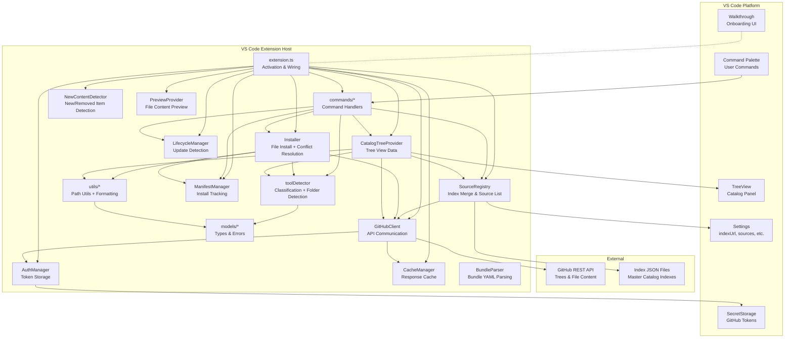

# Per-Folder Segregation & Interactive Onboarding -- Specification

> **Source brief**: `.sdd/ideas/003-folder-segregation-and-onboarding.md`
> **Feature branch**: `003-folder-segregation-and-onboarding`
> **Status**: Draft
> **Version**: 1.0

---

## 1. Overview

The Awesome Coding Assistants VS Code extension currently treats all content in a source repository as a flat structure under the repo root, and provides no guided onboarding for new users. This specification defines two complementary features: (1) per-folder segregation, which enables source repository maintainers to organize agents, prompts, rules, and other items into named subfolders that are auto-discovered and displayed as a grouping level in the catalog tree, with folder prefixes stripped on install; and (2) an interactive onboarding walkthrough that guides new users through configuring their index source URL and browsing the catalog, with support for multiple index URLs to accommodate enterprise deployments with private catalogs.

---

## 2. Goals & Success Criteria

- **SC-001**: Source repos with subfolders containing `.github/` or `.claude/` directories SHALL have their items grouped by folder in the catalog tree, with zero configuration required from the repo maintainer.
- **SC-002**: Items installed from a subfolder SHALL land in the same workspace location as items from the repo root (folder prefix stripped on install).
- **SC-003**: The onboarding walkthrough SHALL auto-open on first extension install and guide users through index URL configuration and catalog browsing in two steps.
- **SC-004**: The `indexUrl` setting SHALL accept an array of strings, with automatic migration from existing single-string values, and the Settings UI SHALL render it as an editable list.
- **SC-005**: Multiple index URLs SHALL be union-merged with deduplication by `url@branch` key, with first-seen metadata winning on conflict.
- **SC-006**: Enterprise administrators SHALL be able to pre-configure `indexUrl` via machine-level `settings.json` to direct users to private catalogs on first launch.
- **SC-007**: Existing repos without subfolders SHALL display identically to the current behavior (no regression).

---

## 3. Users & Roles

### Repository Maintainer
Maintains source repos containing coding assistant configurations. Organizes items into subfolders by team or concern (e.g., `frontend-team/`, `backend-team/`). Does not need to add any metadata -- folder discovery is automatic by structure.

### Enterprise Administrator
Deploys the extension across an organization. Pre-configures `indexUrl` in machine-level `settings.json` via Intune, GPO, or image-based provisioning. Cannot lock settings (users may override). Maintains a private index JSON and source repo.

### Extension User (Individual)
Installs the extension and uses it to browse, install, and manage coding assistant configurations. May configure one or more index URLs. Expects a guided first-run experience.

---

## 4. Functional Requirements

### 4.1 Folder Discovery

- **FR-001**: The system SHALL detect a first-level directory in a source repository as a "folder" when at least one `GitHubTreeEntry` exists with a path matching `<directory>/.github/<subpath>` or `<directory>/.claude/<subpath>`, where `<directory>` is a single path segment containing no slashes.
  - Precondition: The source repository's tree has been fetched via the GitHub Tree API.
  - Postcondition: Each qualifying first-level directory is identified as a discovered folder with its raw directory name preserved for downstream processing.
  - Error: If the GitHub Tree API response is unavailable or returns an error, the system SHALL treat the source as having zero folders and fall back to the flat hierarchy (FR-005).

- **FR-002**: The system SHALL limit folder detection to single-level depth only; nested directories within a discovered folder SHALL NOT be treated as additional folders (e.g., `team1/subproject/` SHALL NOT create a nested "subproject" folder inside "team1").
  - Precondition: The source repository tree contains entries at varying directory depths.
  - Postcondition: Only first-segment directories qualify for folder detection; deeper segments are treated as item paths within the parent folder.
  - Error: None.

- **FR-003**: The system SHALL perform folder detection using only the flat `GitHubTreeEntry[]` array returned by the existing Tree API call, without issuing additional API requests beyond what the current implementation already performs.
  - Precondition: The GitHub Tree API response for the source is available (cached or freshly fetched).
  - Postcondition: Folder detection completes without incrementing the GitHub API call count.
  - Error: None.

#### Implementation Contract -- Folder Discovery

**Inputs**:
- `entries: GitHubTreeEntry[]` -- flat array of tree entries from the GitHub Tree API response

**Outputs**:
- `folders: Set<string>` -- set of raw first-level directory names that qualify as folders (e.g., `{"frontend-team", "backend-team", "templates"}`)

**Error behaviors**:
- Empty `entries` array -> returns empty `Set<string>`
- Entries with no qualifying structural markers -> returns empty `Set<string>`
- Entries with deeply nested structural markers (e.g., `a/b/.github/agents/x.md`) -> only `a` qualifies as a folder (first segment); `b` does not

**Business rules**:
- A directory qualifies if ANY entry in the tree has a path where the first segment is the directory name AND a subsequent segment is `.github` or `.claude`
- Detection is case-sensitive for directory names but case-insensitive for `.github` and `.claude` markers
- The `templates` directory qualifies through the same detection rules as any other folder (FR-017)

**Side effects**: None. Detection is a pure function over the entry array.

---

### 4.2 Folder Tree Display

- **FR-004**: When a source repository contains one or more discovered folders, the catalog tree SHALL display the hierarchy Source > Folder > Category > Items, where Folder is a new collapsible tree level inserted between Source and Category.
  - Precondition: Folder detection (FR-001) identified at least one folder in the source repository.
  - Postcondition: Expanding a Source node reveals Folder nodes; expanding a Folder node reveals Category nodes scoped to items within that folder only. Tool-type badges on category nodes remain unchanged.
  - Error: If rendering a folder's children fails (e.g., classification error), the system SHALL display an error node under that folder with a descriptive message and log the error.

- **FR-005**: When a source repository contains zero discovered folders, the catalog tree SHALL display the unchanged hierarchy Source > Category > Items, identical to the pre-feature behavior.
  - Precondition: Folder detection (FR-001) identified zero folders in the source repository.
  - Postcondition: The tree renders identically to the existing behavior; no synthetic folder nodes appear.
  - Error: None.

- **FR-006**: When a source repository contains both discovered folders AND root-level items (items whose paths match `.github/<subpath>` or `.claude/<subpath>` directly at the repository root without a folder prefix), the system SHALL display the root-level items under a virtual folder node labeled "Default".
  - Precondition: At least one discovered folder exists in the source AND at least one root-level recognized item exists in the source.
  - Postcondition: A "Default" folder node appears alongside real folder nodes, containing only the root-level items. Real folder nodes contain only their respective subfolder items.
  - Error: None.

- **FR-007**: The "Default" virtual folder SHALL NOT appear when no real discovered folders exist in the source repository, even if root-level items are present.
  - Precondition: Folder detection (FR-001) identified zero folders.
  - Postcondition: Root-level items are displayed under Category nodes directly beneath the Source node (existing behavior per FR-005).
  - Error: None.

#### Implementation Contract -- Folder Tree Display

**Inputs**:
- `source: SourceConfig` -- the source repository configuration
- `entries: GitHubTreeEntry[]` -- the flat tree entries for the source
- `folders: Set<string>` -- the set of discovered folder names from FR-001

**Outputs**:
- `FolderItem[]` -- array of folder tree elements (new discriminated union member), each with:
  - `kind: 'folder'`
  - `source: SourceConfig`
  - `folderName: string` -- raw directory name
  - `displayName: string` -- formatted display name (FR-008)
  - `isDefault: boolean` -- `true` for the virtual "Default" folder

**Error behaviors**:
- Folder with zero classifiable items -> folder is omitted from output (FR-016)
- Source with zero folders -> returns empty array; caller falls back to current category-level rendering

**Decision logic**:

| `folders.size` | Root-level items exist? | Tree structure | FR Ref |
|----------------|------------------------|----------------|--------|
| 0 | Yes or No | Source > Category > Items | FR-005, FR-007 |
| >= 1 | No | Source > Folder > Category > Items | FR-004 |
| >= 1 | Yes | Source > [Default + Folders] > Category > Items | FR-004, FR-006 |

**Side effects**: None.

---

### 4.3 Folder Name Formatting

- **FR-008**: The system SHALL auto-format discovered folder names for display by: (1) replacing all dash characters (`-`) and underscore characters (`_`) with space characters, and (2) converting the result to title case where the first character of each space-delimited word is uppercased and all remaining characters are lowercased.
  - Precondition: A raw folder name is extracted from the first path segment of a repository entry (e.g., `frontend-team`).
  - Postcondition: The formatted name is used as the tree node label (e.g., "Frontend Team").
  - Error: If the raw folder name is empty or consists solely of dashes and underscores (resulting in an empty string after replacement and trimming), the system SHALL use the raw folder name unchanged as the display label.

- **FR-009**: The virtual "Default" folder (FR-006) SHALL always display with the label "Default" and SHALL NOT undergo the formatting transformation described in FR-008.
  - Precondition: The "Default" folder node is being rendered.
  - Postcondition: Label is the literal string "Default".
  - Error: None.

**Computed value -- folder name formatting**:

```
formatFolderName(raw: string): string =
  result = raw
    .replace(/[-_]/g, ' ')           // step 1: dashes/underscores to spaces
    .replace(/\w\S*/g, word =>       // step 2: title case each word
      word.charAt(0).toUpperCase() + word.slice(1).toLowerCase()
    )
    .trim()                          // step 3: trim whitespace
  return result.length > 0 ? result : raw   // fallback: raw name if empty
```

**Decision table -- formatting examples**:

| Raw Name | Display Name | FR Ref |
|----------|--------------|--------|
| `frontend-team` | "Frontend Team" | FR-008 |
| `backend_team` | "Backend Team" | FR-008 |
| `my-cool_project` | "My Cool Project" | FR-008 |
| `ALLCAPS` | "Allcaps" | FR-008 |
| `singleword` | "Singleword" | FR-008 |
| `---` | "---" (raw fallback) | FR-008 |

#### Implementation Contract -- Folder Name Formatting

**Inputs**:
- `rawName: string` -- the raw directory name from the repository path

**Outputs**:
- `displayName: string` -- the formatted display label

**Error behaviors**:
- Empty string input -> returns empty string (raw name fallback produces empty)
- Whitespace-only or separator-only after transformation -> returns the original raw name

**Side effects**: None. Pure string transformation.

---

### 4.4 Item Installation with Folders

- **FR-010**: When installing an item from a discovered folder, the system SHALL strip the folder prefix (first path segment) from the item's source path before writing to the workspace, so that the installed file lands at the same location as if it had been at the repository root.
  - Precondition: The user initiates install of an item with a source path of the form `<folder>/<tool-path>/<file>` (e.g., `frontend-team/.github/agents/helper.agent.md`).
  - Postcondition: The file is written to `<workspace>/<tool-path>/<file>` (e.g., `<workspace>/.github/agents/helper.agent.md`). The folder prefix does not appear in the installed file path.
  - Error: If the target path already exists in the workspace, the system SHALL follow the existing overwrite confirmation behavior defined by the current installer.

- **FR-011**: When installing an item from the virtual "Default" folder (root-level items), the system SHALL install items without any path modification, since root-level item paths have no folder prefix to strip.
  - Precondition: The user installs an item whose path starts directly with `.github/` or `.claude/` (no folder prefix).
  - Postcondition: The file is written to `<workspace>/<path>` using the item's original source path.
  - Error: Same overwrite behavior as FR-010.

#### Implementation Contract -- Item Installation with Folders

**Inputs**:
- `itemPath: string` -- the full source path of the item (e.g., `frontend-team/.github/agents/helper.agent.md`)
- `folders: Set<string>` -- the discovered folders for this source
- `source: SourceConfig` -- the source repository
- `workspaceFolder: WorkspaceFolder` -- the target workspace folder

**Outputs**:
- `targetRelativePath: string` -- the workspace-relative path where the file is written (folder prefix stripped)
- `InstallResult` -- result of the install operation

**Error behaviors**:
- Target path already exists -> prompt user for overwrite confirmation (existing behavior)
- File write failure -> return `{ success: false, error: <message> }`
- Network error fetching file content -> return `{ success: false, error: <message> }`

**Business rules**:
- Folder prefix stripping: if the first segment of `itemPath` is a key in `folders`, remove it from the target path; otherwise, the install path is unchanged
- Virtual "Default" folder items have no folder prefix -- their paths start directly with `.github/` or `.claude/`

**Side effects**:
- Manifest entry is created with the FULL source path (including folder prefix) per FR-012

---

### 4.5 Manifest Tracking with Folders

- **FR-012**: The system SHALL store the full source path including the folder prefix in the installation manifest's `itemPath` field (e.g., `frontend-team/.github/agents/helper.agent.md`), preserving the folder context required for update and uninstall operations.
  - Precondition: An item from a discovered folder has been successfully installed.
  - Postcondition: The `InstallationEntry.itemPath` contains the full source path. The `InstallationEntry.id` (computed via `installationId()`) uses the format `url@branch#<full-path>` including the folder prefix.
  - Error: None (manifest write follows existing error handling for file I/O).

- **FR-013**: The update and uninstall operations SHALL use the full source path stored in the manifest to locate the correct item in the source repository tree, and SHALL strip the folder prefix when determining the workspace target path for file operations.
  - Precondition: A manifest entry exists with a folder-prefixed `itemPath`.
  - Postcondition: Update fetches content from the correct full source path; uninstall removes files from the correct workspace path (folder prefix stripped).
  - Error: If the full source path no longer exists in the repository tree (item was moved or deleted), the update operation SHALL report "item not found in source" to the user. The uninstall operation SHALL still remove local files based on the `targetPaths` array stored in the manifest entry, regardless of source availability.

#### Implementation Contract -- Manifest Tracking with Folders

**Inputs**:
- `sourceUrl: string`, `branch: string | undefined`, `fullItemPath: string` -- for ID generation via `installationId()`
- `targetPaths: string[]` -- workspace-relative installed paths (folder prefix already stripped)

**Outputs**:
- `InstallationEntry` with:
  - `id`: `sourceUrl@branch#fullItemPath` (folder prefix included in path)
  - `itemPath`: `fullItemPath` (folder prefix included)
  - `targetPaths`: workspace-relative paths (folder prefix stripped)

**Error behaviors**:
- Manifest file cannot be written -> throw existing manifest I/O error
- Duplicate `id` in manifest -> update the existing entry (idempotent overwrite)

**Side effects**:
- Manifest JSON file is written or updated on disk

---

### 4.6 Cross-Folder Name Conflicts

- **FR-014**: When a user attempts to install an item whose post-strip target path (per FR-010) matches the post-strip target path of an item from a different folder within the same source, the system SHALL display a quick-pick prompt listing the conflicting items with their folder names and allow the user to choose which one to install.
  - Precondition: Two or more items from different folders in the same source resolve to the same workspace target path after folder prefix stripping (e.g., `teamA/.github/agents/helper.agent.md` and `teamB/.github/agents/helper.agent.md` both resolve to `.github/agents/helper.agent.md`).
  - Postcondition: Only the user-selected item is installed; all other conflicting items are skipped for this operation.
  - Error: If the user dismisses the quick-pick without making a selection, no item is installed for that target path, and the system SHALL log the cancellation at info level.

- **FR-015**: Cross-folder conflict detection SHALL occur at install time as a pre-install validation step, not preemptively in the tree view. The system SHALL compare the post-strip target path of the item being installed against `targetPaths` of existing entries in the workspace manifest.
  - Precondition: A user initiates install of a folder item.
  - Postcondition: If no conflict exists, install proceeds normally. If a conflict is detected, the user is prompted per FR-014.
  - Error: None.

#### Implementation Contract -- Cross-Folder Name Conflicts

**Inputs**:
- `itemPath: string` -- the full source path of the item being installed
- `folders: Set<string>` -- discovered folders for this source
- `manifest: Manifest` -- current workspace manifest
- `source: SourceConfig` -- the source repository
- `allEntries: GitHubTreeEntry[]` -- all tree entries for the source (to find conflicting items)

**Outputs**:
- `selectedItemPath: string | undefined` -- the full source path of the user-selected item, or `undefined` if the user cancelled

**Error behaviors**:
- User cancels quick-pick -> returns `undefined`; caller skips installation
- Only one candidate (no conflict) -> returns the item path directly without prompting

**Decision logic**:

| Scenario | Behavior | FR Ref |
|----------|----------|--------|
| No conflict (unique target path) | Install proceeds without prompt | FR-015 |
| Conflict with item from different folder | Show quick-pick with folder-labeled options; install selected | FR-014 |
| User cancels quick-pick | Skip installation; log info | FR-014 |

**Side effects**: None (UI prompt only; installation is handled by the caller).

---

### 4.7 Empty Folder Handling

- **FR-016**: The system SHALL hide any discovered folder that contains zero recognized items after classification (i.e., every `GitHubTreeEntry` within the folder classifies as `tool: 'unknown', category: 'unknown'`).
  - Precondition: A directory passed structural detection (FR-001) but all entries within it classify to `unknown` tool and category.
  - Postcondition: The folder node does not appear in the catalog tree.
  - Error: None.

#### Implementation Contract -- Empty Folder Handling

**Inputs**:
- `folder: string` -- a discovered folder name
- `entries: GitHubTreeEntry[]` -- all tree entries for the source

**Outputs**:
- `hasContent: boolean` -- `true` if the folder contains at least one entry that classifies to a known (non-`unknown`) tool and category; `false` otherwise

**Error behaviors**: None.

**Side effects**: None.

---

### 4.8 templates/ Prefix Unification

- **FR-017**: The system SHALL treat the `templates/` directory using the same folder detection rules as any other first-level directory; `templates/` SHALL qualify as a discovered folder if and only if it contains `.github/` or `.claude/` subdirectories per FR-001.
  - Precondition: The source repository tree contains entries under `templates/.github/...` or `templates/.claude/...`.
  - Postcondition: The `templates/` directory is treated as a discovered folder named "Templates" (after formatting per FR-008).
  - Error: None.

- **FR-018**: The system SHALL remove the special-case `templates/` prefix stripping from the `classifyItem()` function. All folder prefix handling SHALL be performed by the folder discovery and display system, not by the item classification function.
  - Precondition: None.
  - Postcondition: `classifyItem()` no longer contains `templates/`-specific logic. The function operates on paths that have been folder-stripped by the caller, or on raw root-level paths.
  - Error: None.

#### Implementation Contract -- templates/ Prefix Unification

**Inputs**: N/A (refactoring requirement -- no new function signature)

**Outputs**: N/A

**Error behaviors**: None.

**Business rules**:
- After unification, a source repo with ONLY `templates/` as a detectable folder follows the same rules as any single-folder repo: the tree shows Source > Folder ("Templates") > Category > Items
- This is a deliberate behavior change from the current implementation where `templates/` items appear at root level; the change is acceptable because `templates/` was documented as a test-only workaround (not used in production source repos)

**Side effects**:
- The `classifyItem()` function signature is unchanged; its internal `templates/` guard clause is removed
- Existing tests that rely on `templates/` prefix stripping in `classifyItem()` must be updated to perform prefix stripping externally

---

### 4.9 Search Across Folders

- **FR-019**: When a search query is active, the search function SHALL match items across all folders in a source repository using the existing `matchesSearch()` logic applied to each item regardless of folder membership.
  - Precondition: A search query is set via `setSearchQuery()`.
  - Postcondition: Matching items from all folders are displayed; non-matching items and folders containing zero matches are hidden from the tree.
  - Error: If no items match across any source or folder, the existing search-empty state (`kind: 'searchEmpty'`) SHALL be displayed.

- **FR-020**: Search results for items within folders SHALL preserve the folder tree hierarchy, so the user can distinguish between identically named items in different folders.
  - Precondition: Search results include items from discovered folders.
  - Postcondition: Each matching item's tree path includes its parent folder node, making folder membership visible. Empty folders (zero matches) are hidden during search.
  - Error: None.

#### Implementation Contract -- Search Across Folders

**Inputs**:
- `query: string` -- the search query text
- `entries: GitHubTreeEntry[]` -- all tree entries for a source
- `folders: Set<string>` -- discovered folders for the source

**Outputs**:
- Filtered `CatalogFileItem[]` per folder, with empty folders (zero matches) hidden from the tree

**Error behaviors**:
- Empty query -> all items shown (no filtering)
- No matches in any folder across all sources -> return `SearchEmptyItem`

**Side effects**: None.

---

### 4.10 Index URL Migration

- **FR-021**: The `awesome-coding-assistants.indexUrl` setting definition in `package.json` SHALL be changed from `type: "string"` to `type: "array"` with `items: { type: "string" }`, and the default value SHALL be a single-element array containing the community master index URL `"https://raw.githubusercontent.com/jlacube/awesome-coding-assistants/main/index.json"`.
  - Precondition: None.
  - Postcondition: The VS Code Settings UI renders the `indexUrl` setting as an editable list of URL strings.
  - Error: None (schema-level change; no runtime error path).

- **FR-022**: At runtime, when reading the `indexUrl` setting, the system SHALL perform type coercion: if the value is a plain string (from a pre-migration configuration), the system SHALL coerce it to a single-element array `[value]` before further processing.
  - Precondition: The user has an existing `indexUrl` setting value that is a `string` rather than a `string[]`.
  - Postcondition: All downstream logic receives a `string[]` value, regardless of the stored type.
  - Error: If the setting value is neither a `string` nor a `string[]` (e.g., a number, object, or null), the system SHALL fall back to the default index URL array and log a warning message including the invalid value's type.

- **FR-023**: The index URL migration SHALL be transparent to the user -- no manual setting migration, extension reinstall, or user action SHALL be required for existing configurations to continue working after the update.
  - Precondition: A user upgrades from a prior version with a string `indexUrl` value.
  - Postcondition: The extension reads the existing string value and coerces it at runtime. The stored setting value is not overwritten.
  - Error: None.

#### Implementation Contract -- Index URL Migration

**Inputs**:
- `rawValue: unknown` -- the raw setting value from `vscode.workspace.getConfiguration('awesome-coding-assistants').get('indexUrl')`

**Outputs**:
- `urls: string[]` -- normalized array of index URL strings

**Error behaviors**:
- `rawValue` is `string` -> wrap in array: `[rawValue]`
- `rawValue` is `string[]` (all elements are strings) -> use as-is
- `rawValue` is `undefined` or missing -> use default URL array
- `rawValue` is any other type -> log warning with type information, use default URL array

**Computed value**:

```
normalizeIndexUrls(raw: unknown, defaultUrls: string[]): string[] =
  if (typeof raw === 'string') return [raw]
  if (Array.isArray(raw) && raw.every(v => typeof v === 'string')) return raw as string[]
  if (raw !== undefined) log.warn('Invalid indexUrl type: ' + typeof raw)
  return defaultUrls
```

**Side effects**: Warning log on type mismatch.

---

### 4.11 Multiple Index URL Merge

- **FR-024**: When the normalized `indexUrl` array contains two or more URLs, the system SHALL fetch all index JSON files and union-merge their source lists into a single combined source list.
  - Precondition: The `indexUrl` setting resolves to an array with two or more valid URL strings.
  - Postcondition: The combined source list contains all unique sources from all successfully fetched indexes.
  - Error: If an individual index URL fails to fetch (network error, HTTP 404, invalid JSON), the system SHALL log a warning including the URL and error message, and SHALL continue processing the remaining index URLs. If ALL index URLs fail to fetch, the system SHALL fall back to user-configured sources only (from the `sources` setting) and log an error.

- **FR-025**: During union merge, the system SHALL deduplicate sources by their `url@branch` composite key (computed via `sourceKey()`). When the same key appears in multiple indexes, the entry from the first-seen index (earliest in the `indexUrl` array order) SHALL win, and subsequent entries with the same key SHALL be discarded.
  - Precondition: Two or more fetched index files define sources with overlapping `url@branch` keys.
  - Postcondition: Exactly one entry per `url@branch` key exists in the merged list. The winning entry's metadata (name, description, categories, tools) is preserved.
  - Error: None (dedup is deterministic).

- **FR-026**: The system SHALL process index URLs in the order they appear in the `indexUrl` array, ensuring deterministic first-seen-wins semantics based on the user's configured URL order.
  - Precondition: The `indexUrl` array has a defined order.
  - Postcondition: If indexes are fetched in parallel for performance, the merge step SHALL apply results in array order regardless of which fetch completed first.
  - Error: None.

- **FR-027**: The cached master index SHALL be invalidated and re-fetched whenever the `indexUrl` setting value changes (detected via `onDidChangeConfiguration`).
  - Precondition: The user modifies the `indexUrl` setting (add, remove, or reorder URLs).
  - Postcondition: The `cachedMasterIndex` is cleared. The next source list request triggers a fresh fetch of all index URLs.
  - Error: None.

#### Implementation Contract -- Multiple Index URL Merge

**Inputs**:
- `urls: string[]` -- normalized array of index URL strings (from FR-022)
- `github: GitHubClient` -- client instance for fetching index JSON files

**Outputs**:
- `mergedSources: SourceConfig[]` -- deduplicated union of all sources from all indexes

**Error behaviors**:
- Single URL fails to fetch -> log warning, continue with remaining URLs
- All URLs fail -> return empty array; caller falls back to user sources + default source
- Invalid JSON in response -> treat as fetch failure for that URL with logged warning
- Index JSON missing `sources` array or failing schema validation -> treat as fetch failure for that URL

**Business rules**:
- Merge order: iterate URLs in array order; for each URL, iterate sources in their array order within the index JSON
- Dedup key: `sourceKey(source)` = `url@branch` (branch defaults to `"main"` if undefined)
- First-seen wins: the first source encountered for a given key is kept; subsequent duplicates are silently discarded

**Side effects**:
- Cache is populated with the merged result
- Configuration change listener invalidates cache (FR-027)

---

### 4.12 Onboarding Walkthrough

- **FR-028**: The extension SHALL register a VS Code Walkthrough via `contributes.walkthroughs` in `package.json` with a unique `id` (e.g., `"getStarted"`), a user-friendly title, and a brief description of the walkthrough purpose.
  - Precondition: The extension is installed and its `package.json` is processed by VS Code.
  - Postcondition: The walkthrough appears in VS Code's Get Started section (Help > Get Started).
  - Error: If the walkthrough definition is malformed (e.g., missing required fields or invalid step references), VS Code SHALL silently ignore the walkthrough contribution. The extension SHALL activate normally regardless.

- **FR-029**: The walkthrough SHALL contain exactly two steps, defined in the following order:
  1. **Step 1 -- "Configure Your Source"**: The step description SHALL explain what an index URL is and why configuring one is beneficial. The step SHALL include a button or command link that opens the `indexUrl` setting in the VS Code Settings editor. The step SHALL specify `completionEvents` including `"onSettingChanged:awesome-coding-assistants.indexUrl"`.
  2. **Step 2 -- "Browse the Catalog"**: The step description SHALL explain what the catalog contains and how to browse it. The step SHALL include a button or command link that reveals the catalog tree view. The step SHALL specify `completionEvents` including `"onView:awesomeCodingAssistants.catalog"`.
  - Precondition: The walkthrough is rendered in VS Code.
  - Postcondition: Each step is marked complete when its respective completion event fires. Both steps can be completed independently and in any order.
  - Error: If a completion event does not fire (e.g., a setting is changed via managed policy or direct JSON editing without triggering VS Code's event), the step remains incomplete. The user can still proceed to other steps or manually mark steps as done.

- **FR-030**: The walkthrough SHALL auto-open when the extension is installed for the first time, consistent with VS Code's native walkthrough auto-open behavior (auto-opens until all steps are completed or the user explicitly dismisses it).
  - Precondition: The extension is freshly installed (no prior activation state for this walkthrough in VS Code's internal completion store).
  - Postcondition: The walkthrough tab opens automatically in the editor area.
  - Error: None (VS Code controls auto-open lifecycle; the extension does not implement custom auto-open logic).

- **FR-031**: Each walkthrough step SHALL include a markdown media file that provides clear, actionable guidance. The media files SHALL be bundled in the extension's VSIX package at paths referenced in the walkthrough step definitions.
  - Precondition: Media markdown files exist at the paths specified in the `contributes.walkthroughs` steps.
  - Postcondition: Each step displays the markdown content alongside the action button.
  - Error: If a media file is missing from the VSIX bundle, VS Code displays the step without media content. The extension build process SHALL include the walkthrough media files.

#### Implementation Contract -- Onboarding Walkthrough

**Inputs**: N/A (declarative `package.json` contribution and static media files; no runtime inputs)

**Outputs**: N/A (VS Code manages walkthrough rendering and completion state)

**Error behaviors**:
- Malformed walkthrough JSON in `package.json` -> VS Code ignores the walkthrough; extension activates normally
- Missing media files -> VS Code renders steps without media content

**Business rules**:
- The walkthrough `id` is scoped to the extension automatically by VS Code (full ID becomes `jlacube.awesome-coding-assistants#getStarted`)
- Completion events are OR-joined when multiple are specified per step; any single event firing marks the step complete
- Walkthrough completion state is persisted by VS Code in its internal storage and is not managed by the extension

**Side effects**:
- Two markdown media files must be created and bundled in the VSIX package
- The `contributes.walkthroughs` section must be added to `package.json`

---

### 4.13 Walkthrough Re-access

- **FR-032**: The extension SHALL register a command `awesome-coding-assistants.openWalkthrough` titled "Get Started" under the "Awesome Coding Assistants" category that opens the onboarding walkthrough when executed.
  - Precondition: The extension is activated.
  - Postcondition: Executing the command opens the walkthrough in the editor area by calling `vscode.commands.executeCommand('workbench.action.openWalkthrough', 'jlacube.awesome-coding-assistants#getStarted', false)`.
  - Error: If the walkthrough ID does not resolve, the command SHALL log an error and display an information message to the user: "Unable to open the Get Started walkthrough."

- **FR-033**: The extension SHALL make the "Get Started" command accessible from the Command Palette. The command SHALL also appear in a discoverable menu location so that users who have completed or dismissed the walkthrough can re-access it.
  - Precondition: The extension is activated.
  - Postcondition: The command "Awesome Coding Assistants: Get Started" appears in the Command Palette and is executable.
  - Error: None (command registration is static and always succeeds when the `package.json` is valid).

#### Implementation Contract -- Walkthrough Re-access

**Inputs**: None (command handler takes no arguments)

**Outputs**: None (side-effect-only: opens walkthrough UI)

**Error behaviors**:
- Walkthrough ID not found -> log error, show information message via `vscode.window.showInformationMessage()`
- `executeCommand` throws -> catch the error, log it, show information message

**Side effects**:
- Opens the walkthrough tab in the VS Code editor area
- Requires a command handler registered in `extension.ts` activate function

---

### 4.14 Enterprise Pre-configuration

- **FR-034**: Enterprise administrators SHALL be able to pre-populate the `indexUrl` setting with one or more private index URLs by placing a `settings.json` file at the machine-level VS Code configuration path, provisioned via Intune, GPO, or image-based deployment. The extension SHALL read these pre-configured values through the standard `vscode.workspace.getConfiguration()` API.
  - Precondition: The machine-level `settings.json` contains `"awesome-coding-assistants.indexUrl": ["https://private-index.example.com/index.json"]`.
  - Postcondition: On first launch, the extension reads the pre-configured index URL(s) and uses them to fetch sources per FR-024. The walkthrough Step 1 is NOT auto-completed by this pre-configuration (managed settings do not trigger `onSettingChanged` completion events).
  - Error: If the pre-configured URL is invalid or unreachable, the system SHALL handle it per FR-024 (log warning, continue with remaining URLs or fall back).

- **FR-035**: Because VS Code does NOT support policy-enforced (locked) settings for custom extension settings, users SHALL be able to override the pre-configured `indexUrl` value at the user or workspace level. The extension SHALL NOT assume that enterprise-configured values are immutable or locked.
  - Precondition: An enterprise administrator has pre-populated `indexUrl` via machine-level settings.
  - Postcondition: Users can add, remove, or modify index URLs in their user-level or workspace-level settings. VS Code's standard settings precedence (workspace > user > machine) applies.
  - Error: None.

#### Implementation Contract -- Enterprise Pre-configuration

**Inputs**: N/A (no custom enterprise configuration code required; relies on VS Code's standard settings resolution)

**Outputs**: N/A

**Error behaviors**: N/A (standard VS Code settings behavior handles all cases)

**Business rules**:
- Machine-level settings provide default values; user-level and workspace-level settings override them per VS Code's settings precedence model
- The extension reads `indexUrl` via `vscode.workspace.getConfiguration()`, which automatically resolves settings precedence
- The walkthrough `onSettingChanged` completion event fires only for interactive setting changes in the Settings editor, not for values present at extension activation time from pre-populated settings

**Side effects**: None (no custom enterprise code; standard VS Code behavior).

---

## 10. Non-Functional Requirements

### 10.1 Performance

- **NFR-001**: Folder detection SHALL add zero additional GitHub API calls beyond those already performed for tree fetching. The detection SHALL operate exclusively on the in-memory `GitHubTreeEntry[]` array.

- **NFR-002**: Folder detection and grouping SHALL add no more than 50ms of processing time at p95 compared to the current folder-less tree rendering, for source repositories with up to 20 folders and 500 total items.

- **NFR-003**: When multiple index URLs are configured, the system SHALL fetch index JSON files in parallel. Total index fetch latency SHALL NOT exceed the latency of the slowest individual index fetch plus 100ms of merge processing overhead at p95.

- **NFR-004**: Folder name formatting SHALL complete in under 1ms per folder name at p99 (simple in-memory string transformation with no I/O).

- **NFR-005**: Cross-folder conflict detection at install time SHALL complete in under 10ms at p95, as it involves an in-memory scan of the manifest entries array.

### 10.2 Security

> This subsection is a placeholder. The spec-security skill will expand it with detailed security requirements, threat analysis, and OWASP mitigations.

- **NFR-006**: Index URLs fetched from the `indexUrl` setting SHALL be validated as well-formed HTTPS URLs before fetch attempts. Non-HTTPS URLs SHALL be rejected with a logged warning.

### 10.3 Scalability

- **NFR-007**: The system SHALL support up to 20 discovered folders per source repository without degradation of tree rendering performance.

- **NFR-008**: The system SHALL support up to 10 configured index URLs in the `indexUrl` setting array.

- **NFR-009**: The union merge operation SHALL handle up to 1,000 total source entries across all fetched indexes without exceeding 200ms of merge processing time at p95.

### 10.4 Accessibility

- **NFR-010**: Folder tree nodes SHALL provide `accessibilityInformation` with a label following the pattern `"Folder: <display name>, source: <source name>"` for screen reader compatibility.

- **NFR-011**: The "Default" virtual folder node SHALL provide an `accessibilityInformation` label of `"Default folder (root-level items), source: <source name>"`.

- **NFR-012**: The onboarding walkthrough SHALL be fully navigable via keyboard, consistent with VS Code's native walkthrough accessibility support (no custom accessibility code required).

- **NFR-013**: Folder-related icons and decorations SHALL meet WCAG 2.1 Level AA color contrast requirements (minimum 4.5:1 contrast ratio for text, 3:1 for graphical elements).

### 10.5 Observability

- **NFR-014**: The system SHALL log discovered folder names and their count at `info` level when folder detection completes for a source (e.g., `"Discovered 3 folders in <source-url>: frontend-team, backend-team, templates"`).

- **NFR-015**: The system SHALL log each index URL fetch result at `info` level (success with source count, or failure with error message).

- **NFR-016**: The system SHALL log cross-folder conflict prompt outcomes at `info` level, including the conflicting paths and the user's selection or cancellation.

- **NFR-017**: The system SHALL log index URL type coercion events at `warn` level when a string value is coerced to an array, or when an invalid type is encountered and the default is used.

---

## 12. Constraints & Assumptions

### 12.1 Constraints

| # | Constraint | Impact |
|---|-----------|--------|
| C-01 | VS Code custom extension settings cannot be policy-enforced (locked) via Intune/GPO; only built-in VS Code settings support policy enforcement | Enterprise pre-configuration is advisory only. Users can override `indexUrl` at the user or workspace level. The extension SHALL NOT rely on immutable enterprise settings. |
| C-02 | GitHub Tree API returns a flat array of entries, limited to approximately 100,000 entries per response; responses exceeding this limit are truncated | Folder detection must work from flat path strings. Very large repositories may have truncated tree responses, causing some folders to be missed. The system falls back to flat hierarchy on truncation (FR-001). |
| C-03 | Folder detection is limited to single-level depth (first path segment only) | Multi-level folder nesting (e.g., `team/subteam/`) is not supported. Nested directories within a folder are treated as item paths, not as sub-folders. |
| C-04 | VS Code Walkthrough API requires all media files to be bundled as static assets in the VSIX package | Walkthrough content cannot be fetched dynamically or customized per deployment. Media files must be included in the extension build process. |
| C-05 | The `indexUrl` setting type change from `string` to `array` is a JSON schema-level change | Runtime coercion (FR-022) handles backward compatibility for existing string values. External tooling that reads the `package.json` schema directly will see the new type. |
| C-06 | VS Code minimum engine version is `^1.85.0` (from existing `package.json`) | The Walkthrough API has been stable since VS Code 1.60, so it is available in all supported versions. No minimum version change is required. |
| C-07 | The existing `classifyItem()` function signature is a public API used by tests and multiple callers | Removing the `templates/` prefix stripping (FR-018) changes classification behavior. All callers must be updated to perform folder-aware prefix stripping before calling `classifyItem()`. |

### 12.2 Assumptions

| # | Assumption | If wrong |
|---|-----------|----------|
| A-01 | Source repositories use single-level folders with `.github/` or `.claude/` subdirectories as structural markers for organizing items | If repos need deeper nesting, the single-level detection will miss nested folders. The spec would need revision to support multi-level hierarchy (currently deferred to P3). |
| A-02 | VS Code's `onSettingChanged` completion event fires reliably when a user interactively modifies a setting in the Settings editor | If the event does not fire reliably, walkthrough Step 1 will not auto-complete. Fallback: users manually proceed past the step, or the step is changed to use an `onCommand:` completion event tied to a "Configure Source" command. |
| A-03 | Structural detection (`.github/` or `.claude/` subfolders) produces negligible false positives in real-world source repositories | If repositories have directories like `docs/.github/` or `examples/.claude/` for documentation purposes, phantom folders will appear in the tree. This is mitigated by FR-016 (empty folders are hidden), but folders with incidental classifiable content would still appear. |
| A-04 | VS Code Settings UI renders `type: "array", items: { type: "string" }` as a user-friendly editable string list | If the Settings UI renders it as a raw JSON editor, the user experience for configuring index URLs will be poor. This has been verified in testing with VS Code 1.85+. |
| A-05 | First-seen-wins merge order for duplicate sources across indexes is acceptable to extension users | If users expect last-seen-wins or explicit conflict resolution, the merge behavior will be surprising. Mitigation: document the merge order behavior in the `indexUrl` setting description. |
| A-06 | The `templates/` prefix was used only in test fixtures, not in production source repositories | If production repos rely on `templates/` prefix stripping by `classifyItem()`, the unification (FR-017, FR-018) will change their catalog tree display. Mitigation: document the behavior change in release notes. |
| A-07 | Fetching multiple index JSON files in parallel does not cause GitHub API rate-limit issues for typical usage (up to 10 URLs) | If users configure many URLs or share API tokens, parallel fetches risk triggering rate limits. Mitigation: the existing `GitHubClient` handles rate-limit responses with backoff. |

---

## 13. Out of Scope

- **Nested folders (multi-level hierarchy)**: Deferred to P3. Single-level folder detection covers the primary use case of team-based segregation. Adding multi-level nesting would require recursive tree traversal, nested collapsible nodes, and deeper path-stripping logic.

- **Folder access control or permissions**: Not applicable. Folders are an organizational grouping in the catalog tree, not a security boundary. Access control is handled at the GitHub repository level.

- **Automatic migration of existing installation manifest entries**: Items already installed from a source repository that later adds folders retain their existing manifest entries unchanged. The system does not retroactively update manifest `itemPath` values to add folder prefixes.

- **Folder ordering or custom sort**: Folders display in alphabetical order by formatted display name. Custom ordering, pinning, or drag-and-drop reordering of folders are not addressed in this release.

- **Walkthrough customization per source**: Source repositories cannot define their own walkthrough steps or contribute additional onboarding content to the extension's walkthrough.

- **Notification-based onboarding**: Only the VS Code Walkthrough mechanism is used for first-run onboarding. Toast notifications, information bars, or status bar messages for onboarding guidance are not included.

- **Folder-level badges for new/updated content**: Deferred to P2. New-content detection badges (new items, removed items) apply to individual items and categories, not to folder nodes.

- **Folder-level bulk install/uninstall**: Deferred to P2. Bulk operations such as "install all items in a folder" or "uninstall all items in a folder" are not included in this release.

- **Walkthrough localization (l10n)**: Deferred to P2. Walkthrough title, step descriptions, and media content are in English only for this release.

- **Index URL validation with inline error diagnostics**: Deferred to P2. The Settings UI does not provide inline validation feedback or error squiggles for malformed index URL values.

- **Folder descriptions from metadata files**: Deferred to P3. Folders do not read a description or display name from a README, metadata JSON, or similar file. The display name is derived solely from the directory name via formatting rules (FR-008).

- **Analytics on walkthrough completion rates**: Deferred to P3. The extension does not track, report, or emit telemetry on walkthrough step completion metrics.

- **Dynamic walkthrough content**: Not included. Walkthrough media is static and bundled in the VSIX package. Dynamic content fetched from a URL at runtime is not supported by the VS Code Walkthrough API.

---

## 5. User Stories

### Repository Maintainer

### US-01 -- Auto-Discover Folders in Source Repository (Priority: P1) MVP

**As a** Repository Maintainer, **I want** my source repository's first-level directories to be automatically discovered as folders when they contain `.github/` or `.claude/` subdirectories, **so that** I can organize items by team or concern without adding any configuration or metadata files.

**Why P1**: Folder discovery is the foundational capability that enables the entire per-folder segregation feature. Without it, no folder-level grouping is possible.

**Independent Test**: Create a source repository with two directories (`team-a/` containing `team-a/.github/agents/x.md`, and `team-b/` containing `team-b/.claude/commands/y.md`). Fetch the repository tree and verify that folder detection returns `{"team-a", "team-b"}`.

**Acceptance Scenarios**:
1. **Given** a source repo tree contains entries `frontend-team/.github/agents/helper.agent.md` and `backend-team/.claude/commands/review.md`, **When** folder detection runs on the tree entries, **Then** the system SHALL return `{"frontend-team", "backend-team"}` as discovered folders.
2. **Given** a source repo tree contains only root-level entries like `.github/agents/helper.agent.md` (no first-level directories with `.github/` or `.claude/`), **When** folder detection runs, **Then** the system SHALL return an empty set and the source SHALL fall back to flat hierarchy (FR-005).
3. **Given** the GitHub Tree API returns an error or is unavailable for a source, **When** folder detection is attempted, **Then** the system SHALL treat the source as having zero folders and fall back to flat hierarchy (FR-005).
4. **Given** a source repo tree contains entries at nested depth like `team-a/subproject/.github/agents/x.md`, **When** folder detection runs, **Then** only `team-a` SHALL qualify as a folder; `subproject` SHALL NOT be treated as a folder (FR-002).
5. **Given** a source repo tree contains a directory `docs/` with files like `docs/README.md` but no `.github/` or `.claude/` subdirectories, **When** folder detection runs, **Then** `docs` SHALL NOT be discovered as a folder.
6. **Given** a source repo tree contains `team/.GitHub/agents/x.md` (mixed case `.GitHub`), **When** folder detection runs, **Then** `team` SHALL qualify as a folder because marker detection is case-insensitive for `.github` and `.claude` (FR-001).

### Edge Cases
- What happens when the tree entry array is empty? The system SHALL return an empty `Set<string>` with zero folders.
- What happens when a directory name contains slashes (impossible in GitHub paths)? The first path segment extraction uses the first slash delimiter, so this scenario cannot occur with valid GitHub tree entries.
- What happens when folder detection is called multiple times for the same source? Detection is a pure function over the entry array; repeated calls produce identical results with no side effects (FR-003).

---

### US-02 -- Auto-Format Folder Names for Display (Priority: P1) MVP

**As a** Repository Maintainer, **I want** my folder directory names (e.g., `frontend-team`, `backend_team`) to be automatically formatted to human-readable display labels (e.g., "Frontend Team", "Backend Team"), **so that** end users see clean, readable folder labels without me needing to provide display name metadata.

**Why P1**: Folder names derived from directory names are typically kebab-case or snake_case. Without auto-formatting, the catalog tree would show raw directory names, degrading the user experience for every user of every source.

**Independent Test**: Call the folder name formatting function with the input `"frontend-team"` and verify the output is `"Frontend Team"`. Repeat for `"backend_team"` ("Backend Team"), `"ALLCAPS"` ("Allcaps"), `"---"` ("---"), and `"singleword"` ("Singleword").

**Acceptance Scenarios**:
1. **Given** a discovered folder with raw name `frontend-team`, **When** the system formats the name for display, **Then** the display label SHALL be "Frontend Team" (dashes replaced with spaces, title case applied).
2. **Given** a discovered folder with raw name `backend_team`, **When** the system formats the name, **Then** the display label SHALL be "Backend Team" (underscores replaced with spaces, title case applied).
3. **Given** a discovered folder with raw name `my-cool_project`, **When** the system formats the name, **Then** the display label SHALL be "My Cool Project" (mixed separators handled).
4. **Given** a discovered folder with raw name `ALLCAPS`, **When** the system formats the name, **Then** the display label SHALL be "Allcaps" (first char uppercased, remaining lowercased).
5. **Given** a discovered folder with raw name `singleword`, **When** the system formats the name, **Then** the display label SHALL be "Singleword" (first char uppercased, remaining lowercased).
6. **Given** a discovered folder with raw name `---`, **When** the system formats the name, **Then** the display label SHALL be `"---"` (raw fallback because formatted result is empty after trim).
7. **Given** the virtual "Default" folder is being rendered, **When** the system determines its label, **Then** the label SHALL be the literal string "Default" without undergoing the formatting transformation (FR-009).

### Edge Cases
- What happens when a folder name consists solely of underscores (e.g., `___`)? After replacing underscores with spaces and trimming, the result is empty, so the system SHALL use the raw name `"___"` as the display label.
- What happens when a folder name is a single character (e.g., `a`)? The system SHALL format it as `"A"` (title case applied to the single word).

---

### US-03 -- Unify templates/ Prefix into Folder System (Priority: P1) MVP

**As a** Repository Maintainer, **I want** the `templates/` directory to be treated as a regular folder under the same auto-discovery rules as any other first-level directory, **so that** there is one consistent mechanism for folder handling instead of a special-case workaround.

**Why P1**: The existing `templates/` prefix stripping in `classifyItem()` is a test-only workaround that must be removed to avoid conflicting with the new folder system. Leaving two parallel prefix-stripping mechanisms would create bugs and maintenance burden.

**Independent Test**: Create a source repository with entries under `templates/.github/agents/helper.agent.md`. Verify that (1) `templates` is discovered as a folder, (2) it displays as "Templates" in the tree, and (3) `classifyItem()` no longer contains `templates/`-specific stripping logic.

**Acceptance Scenarios**:
1. **Given** a source repo tree contains `templates/.github/agents/helper.agent.md`, **When** folder detection runs, **Then** `templates` SHALL be discovered as a folder and displayed as "Templates" after formatting (FR-017).
2. **Given** the source repo has ONLY `templates/` as a detectable folder (no other folders), **When** the catalog tree renders, **Then** the tree SHALL show Source > Folder ("Templates") > Category > Items, consistent with any single-folder source.
3. **Given** the `classifyItem()` function is called with a path like `.github/agents/helper.agent.md`, **When** classification runs, **Then** the function SHALL NOT perform any `templates/`-specific prefix stripping because that logic has been removed (FR-018).
4. **Given** a `templates/` directory exists but contains no `.github/` or `.claude/` subdirectories, **When** folder detection runs, **Then** `templates` SHALL NOT be treated as a folder (same rules as any other directory per FR-001).

### Edge Cases
- What happens to existing tests that rely on `classifyItem()` stripping the `templates/` prefix? Those tests SHALL be updated to perform folder-aware prefix stripping before calling `classifyItem()`, as the function no longer handles it internally (FR-018).
- What happens if a source repo has both a `templates/` folder and root-level items? The `templates/` folder appears alongside a "Default" folder per standard folder display rules (FR-006).

---

### Enterprise Administrator

### US-04 -- Pre-Configure Index URLs for Organization (Priority: P1) MVP

**As an** Enterprise Administrator, **I want** to pre-populate the `indexUrl` setting with my organization's private index URL(s) via machine-level `settings.json`, **so that** users in my organization see our private catalog on first launch without manual configuration.

**Why P1**: Enterprise adoption depends on zero-touch deployment. Without machine-level pre-configuration, every user in the organization would need to manually configure the private index URL, which is unsustainable at scale.

**Independent Test**: Place a machine-level `settings.json` containing `"awesome-coding-assistants.indexUrl": ["https://private.example.com/index.json"]`. Launch VS Code with the extension and verify that the extension reads and uses the pre-configured URL to fetch sources.

**Acceptance Scenarios**:
1. **Given** a machine-level `settings.json` contains `"awesome-coding-assistants.indexUrl": ["https://private.example.com/index.json"]`, **When** the extension activates for the first time, **Then** the system SHALL read the pre-configured URL and use it to fetch sources per FR-024.
2. **Given** a machine-level `indexUrl` is pre-configured, **When** a user sets `indexUrl` at the user level to a different value, **Then** the user-level setting SHALL override the machine-level setting per VS Code's standard settings precedence (workspace > user > machine) (FR-035).
3. **Given** a machine-level `indexUrl` is pre-configured with an unreachable URL, **When** the extension attempts to fetch that index, **Then** the system SHALL log a warning and continue with any remaining URLs or fall back to user-configured sources (FR-024).
4. **Given** a machine-level `indexUrl` is pre-configured, **When** the walkthrough auto-opens on first install, **Then** Step 1 ("Configure Your Source") SHALL NOT be auto-completed by the pre-configuration because managed settings do not trigger `onSettingChanged` completion events (FR-034).

### Edge Cases
- What happens when the machine-level and user-level settings both define `indexUrl`? VS Code's standard settings precedence applies: workspace-level > user-level > machine-level. The extension reads the resolved value via `vscode.workspace.getConfiguration()` and does not implement custom precedence logic (FR-035).
- What happens if the enterprise admin sets `indexUrl` to an empty array `[]`? The system SHALL treat it as a valid empty array and fall back to user-configured sources only (no index URLs to fetch).

---

### Extension User

### US-05 -- Browse Folder-Organized Catalog Tree (Priority: P1) MVP

**As an** Extension User, **I want** to see source repository items organized into collapsible folder groups in the catalog tree, **so that** I can navigate large catalogs efficiently by team or concern area.

**Why P1**: The folder tree hierarchy is the primary user-facing surface of the folder segregation feature. Without it, folder discovery has no visible effect and the feature delivers zero value to end users.

**Independent Test**: Configure a source that has two folders (`frontend-team/` and `backend-team/`) and root-level items. Expand the source node in the catalog tree and verify three folder nodes appear: "Default", "Frontend Team", and "Backend Team".

**Acceptance Scenarios**:
1. **Given** a source repository contains discovered folders `frontend-team` and `backend-team`, **When** the user expands the source node in the catalog tree, **Then** the tree SHALL display Source > Folder > Category > Items with "Frontend Team" and "Backend Team" as collapsible folder nodes (FR-004).
2. **Given** a source repository contains zero discovered folders, **When** the user expands the source node, **Then** the tree SHALL display Source > Category > Items identically to pre-feature behavior with no synthetic folder nodes (FR-005).
3. **Given** a source repository contains discovered folders AND root-level items (items at `.github/` or `.claude/` directly under the repo root), **When** the user expands the source node, **Then** a virtual "Default" folder node SHALL appear alongside real folder nodes, containing only root-level items (FR-006).
4. **Given** a source repository has zero discovered folders but has root-level items, **When** the user expands the source node, **Then** the "Default" folder SHALL NOT appear; root items display under Category nodes directly beneath the Source node (FR-007).
5. **Given** a discovered folder contains zero recognized items (all entries classify as `tool: 'unknown', category: 'unknown'`), **When** the catalog tree renders, **Then** that folder SHALL be hidden from the tree (FR-016).
6. **Given** a source repository has folders, **When** rendering a folder's children fails due to a classification error, **Then** the system SHALL display an error node under that folder with a descriptive message and log the error (FR-004).
7. **Given** a source repository with folders, **When** the user expands a folder node, **Then** the folder SHALL display Category nodes scoped to items within that folder only, with tool-type badges unchanged on category nodes (FR-004).

### Edge Cases
- What happens when a source has 20 folders (the scalability limit per NFR-007)? All 20 folders SHALL render as collapsible nodes in alphabetical order by formatted display name, within the tree rendering performance budget (NFR-002).
- What happens when a folder contains only one item? The folder is still displayed (it has recognized content), with one Category node containing one item.

---

### US-06 -- Install Items from Folders to Standard Paths (Priority: P1) MVP

**As an** Extension User, **I want** items installed from a subfolder to land at the same workspace location as if they were at the repository root, **so that** folder organization in the source repo does not affect my local workspace structure.

**Why P1**: Folder prefix stripping on install is essential for the folder system to be transparent to the end user's workspace. Without it, installed items would land in unexpected paths, breaking tool detection and configuration file discovery.

**Independent Test**: Install an item with source path `frontend-team/.github/agents/helper.agent.md` and verify the file is written to `<workspace>/.github/agents/helper.agent.md`. Then inspect the manifest to confirm the entry's `itemPath` is `frontend-team/.github/agents/helper.agent.md` and `targetPaths` contains `.github/agents/helper.agent.md`.

**Acceptance Scenarios**:
1. **Given** the user installs an item with source path `frontend-team/.github/agents/helper.agent.md`, **When** the install operation writes the file, **Then** the file SHALL be written to `<workspace>/.github/agents/helper.agent.md` with the folder prefix stripped (FR-010).
2. **Given** the user installs an item from the virtual "Default" folder with source path `.github/agents/root-helper.agent.md`, **When** the install writes the file, **Then** the file SHALL be written to `<workspace>/.github/agents/root-helper.agent.md` without any path modification because root-level items have no folder prefix (FR-011).
3. **Given** the user installs a folder item successfully, **When** the manifest entry is created, **Then** the `itemPath` field SHALL contain the full source path including the folder prefix (e.g., `frontend-team/.github/agents/helper.agent.md`) and the `id` SHALL be `url@branch#frontend-team/.github/agents/helper.agent.md` (FR-012).
4. **Given** the user updates an installed folder item, **When** the update operation runs, **Then** the system SHALL fetch content from the full source path in the manifest and write it to the folder-stripped workspace path (FR-013).
5. **Given** the user uninstalls a folder item, **When** the uninstall runs, **Then** the system SHALL remove local files using the `targetPaths` array from the manifest, regardless of whether the source is still available (FR-013).
6. **Given** the target workspace path already exists when installing a folder item, **When** the install is attempted, **Then** the system SHALL follow the existing overwrite confirmation behavior (FR-010).
7. **Given** the user tries to update a folder item but the full source path no longer exists in the repository tree, **When** the update runs, **Then** the system SHALL report "item not found in source" to the user (FR-013).

### Edge Cases
- What happens when a file write fails (e.g., disk full, permissions error)? The install returns `{ success: false, error: <message> }` consistent with existing installer error handling.
- What happens when a manifest entry already exists for the same `id`? The existing entry is overwritten (idempotent update) per the manifest tracking contract (FR-012).

---

### US-07 -- Resolve Cross-Folder Name Conflicts at Install (Priority: P1) MVP

**As an** Extension User, **I want** the system to prompt me to choose when items from different folders have conflicting target paths, **so that** I can decide which version to install rather than having one silently overwrite the other.

**Why P1**: Without conflict resolution, installing items from multiple folders that resolve to the same workspace path would silently overwrite each other, causing data loss and user confusion.

**Independent Test**: Create a source with `teamA/.github/agents/helper.agent.md` and `teamB/.github/agents/helper.agent.md`. Attempt to install the teamA item after teamB's item is already installed. Verify a quick-pick prompt appears showing both items with their folder labels.

**Acceptance Scenarios**:
1. **Given** the user installs an item whose post-strip target path matches an existing manifest entry from a different folder (e.g., `teamA/.github/agents/helper.agent.md` conflicts with installed `teamB/.github/agents/helper.agent.md`), **When** the install is initiated, **Then** the system SHALL display a quick-pick prompt listing the conflicting items with their folder names (FR-014).
2. **Given** a cross-folder conflict prompt is displayed, **When** the user selects one item, **Then** only the selected item SHALL be installed and all other conflicting items SHALL be skipped (FR-014).
3. **Given** a cross-folder conflict prompt is displayed, **When** the user dismisses the quick-pick without selecting, **Then** no item SHALL be installed for that target path and the cancellation SHALL be logged at info level (FR-014).
4. **Given** the user installs an item whose post-strip target path does not conflict with any existing manifest entry or sibling folder item, **When** the install is initiated, **Then** the install SHALL proceed without any conflict prompt (FR-015).

### Edge Cases
- What happens when three or more folders all have items that resolve to the same target path? The quick-pick SHALL list all conflicting items from all folders, and the user selects exactly one.
- What happens when a conflict exists between a folder item and a "Default" folder (root-level) item? Both items appear in the conflict prompt with their respective folder labels ("Default" for the root item).

---

### US-08 -- Search Items Across Folders (Priority: P1) MVP

**As an** Extension User, **I want** my search queries to match items across all folders in a source repository, **so that** I can find items regardless of which folder they are organized under.

**Why P1**: Search is a core navigation mechanism. If search did not span folders, users would need to expand each folder individually to find items, negating the discoverability benefit of the catalog.

**Independent Test**: Configure a source with two folders each containing items with distinct names. Enter a search query that matches one item in each folder. Verify both items appear in the results with their folder hierarchy preserved.

**Acceptance Scenarios**:
1. **Given** a source with folders `frontend-team` and `backend-team`, each containing items, **When** the user enters a search query matching items in both folders, **Then** matching items from both folders SHALL be displayed in the search results (FR-019).
2. **Given** search results include items from discovered folders, **When** the results are rendered, **Then** each matching item's tree path SHALL include its parent folder node so the user can distinguish identically named items in different folders (FR-020).
3. **Given** a search query matches items in `frontend-team` but not `backend-team`, **When** the results render, **Then** the `backend-team` folder SHALL be hidden (zero matches) while `frontend-team` SHALL be visible with its matching items (FR-020).
4. **Given** a search query matches no items in any folder across all sources, **When** the results render, **Then** the system SHALL display the `searchEmpty` state (FR-019).
5. **Given** a search query is active, **When** the user clears the search, **Then** all items across all folders SHALL be displayed (no filtering).

### Edge Cases
- What happens when two items in different folders have identical names and both match the search? Both items appear in the results, each under its respective parent folder node, allowing the user to distinguish them by folder context.
- What happens when the search query matches a folder's formatted display name but no items within it? Only items are searched; folder names are not part of the search scope. The folder is hidden if it has zero matching items.

---

### US-09 -- Complete Index URL Migration on Upgrade (Priority: P1) MVP

**As an** Extension User, **I want** my existing single-string `indexUrl` configuration to keep working after upgrading the extension, **so that** I do not need to manually reconfigure my settings.

**Why P1**: Breaking existing configurations on upgrade would cause immediate support burden and user frustration. Transparent migration is a non-negotiable requirement for the type change from `string` to `string[]`.

**Independent Test**: Set `awesome-coding-assistants.indexUrl` to the string value `"https://example.com/index.json"` in user settings. Upgrade the extension to the new version. Verify the extension reads the value and coerces it to `["https://example.com/index.json"]` without errors.

**Acceptance Scenarios**:
1. **Given** an existing configuration has `indexUrl` set to the string `"https://example.com/index.json"`, **When** the upgraded extension reads the setting, **Then** the system SHALL coerce it to `["https://example.com/index.json"]` and proceed normally (FR-022).
2. **Given** a new configuration has `indexUrl` set to the array `["https://a.com/index.json", "https://b.com/index.json"]`, **When** the extension reads the setting, **Then** the system SHALL use the array as-is (FR-022).
3. **Given** the `indexUrl` setting is missing or undefined, **When** the extension reads the setting, **Then** the system SHALL fall back to the default index URL array containing the community master index URL (FR-022).
4. **Given** the `indexUrl` setting is an invalid type (e.g., a number `42` or `null`), **When** the extension reads the setting, **Then** the system SHALL log a warning including the invalid type, and fall back to the default index URL array (FR-022).
5. **Given** an existing string `indexUrl` configuration, **When** the extension upgrades, **Then** the stored setting value SHALL NOT be overwritten -- coercion happens at runtime only (FR-023).

### Edge Cases
- What happens when a user has an array with non-string elements (e.g., `["https://a.com", 42]`)? The array fails the `every(v => typeof v === 'string')` check and is treated as an invalid type, falling back to the default URL array with a warning logged.
- What happens when the setting is an empty string `""`? It is coerced to `[""]`, which is a valid single-element array. The empty string URL will fail downstream validation (NFR-006) when a fetch is attempted.

---

### US-10 -- Configure Multiple Index URLs with Merged Catalogs (Priority: P1) MVP

**As an** Extension User, **I want** to configure multiple index URLs and see all their sources merged into a single catalog, **so that** I can browse both my organization's private catalog and the community catalog from one unified tree.

**Why P1**: Multi-source support is essential for enterprise users who need access to both private and community catalogs. Without union merge and deduplication, configuring multiple URLs could result in duplicate entries or only one index being used.

**Independent Test**: Configure `indexUrl` to `["https://private.example.com/index.json", "https://community.example.com/index.json"]`. Verify that sources from both indexes appear in the catalog tree, with duplicate `url@branch` entries deduplicated by first-seen-wins order.

**Acceptance Scenarios**:
1. **Given** `indexUrl` is set to two URLs, each pointing to a valid index JSON, **When** the extension fetches indexes, **Then** the system SHALL fetch both and union-merge their source lists into a single combined source list (FR-024).
2. **Given** two index JSON files both define a source with `url@branch` key `https://github.com/org/repo@main`, **When** the merge runs, **Then** the entry from the first index URL in the array SHALL win, and the duplicate from the second index SHALL be discarded (FR-025).
3. **Given** `indexUrl` contains three URLs and the second URL fails to fetch (network error), **When** the extension fetches indexes, **Then** the system SHALL log a warning for the failed URL and continue merging sources from the first and third URLs (FR-024).
4. **Given** all configured index URLs fail to fetch, **When** the extension fetches indexes, **Then** the system SHALL log an error and fall back to user-configured sources only (from the `sources` setting) (FR-024).
5. **Given** the user modifies the `indexUrl` setting by adding a new URL, **When** the configuration change is detected, **Then** the cached master index SHALL be invalidated and the next source list request SHALL trigger a fresh fetch of all index URLs (FR-027).
6. **Given** `indexUrl` contains URLs processed in parallel for performance, **When** the merge step combines results, **Then** results SHALL be applied in array order regardless of which fetch completed first, ensuring deterministic first-seen-wins semantics (FR-026).
7. **Given** an index JSON response has invalid JSON content, **When** the system processes it, **Then** the system SHALL treat it as a fetch failure for that URL with a logged warning (FR-024).

### Edge Cases
- What happens when `indexUrl` has only one URL? The system fetches and uses it directly with no merge step needed. This is the common single-source configuration.
- What happens when an index JSON has a valid structure but the `sources` array is empty? The index contributes zero sources to the merge. No warning is logged (empty is valid).
- What happens when `indexUrl` has 10 URLs (the scalability limit per NFR-008)? All 10 SHALL be fetched in parallel and merged in array order.

---

### US-11 -- Complete Onboarding Walkthrough on First Install (Priority: P1) MVP

**As an** Extension User, **I want** a guided walkthrough to auto-open when I first install the extension, walking me through configuring my source URL and browsing the catalog, **so that** I can get started quickly without reading documentation.

**Why P1**: First-run experience determines user retention. Without a walkthrough, new users face a blank or unfamiliar catalog with no guidance on how to configure sources, leading to abandonment.

**Independent Test**: Install the extension for the first time in a clean VS Code profile. Verify the walkthrough tab auto-opens with two steps: "Configure Your Source" and "Browse the Catalog". Complete Step 1 by changing the `indexUrl` setting and verify it is marked complete. Complete Step 2 by opening the catalog view and verify it is marked complete.

**Acceptance Scenarios**:
1. **Given** the extension is freshly installed with no prior activation state, **When** VS Code activates the extension, **Then** the walkthrough SHALL auto-open in the editor area (FR-030).
2. **Given** the walkthrough is rendered, **When** the user views Step 1 ("Configure Your Source"), **Then** the step SHALL include a button or command link that opens the `indexUrl` setting in the VS Code Settings editor, and the step SHALL complete when `onSettingChanged:awesome-coding-assistants.indexUrl` fires (FR-029).
3. **Given** the walkthrough is rendered, **When** the user views Step 2 ("Browse the Catalog"), **Then** the step SHALL include a button or command link that reveals the catalog tree view, and the step SHALL complete when `onView:awesomeCodingAssistants.catalog` fires (FR-029).
4. **Given** the extension is installed and its `package.json` contains a valid `contributes.walkthroughs` definition, **When** VS Code processes the extension, **Then** the walkthrough SHALL appear in Help > Get Started (FR-028).
5. **Given** a walkthrough step definition includes a markdown media file path, **When** the step renders, **Then** the step SHALL display the markdown content alongside the action button (FR-031).
6. **Given** the walkthrough definition in `package.json` is malformed (e.g., missing required fields), **When** VS Code processes the extension, **Then** VS Code SHALL silently ignore the walkthrough and the extension SHALL activate normally (FR-028).
7. **Given** a walkthrough media file is missing from the VSIX bundle, **When** the step renders, **Then** VS Code SHALL display the step without media content (FR-031).

### Edge Cases
- What happens when a user changes the indexUrl via direct JSON editing of settings.json instead of the Settings UI? The `onSettingChanged` event may or may not fire depending on how VS Code processes the edit. If it does not fire, the step remains incomplete, but the user can manually proceed to Step 2.
- What happens when a user completes Step 2 before Step 1? Both steps can be completed independently and in any order (FR-029). The walkthrough is marked "all completed" once both steps are done.

---

### US-12 -- Re-Access Walkthrough After Completion (Priority: P1) MVP

**As an** Extension User, **I want** to re-access the onboarding walkthrough from the Command Palette after I have completed or dismissed it, **so that** I can revisit the setup instructions if I need to reconfigure my sources later.

**Why P1**: Users who dismiss the walkthrough during first install may need it later when configuring new sources or troubleshooting. Without re-access, the walkthrough becomes a one-shot affordance with no recovery path.

**Independent Test**: Complete the onboarding walkthrough (both steps). Open the Command Palette and search for "Get Started". Execute the command and verify the walkthrough tab opens in the editor area.

**Acceptance Scenarios**:
1. **Given** the user opens the Command Palette and types "Get Started", **When** the user selects "Awesome Coding Assistants: Get Started", **Then** the walkthrough SHALL open in the editor area (FR-032, FR-033).
2. **Given** the walkthrough ID does not resolve (e.g., the walkthrough contribution was removed), **When** the user executes the "Get Started" command, **Then** the system SHALL log an error and display an information message "Unable to open the Get Started walkthrough." (FR-032).

### Edge Cases
- What happens when the user runs the "Get Started" command while the walkthrough is already open? VS Code focuses the existing walkthrough tab rather than opening a duplicate.
- What happens when the user runs the command before the extension is fully activated? The command handler is registered during activation, so the command is only available after activation completes. If the extension fails to activate, the command will not appear in the Command Palette.

---

### FR-US Cross-Reference Validation

#### Forward Check (US -> FR)

| User Story | Backing FRs |
|-----------|-------------|
| US-01 | FR-001, FR-002, FR-003 |
| US-02 | FR-008, FR-009 |
| US-03 | FR-017, FR-018 |
| US-04 | FR-034, FR-035 |
| US-05 | FR-004, FR-005, FR-006, FR-007, FR-016 |
| US-06 | FR-010, FR-011, FR-012, FR-013 |
| US-07 | FR-014, FR-015 |
| US-08 | FR-019, FR-020 |
| US-09 | FR-021, FR-022, FR-023 |
| US-10 | FR-024, FR-025, FR-026, FR-027 |
| US-11 | FR-028, FR-029, FR-030, FR-031 |
| US-12 | FR-032, FR-033 |

All user stories map to at least one FR in Section 4. No orphan stories.

#### Reverse Check (FR -> US)

| FR | Covering Story |
|----|---------------|
| FR-001 | US-01 |
| FR-002 | US-01 |
| FR-003 | US-01 |
| FR-004 | US-05 |
| FR-005 | US-05 |
| FR-006 | US-05 |
| FR-007 | US-05 |
| FR-008 | US-02 |
| FR-009 | US-02 |
| FR-010 | US-06 |
| FR-011 | US-06 |
| FR-012 | US-06 |
| FR-013 | US-06 |
| FR-014 | US-07 |
| FR-015 | US-07 |
| FR-016 | US-05 |
| FR-017 | US-03 |
| FR-018 | US-03 |
| FR-019 | US-08 |
| FR-020 | US-08 |
| FR-021 | US-09 |
| FR-022 | US-09 |
| FR-023 | US-09 |
| FR-024 | US-10 |
| FR-025 | US-10 |
| FR-026 | US-10 |
| FR-027 | US-10 |
| FR-028 | US-11 |
| FR-029 | US-11 |
| FR-030 | US-11 |
| FR-031 | US-11 |
| FR-032 | US-12 |
| FR-033 | US-12 |
| FR-034 | US-04 |
| FR-035 | US-04 |

All 35 FRs in Section 4 are covered by at least one user story. No orphan FRs.

**FR-US Coverage Notes** (for traceability skill):
- All FRs (FR-001 through FR-035) are covered. No orphan FRs.
- Deferred P2 capabilities (folder-level badges, folder-level bulk install/uninstall, walkthrough localization, index URL validation diagnostics) are documented in Section 13 (Out of Scope) and have no backing FRs in this release. They will receive FRs when promoted to a future release specification.
- Deferred P3 capabilities (nested folders, folder descriptions from metadata, walkthrough workspace tool detection, analytics on walkthrough completion) are likewise documented in Section 13 and have no backing FRs for this release.

---

## 6. User Flows

### 6.1 Browse Folder-Organized Catalog

**Actor**: Extension User
**Precondition**: The extension is activated. At least one source is configured. The source repository tree has been fetched or is cached.
**Trigger**: The user expands a source node in the catalog tree view.

1. **User** clicks the expand arrow on a source node in the catalog tree.
2. **System** fetches the source repository's tree via the GitHub Tree API (or retrieves it from cache).
3. **System** runs folder detection on the flat `GitHubTreeEntry[]` array, identifying first-level directories that contain `.github/` or `.claude/` subdirectories (FR-001, FR-002, FR-003).
4. **System** auto-formats each discovered folder name by replacing dashes and underscores with spaces and applying title case (FR-008).
5. **System** determines the tree structure based on folder discovery results:
   - *If zero folders detected*: renders Source > Category > Items (existing flat hierarchy per FR-005). Flow ends at step 8.
   - *If folders detected AND root-level items exist*: creates a "Default" virtual folder node for root items alongside real folder nodes (FR-006).
   - *If folders detected AND no root-level items*: renders real folder nodes only (FR-004).
6. **System** filters out any discovered folder that contains zero recognized items after classification (FR-016).
7. **System** renders the folder nodes as collapsible children of the source node, sorted alphabetically by formatted display name.
8. **User** clicks the expand arrow on a folder node.
9. **System** renders Category nodes scoped to items within that folder, with tool-type badges on category nodes.
10. **User** expands a category to browse individual items within the folder.

**Postcondition**: The catalog tree displays the source's items organized by folder, with each folder containing only its own scoped items.

---

### 6.2 Install Item from Folder

**Actor**: Extension User
**Precondition**: The catalog tree is rendered with folder hierarchy. The user has identified an item to install.
**Trigger**: The user clicks the install action on a catalog item within a folder.

1. **User** clicks the install button on an item within a folder (e.g., `frontend-team/.github/agents/helper.agent.md`).
2. **System** determines the item's full source path and checks if the first path segment is a discovered folder.
3. **System** computes the post-strip target path by removing the folder prefix (e.g., `.github/agents/helper.agent.md`) (FR-010).
   - *If the item is from the "Default" folder*: the path has no folder prefix and is used unchanged (FR-011).
4. **System** checks the workspace manifest for existing entries with the same post-strip target path from a different folder (FR-015).
   - *If a conflict is detected*: flow continues to Flow 6.3 (Resolve Cross-Folder Conflict).
   - *If the target path already exists in the workspace*: the system prompts the user for overwrite confirmation (existing behavior).
5. **System** fetches the file content from the source repository using the full source path.
   - *If fetch fails (network error)*: the system returns `{ success: false, error: <message> }` and displays the error to the user.
6. **System** writes the file to `<workspace>/<post-strip target path>`.
   - *If write fails (disk error)*: the system returns `{ success: false, error: <message> }` and displays the error to the user.
7. **System** creates a manifest entry with the full source path (including folder prefix) as `itemPath`, the `url@branch#<full-path>` as `id`, and the post-strip path in `targetPaths` (FR-012).
8. **System** displays a success notification to the user.

**Postcondition**: The item file exists at the folder-stripped workspace path. The manifest contains an entry with the full source path preserved for future update and uninstall operations.

---

### 6.3 Resolve Cross-Folder Name Conflict

**Actor**: Extension User
**Precondition**: The user initiated an install that triggered a cross-folder conflict (two or more items from different folders resolve to the same post-strip target path).
**Trigger**: The system detects a cross-folder name conflict during pre-install validation (FR-015).

1. **System** identifies all items from different folders that resolve to the same post-strip target path.
2. **System** displays a quick-pick prompt listing each conflicting item with its folder name (e.g., "helper.agent.md (Frontend Team)" and "helper.agent.md (Backend Team)") (FR-014).
3. **User** selects one item from the quick-pick list.
   - *If the user dismisses the quick-pick without selecting*: no item is installed for that target path; the system logs the cancellation at info level (FR-014). Flow ends.
4. **System** proceeds to install only the user-selected item, skipping all other conflicting items.
5. **System** continues with the install flow (Flow 6.2, step 5 onward) for the selected item.

**Postcondition**: Exactly one item is installed at the contested target path. The conflict resolution choice is logged at info level (NFR-016).

---

### 6.4 Search Across Folders

**Actor**: Extension User
**Precondition**: The catalog tree is rendered. At least one source has discovered folders.
**Trigger**: The user enters a search query via the catalog search input.

1. **User** types a search query into the catalog search input.
2. **System** calls `setSearchQuery()` with the user's input text.
3. **System** applies `matchesSearch()` to every item across all folders in every source, regardless of folder membership (FR-019).
4. **System** filters the tree to show only matching items, preserving folder hierarchy for each match so the user can distinguish items from different folders (FR-020).
5. **System** hides any folder that contains zero matching items.
   - *If no items match across any source or folder*: the system displays the `searchEmpty` state (FR-019).
6. **User** browses the filtered results, expanding folders and categories to see matching items.
7. **User** clears the search query.
8. **System** restores the full unfiltered tree with all folders and items visible.

**Postcondition**: The tree shows only items matching the search query, organized under their respective folder and category nodes.

---

### 6.5 First-Run Onboarding Walkthrough

**Actor**: Extension User
**Precondition**: The extension is freshly installed. No prior activation state exists for this walkthrough.
**Trigger**: VS Code activates the extension for the first time after installation.

1. **System** activates the extension and processes the `contributes.walkthroughs` definition in `package.json` (FR-028).
2. **System** auto-opens the walkthrough tab in the editor area (FR-030).
3. **User** views Step 1 -- "Configure Your Source" -- which explains what an index URL is and why configuring one is beneficial.
4. **User** clicks the action button to open the `indexUrl` setting in the VS Code Settings editor.
5. **System** opens the Settings editor filtered to the `indexUrl` setting.
6. **User** modifies the `indexUrl` setting (adds, changes, or confirms the value).
7. **System** detects the `onSettingChanged:awesome-coding-assistants.indexUrl` event and marks Step 1 as complete (FR-029).
   - *If the user skips Step 1 without changing the setting*: the step remains incomplete, but the user can proceed to Step 2.
8. **User** views Step 2 -- "Browse the Catalog" -- which explains what the catalog contains and how to browse it.
9. **User** clicks the action button to reveal the catalog tree view.
10. **System** reveals the catalog tree view in the sidebar.
11. **System** detects the `onView:awesomeCodingAssistants.catalog` event and marks Step 2 as complete (FR-029).
12. **System** marks the walkthrough as fully completed (both steps done). The walkthrough no longer auto-opens on subsequent activations.

**Postcondition**: The user has configured at least one index URL and has seen the catalog tree. The walkthrough completion state is persisted by VS Code.

---

### 6.6 Re-Access Walkthrough

**Actor**: Extension User
**Precondition**: The extension is activated. The walkthrough may or may not have been previously completed.
**Trigger**: The user opens the Command Palette and executes "Awesome Coding Assistants: Get Started".

1. **User** opens the Command Palette (`Ctrl+Shift+P`).
2. **User** types "Get Started" and selects "Awesome Coding Assistants: Get Started" (FR-033).
3. **System** executes the `awesome-coding-assistants.openWalkthrough` command (FR-032).
4. **System** calls `vscode.commands.executeCommand('workbench.action.openWalkthrough', 'jlacube.awesome-coding-assistants#getStarted', false)`.
   - *If the walkthrough ID does not resolve*: the system logs an error and displays an information message "Unable to open the Get Started walkthrough." (FR-032). Flow ends.
5. **System** opens the walkthrough tab in the editor area, showing the current completion state of each step.

**Postcondition**: The walkthrough is displayed in the editor area. The user can revisit or re-complete any step.

---

### 6.7 Configure Multiple Index URLs

**Actor**: Extension User
**Precondition**: The extension is activated. The `indexUrl` setting is accessible.
**Trigger**: The user modifies the `indexUrl` setting to include two or more URLs.

1. **User** opens VS Code Settings and navigates to the `indexUrl` setting.
2. **User** adds a second URL to the `indexUrl` array (e.g., adds a private index URL alongside the community URL).
3. **System** detects the configuration change via `onDidChangeConfiguration` and invalidates the cached master index (FR-027).
4. **System** reads the updated `indexUrl` array and normalizes it via type coercion (FR-022).
5. **System** fetches all index JSON files in parallel from the configured URLs (FR-024).
   - *If one URL fails to fetch*: the system logs a warning with the URL and error message, and continues with the remaining URLs (FR-024).
   - *If all URLs fail*: the system logs an error and falls back to user-configured sources from the `sources` setting (FR-024).
6. **System** union-merges the source lists from all successfully fetched indexes, iterating in `indexUrl` array order (FR-026).
7. **System** deduplicates by `url@branch` composite key, applying first-seen-wins semantics (FR-025).
8. **System** updates the catalog tree with the merged source list.
9. **User** sees sources from all configured indexes in the catalog tree, with duplicates resolved.

**Postcondition**: The catalog tree displays the union of sources from all configured index URLs, with duplicates removed by first-seen-wins order.

---

### 6.8 Index URL Migration on Upgrade

**Actor**: Extension User
**Precondition**: The user has an existing `indexUrl` setting stored as a plain string (pre-migration configuration).
**Trigger**: The user upgrades the extension to the version that changes `indexUrl` from `string` to `string[]`.

1. **System** activates the upgraded extension.
2. **System** reads the `indexUrl` setting via `vscode.workspace.getConfiguration()`.
3. **System** detects that the raw value is a `string` rather than a `string[]`.
4. **System** coerces the string to a single-element array `[value]` (FR-022).
   - *If the raw value is neither `string` nor `string[]`*: the system logs a warning with the invalid type and falls back to the default index URL array (FR-022).
5. **System** proceeds with the normalized `string[]` value for all downstream processing (fetching indexes, merging sources, etc.).
6. **System** does NOT overwrite the stored setting value -- coercion is runtime-only (FR-023).

**Postcondition**: The extension operates normally using the coerced URL array. The user's stored setting remains unchanged. No user action was required.

---

### 6.9 Enterprise Pre-Configure Index URLs

**Actor**: Enterprise Administrator
**Precondition**: The organization uses Intune, GPO, or image-based provisioning to manage VS Code settings.
**Trigger**: The administrator deploys a machine-level `settings.json` containing the `indexUrl` setting.

1. **Enterprise Administrator** creates a machine-level `settings.json` containing `"awesome-coding-assistants.indexUrl": ["https://private.example.com/index.json"]`.
2. **Enterprise Administrator** deploys the settings file to managed machines via Intune, GPO, or disk image.
3. **User** launches VS Code on a managed machine with the extension installed.
4. **System** reads `indexUrl` via `vscode.workspace.getConfiguration()`, which resolves the machine-level value (FR-034).
5. **System** fetches the private index and displays the organization's sources in the catalog tree.
   - *If the pre-configured URL is unreachable*: the system logs a warning and falls back to any other configured URLs or user-defined sources (FR-024).
6. **System** auto-opens the onboarding walkthrough (FR-030). Step 1 remains incomplete because managed settings do not trigger `onSettingChanged` (FR-034).
7. **User** may optionally override `indexUrl` at the user or workspace level to add the community catalog URL or remove the private URL (FR-035).

**Postcondition**: The user's VS Code instance is configured with the organization's private index URL. The user retains the ability to override the setting at user or workspace scope.

---

## 7. Data Model

This section defines every entity the system manages for the per-folder segregation and interactive onboarding features. Entities are derived from functional requirements (Section 4), user stories (Section 5), and user flows (Section 6). Companion artifact files (`data-schemas.ts` and `state-machines.ts`) are provided in the artifacts directory.

> **Existing entities** (`SourceConfig`, `SourceEntry`, `MasterIndex`, `InstallationEntry`, `Manifest`, `CacheEntry`, `CatalogItem` union members, `GitHubTreeEntry`, `Bundle`, `BundleItem`) are defined in the current codebase at `src/models/types.ts`. This section documents only **new entities** and **modifications to existing entities** introduced by this specification. Unchanged entities are not repeated.

---

### 7.1 FolderDetectionResult

Result of running folder detection on a source repository's tree entries. Represents a single discovered folder and its associated tree entries.

| Field | Type | Required | Constraints | Default | Description |
|-------|------|----------|-------------|---------|-------------|
| folderName | string | yes | max 255, no slashes, first path segment only | - | Raw directory name extracted from the first segment of repository entry paths |
| isDefault | boolean | yes | - | false | `true` when this represents the virtual "Default" folder for root-level items (FR-006) |
| entries | GitHubTreeEntry[] | yes | non-empty after filtering (empty folders are hidden per FR-016) | [] | Subset of tree entries whose paths belong to this folder (or root-level entries for the "Default" folder) |

#### Relationships

| Related Entity | Cardinality | Description |
|---------------|-------------|-------------|
| GitHubTreeEntry | 1:N | A folder contains one or more tree entries that belong to it |
| SourceConfig | N:1 | Each folder belongs to exactly one source repository |
| FolderItem | 1:1 | Each detection result maps to one tree node for display |

#### Validation Rules

- `folderName` SHALL NOT contain slash characters (`/`). If a slash is detected, the folder name is malformed and the entry SHALL be skipped during detection.
- When `isDefault` is `true`, `folderName` SHALL be the literal string `"__default__"` (internal sentinel; display name is "Default" per FR-009).
- `entries` SHALL contain at least one entry that classifies to a known (non-`unknown`) tool and category; folders with zero recognized items are hidden (FR-016).
- A `FolderDetectionResult` with `isDefault: true` SHALL only be produced when at least one real (non-default) folder exists in the same source (FR-007).

---

### 7.2 FolderItem

New discriminated union member for the catalog tree. Represents a folder-level node in the tree hierarchy between Source and Category.

| Field | Type | Required | Constraints | Default | Description |
|-------|------|----------|-------------|---------|-------------|
| kind | 'folder' (literal) | yes | discriminant value; must be `'folder'` | - | Discriminant field for the CatalogItem union |
| source | SourceConfig | yes | valid SourceConfig reference | - | The source repository this folder belongs to |
| folderName | string | yes | max 255, no slashes | - | Raw directory name from the repository path (e.g., `"frontend-team"`) |
| displayName | string | yes | max 255, non-empty after formatting | - | Formatted display label (e.g., `"Frontend Team"`) computed via FR-008 |
| isDefault | boolean | yes | - | false | `true` for the virtual "Default" folder (FR-006); `false` for real discovered folders |

#### Relationships

| Related Entity | Cardinality | Description |
|---------------|-------------|-------------|
| SourceConfig | N:1 | Each folder belongs to exactly one source |
| SourceItem | N:1 | Folder nodes are children of a source node in the tree |
| CategoryItem | 1:N | Each folder contains one or more category nodes scoped to its items |

#### Validation Rules

- `kind` SHALL always be the literal string `'folder'`.
- `displayName` SHALL be computed from `folderName` via the formatting algorithm in FR-008, unless `isDefault` is `true` (in which case `displayName` is `"Default"` per FR-009).
- When `isDefault` is `true`, `folderName` SHALL be `"__default__"`.

---

### 7.3 ToolItem -- Not Used

The brief originally proposed a Source > Folder > Tool > Category > Items hierarchy, but this was resolved in favor of Source > Folder > Category > Items (no Tool level). The `ToolItem` type is not part of this specification. Category nodes already encode their associated tool type via the `tool` field on `CategoryItem`, making a separate `ToolItem` level redundant.

---

### 7.4 CategoryType (Existing -- No Change)

The existing `CategoryType` union type is unchanged by this specification. All existing category values remain valid:

```
'agents' | 'instructions' | 'skills' | 'prompts' | 'hooks' | 'commands' | 'rules' | 'modes' | 'plugins' | 'workflows' | 'bundles' | 'unknown'
```

No new category values are introduced by the folder segregation or onboarding features.

---

### 7.5 ToolType (Existing -- No Change)

The existing `ToolType` union type is unchanged by this specification. All existing tool values remain valid:

```
'copilot' | 'claude-code' | 'kiro' | 'kilocode' | 'opencode' | 'unknown'
```

No new tool values are introduced.

---

### 7.6 CatalogItem Union (Modified)

The existing `CatalogItem` discriminated union SHALL be extended to include the new `FolderItem` type:

**Current definition**:
```
CatalogItem = SourceItem | CategoryItem | CatalogFileItem
```

**New definition**:
```
CatalogItem = SourceItem | CategoryItem | CatalogFileItem | FolderItem
```

| Field | Type | Required | Constraints | Default | Description |
|-------|------|----------|-------------|---------|-------------|
| kind | 'source' \| 'category' \| 'item' \| 'folder' | yes | discriminant | - | Discriminant field identifying the union member |

#### Validation Rules

- All existing `CatalogItem` consumers SHALL handle the new `'folder'` `kind` value. Exhaustive switch/case statements SHALL include a `'folder'` branch.
- The `FolderItem` union member is only present in the tree when folder detection (FR-001) discovers at least one folder in the source.

---

### 7.7 InstallationEntry (Existing -- Semantic Clarification)

The existing `InstallationEntry` interface is structurally unchanged, but the semantics of the `itemPath` and `id` fields are clarified for folder-aware installations:

| Field | Type | Required | Existing/New | Folder Semantics |
|-------|------|----------|-------------|------------------|
| id | string | yes | existing | Format: `url@branch#<full-source-path>`. For folder items, the full source path INCLUDES the folder prefix (e.g., `url@main#frontend-team/.github/agents/helper.agent.md`) (FR-012). |
| itemPath | string | yes | existing | Full source path INCLUDING the folder prefix (e.g., `frontend-team/.github/agents/helper.agent.md`). Used to locate the item in the source repository for update operations (FR-013). |
| targetPaths | string[] | yes | existing | Workspace-relative paths with the folder prefix STRIPPED (e.g., `.github/agents/helper.agent.md`). Used for uninstall file removal (FR-013). |

All other `InstallationEntry` fields (`sourceUrl`, `sourceBranch`, `tool`, `category`, `commitSha`, `installedAt`, `updatedAt`) remain unchanged in type and semantics.

#### Validation Rules

- `itemPath` SHALL preserve the full source path including any folder prefix. Stripping occurs only when computing `targetPaths`.
- `id` SHALL be computed via `installationId(sourceUrl, branch, itemPath)` where `itemPath` includes the folder prefix.
- For root-level items (from the "Default" folder or from sources without folders), `itemPath` has no prefix and starts directly with `.github/` or `.claude/`.

---

### 7.8 IndexUrlSetting

Represents the normalized `indexUrl` configuration value after runtime type coercion (FR-022). This is not a persisted entity but a runtime-computed value used throughout the extension lifecycle.

| Field | Type | Required | Constraints | Default | Description |
|-------|------|----------|-------------|---------|-------------|
| urls | string[] | yes | 1..10 elements (NFR-008), each element is a well-formed HTTPS URL (NFR-006) | `["https://raw.githubusercontent.com/jlacube/awesome-coding-assistants/main/index.json"]` | Normalized array of index URL strings |

#### Relationships

| Related Entity | Cardinality | Description |
|---------------|-------------|-------------|
| MasterIndex | 1:N | Each URL in the array points to one MasterIndex JSON file |
| SourceEntry | 1:N (via MasterIndex) | Each MasterIndex contains zero or more SourceEntry objects |

#### Validation Rules

- Each URL in `urls` SHALL be a well-formed HTTPS URL. Non-HTTPS URLs SHALL be rejected with a logged warning (NFR-006).
- The array SHALL contain at most 10 elements (NFR-008).
- Empty arrays are valid and result in zero index-sourced entries (user-configured sources only).
- Duplicate URLs within the array are not explicitly prevented but are harmless -- duplicate MasterIndex fetches will be deduplicated by the `url@branch` key during merge (FR-025).

#### Coercion Rules (State Machine)

The `normalizeIndexUrls` function transforms the raw VS Code setting value into a validated `string[]`:

| Input Type | Behavior | FR Ref |
|-----------|----------|--------|
| `string` | Wrap in single-element array: `[value]` | FR-022 |
| `string[]` (all elements are strings) | Use as-is | FR-022 |
| `undefined` or missing | Use default URL array | FR-022 |
| Any other type (`number`, `object`, `null`, mixed array) | Log warning with type info, use default URL array | FR-022 |

---

### 7.9 MergedSourceList

Runtime-computed result of fetching and union-merging multiple MasterIndex files. Not persisted -- recomputed on each cache invalidation.

| Field | Type | Required | Constraints | Default | Description |
|-------|------|----------|-------------|---------|-------------|
| sources | SourceConfig[] | yes | deduplicated by `sourceKey()` composite key | [] | Union-merged list of sources from all successfully fetched indexes |
| fetchResults | IndexFetchResult[] | yes | one entry per URL in the `indexUrl` array | [] | Per-URL fetch outcome for observability (success/failure with details) |

#### Relationships

| Related Entity | Cardinality | Description |
|---------------|-------------|-------------|
| IndexUrlSetting | N:1 | The merged list is derived from the URLs in the IndexUrlSetting |
| SourceConfig | 1:N | The merged list contains zero or more deduplicated SourceConfig entries |
| IndexFetchResult | 1:N | Each URL produces one fetch result |

#### Validation Rules

- Sources SHALL be deduplicated by `sourceKey()` = `url@branch` (branch defaults to `"main"` if undefined) (FR-025).
- First-seen-wins: when the same `sourceKey()` appears in multiple indexes, the entry from the earliest URL in the `indexUrl` array order SHALL be retained (FR-025, FR-026).
- Merge order SHALL follow `indexUrl` array order regardless of parallel fetch completion order (FR-026).
- If ALL index URLs fail to fetch, `sources` SHALL be an empty array, and the caller SHALL fall back to user-configured sources (FR-024).

---

### 7.10 IndexFetchResult

Per-URL fetch outcome used for observability and error reporting when fetching multiple index URLs.

| Field | Type | Required | Constraints | Default | Description |
|-------|------|----------|-------------|---------|-------------|
| url | string | yes | well-formed HTTPS URL | - | The index URL that was fetched |
| success | boolean | yes | - | - | Whether the fetch and parse succeeded |
| sourceCount | integer \| null | yes | >= 0 when success is true; null when success is false | - | Number of sources contributed by this index (before dedup) |
| error | string \| null | yes | non-empty when success is false; null when success is true | - | Error message when fetch or parse failed |

#### Relationships

| Related Entity | Cardinality | Description |
|---------------|-------------|-------------|
| MergedSourceList | N:1 | Each fetch result belongs to one merge operation |

#### Validation Rules

- When `success` is `true`, `sourceCount` SHALL be a non-negative integer and `error` SHALL be `null`.
- When `success` is `false`, `error` SHALL be a non-empty string and `sourceCount` SHALL be `null`.
- `url` SHALL match exactly one entry in the `IndexUrlSetting.urls` array.

---

### 7.11 WalkthroughDefinition

Declarative definition of the onboarding walkthrough, specified in `package.json` under `contributes.walkthroughs`. This is not a runtime entity -- it is a static JSON structure processed by VS Code.

| Field | Type | Required | Constraints | Default | Description |
|-------|------|----------|-------------|---------|-------------|
| id | string | yes | SHALL be `"getStarted"`; VS Code scopes to `"jlacube.awesome-coding-assistants#getStarted"` | - | Walkthrough identifier, scoped to the extension by VS Code |
| title | string | yes | max 100, plain text | - | Display title shown in the Get Started section |
| description | string | yes | max 500, plain text | - | Brief description of the walkthrough purpose |
| steps | WalkthroughStep[] | yes | exactly 2 elements (FR-029) | - | Ordered array of walkthrough step definitions |

#### Relationships

| Related Entity | Cardinality | Description |
|---------------|-------------|-------------|
| WalkthroughStep | 1:N | Each walkthrough contains exactly two steps |

#### Validation Rules

- `id` SHALL be `"getStarted"` (producing the full VS Code-scoped ID `jlacube.awesome-coding-assistants#getStarted`).
- `steps` SHALL contain exactly 2 elements, in the order: "Configure Your Source", then "Browse the Catalog" (FR-029).
- The walkthrough definition is validated by VS Code at extension load time. Malformed definitions are silently ignored (FR-028).

---

### 7.12 WalkthroughStep

A single step within the onboarding walkthrough. Defined statically in `package.json`.

| Field | Type | Required | Constraints | Default | Description |
|-------|------|----------|-------------|---------|-------------|
| id | string | yes | unique within the walkthrough | - | Step identifier |
| title | string | yes | max 100, plain text | - | Step title displayed in the walkthrough UI |
| description | string | yes | max 500, plain text or markdown | - | Step description with instructions for the user |
| media | WalkthroughStepMedia | yes | valid file path reference | - | Media content (markdown file) displayed alongside the step |
| completionEvents | string[] | yes | at least one event per step | - | VS Code events that mark the step as complete |

#### Relationships

| Related Entity | Cardinality | Description |
|---------------|-------------|-------------|
| WalkthroughDefinition | N:1 | Each step belongs to exactly one walkthrough |

#### Validation Rules

- Step 1 SHALL have `completionEvents` including `"onSettingChanged:awesome-coding-assistants.indexUrl"` (FR-029).
- Step 2 SHALL have `completionEvents` including `"onView:awesomeCodingAssistants.catalog"` (FR-029).
- `media` SHALL reference a markdown file path that is bundled in the VSIX package (FR-031).
- Completion events are OR-joined: any single event firing marks the step complete.

#### Step Instance Table

| Step # | id | title | completionEvents | FR Ref |
|--------|-----|-------|-----------------|--------|
| 1 | `"configureSource"` | "Configure Your Source" | `["onSettingChanged:awesome-coding-assistants.indexUrl"]` | FR-029 |
| 2 | `"browseCatalog"` | "Browse the Catalog" | `["onView:awesomeCodingAssistants.catalog"]` | FR-029 |

---

### 7.13 WalkthroughStepMedia

Media configuration for a walkthrough step. References a static markdown file.

| Field | Type | Required | Constraints | Default | Description |
|-------|------|----------|-------------|---------|-------------|
| markdown | string | yes | relative path to a `.md` file bundled in the VSIX | - | Path to the markdown media file rendered alongside the step |

#### Relationships

| Related Entity | Cardinality | Description |
|---------------|-------------|-------------|
| WalkthroughStep | 1:1 | Each step has exactly one media configuration |

#### Validation Rules

- The `markdown` path SHALL be relative to the extension root directory.
- The referenced file SHALL exist in the VSIX package at build time. Missing files cause the step to render without media (FR-031).

---

### 7.14 CrossFolderConflict

Runtime-computed value representing a detected cross-folder name conflict during pre-install validation (FR-014, FR-015).

| Field | Type | Required | Constraints | Default | Description |
|-------|------|----------|-------------|---------|-------------|
| targetPath | string | yes | workspace-relative path after folder prefix stripping | - | The contested post-strip target path (e.g., `.github/agents/helper.agent.md`) |
| candidates | ConflictCandidate[] | yes | 2 or more elements | - | All items from different folders that resolve to the same target path |

#### Relationships

| Related Entity | Cardinality | Description |
|---------------|-------------|-------------|
| ConflictCandidate | 1:N | Each conflict involves two or more candidate items |
| InstallationEntry | 0:1 | May reference an existing manifest entry at the contested target path |

#### Validation Rules

- `candidates` SHALL contain at least 2 elements (a conflict requires at minimum two competing items).
- All candidates SHALL resolve to the same `targetPath` after folder prefix stripping.
- Candidates SHALL be from different folders (same-folder duplicates are not cross-folder conflicts).

---

### 7.15 ConflictCandidate

A single candidate item in a cross-folder name conflict.

| Field | Type | Required | Constraints | Default | Description |
|-------|------|----------|-------------|---------|-------------|
| fullSourcePath | string | yes | includes folder prefix | - | Full source path of the item (e.g., `frontend-team/.github/agents/helper.agent.md`) |
| folderName | string | yes | max 255 | - | Raw folder name the item belongs to (e.g., `"frontend-team"`) |
| folderDisplayName | string | yes | max 255 | - | Formatted folder display label (e.g., `"Frontend Team"`) |
| source | SourceConfig | yes | valid SourceConfig reference | - | The source repository this item belongs to |

#### Relationships

| Related Entity | Cardinality | Description |
|---------------|-------------|-------------|
| CrossFolderConflict | N:1 | Each candidate belongs to exactly one conflict |
| FolderDetectionResult | N:1 | Each candidate is associated with a detected folder |

#### Validation Rules

- `folderDisplayName` SHALL be computed from `folderName` via the formatting algorithm in FR-008, or be `"Default"` if the item is from the virtual "Default" folder.
- `fullSourcePath` SHALL start with `folderName + "/"` (unless the item is from the "Default" folder, in which case it has no folder prefix).

---

### 7.16 SourceKey (Computed Value)

Not a persisted entity. A composite key used for deduplication during index merge and for manifest ID construction.

| Field | Type | Required | Constraints | Default | Description |
|-------|------|----------|-------------|---------|-------------|
| url | string | yes | valid URL string | - | Source repository URL |
| branch | string | yes | non-empty | `"main"` | Repository branch name; defaults to `"main"` when undefined |

**Computed format**: `url@branch`

**Examples**:
- `https://github.com/org/repo@main`
- `https://github.com/org/private-repo@develop`

#### Validation Rules

- Branch defaults to `"main"` when the source's `branch` field is `undefined` or not provided.
- The computed key is case-sensitive for both URL and branch components.
- Used by `sourceKey()` function in `sourceRegistry.ts` (existing implementation).

---

### 7.17 InstallationId (Computed Value)

Not a persisted entity. A composite key used as the unique identifier for manifest entries.

| Field | Type | Required | Constraints | Default | Description |
|-------|------|----------|-------------|---------|-------------|
| sourceUrl | string | yes | valid URL string | - | Source repository URL |
| branch | string | yes | non-empty | `"main"` | Repository branch name; defaults to `"main"` when undefined |
| itemPath | string | yes | full source path including folder prefix | - | Item path within the repository |

**Computed format**: `url@branch#itemPath`

**Examples**:
- `https://github.com/org/repo@main#.github/agents/helper.agent.md` (root-level item)
- `https://github.com/org/repo@main#frontend-team/.github/agents/helper.agent.md` (folder item)

#### Validation Rules

- `itemPath` SHALL include the folder prefix when the item belongs to a discovered folder.
- `itemPath` SHALL NOT include the folder prefix when the item is at root level.
- Computed via `installationId(sourceUrl, branch, itemPath)` (existing implementation in `types.ts`).

---

### Entity Cross-Reference Matrix

| Entity | Created By (FR) | Read By (FR) | Modified By (FR) | Deleted By (FR) |
|--------|----------------|-------------|-----------------|----------------|
| FolderDetectionResult | FR-001, FR-002 | FR-004, FR-006, FR-016 | - | - |
| FolderItem | FR-004, FR-006 | FR-004, FR-008, FR-009, FR-019, FR-020 | - | - |
| CatalogItem (modified union) | existing | FR-004, FR-005, FR-019 | - | - |
| InstallationEntry (clarified) | FR-012 | FR-013, FR-015 | FR-013 | FR-013 |
| IndexUrlSetting | FR-021, FR-022 | FR-024, FR-027, FR-034 | FR-027 | - |
| MergedSourceList | FR-024, FR-025, FR-026 | FR-004 | FR-027 | FR-027 |
| IndexFetchResult | FR-024 | NFR-015 | - | - |
| WalkthroughDefinition | FR-028 | FR-030 | - | - |
| WalkthroughStep | FR-029 | FR-029, FR-030 | - | - |
| WalkthroughStepMedia | FR-031 | FR-031 | - | - |
| CrossFolderConflict | FR-015 | FR-014 | - | - |
| ConflictCandidate | FR-015 | FR-014 | - | - |
| SourceKey | existing | FR-025 | - | - |
| InstallationId | existing | FR-012.id | - | - |

---

## 8. API / Interface Design

> This section defines the public TypeScript function signatures and service interfaces introduced or modified by this specification. Because this is a VS Code extension with no HTTP/REST surface, "API" refers to internal module boundaries -- the typed function signatures and method contracts that other modules call. Error handling follows the extension's established pattern: services throw `ExtensionError` subclasses, and command handlers catch and display user-facing error messages. Companion artifact files (`api-contracts.ts`, `error-catalog.ts`, and `interfaces.ts`) are provided in the artifacts directory.

---

### 8.1 Folder Discovery

#### 8.1.1 detectFolders

**Purpose**: Scan a flat array of GitHub tree entries to identify first-level directories that qualify as folders per FR-001.

**Module**: `services/toolDetector.ts`

**Signature**:
```typescript
function detectFolders(entries: GitHubTreeEntry[]): FolderDetectionResult[]
```

**Parameters**:

| Parameter | Type | Required | Constraints | Description |
|-----------|------|----------|-------------|-------------|
| entries | `GitHubTreeEntry[]` | yes | -- | Flat array of tree entries from the GitHub Tree API response |

**Returns**: `FolderDetectionResult[]` (see Section 7.1)

- Array of detected folders, each containing `folderName`, `isDefault`, and `entries` fields.
- Empty array when no qualifying folders are detected.
- When real folders exist AND root-level items exist (paths starting directly with `.github/` or `.claude/`), the result SHALL include a virtual "Default" folder with `isDefault: true` and `folderName: "__default__"` (FR-006).
- When no real folders exist, the virtual "Default" folder SHALL NOT be included, even if root-level items are present (FR-007).

**Errors**:

| Error Code | Condition | Behavior |
|------------|-----------|----------|
| (none -- pure function) | Empty `entries` array | Returns empty `FolderDetectionResult[]` |
| (none -- pure function) | No entries match `.github` or `.claude` structural markers | Returns empty `FolderDetectionResult[]` |
| (none -- pure function) | Markers exist only at nested depth (e.g., `a/b/.github/`) | Only the first path segment (`a`) qualifies as a folder |

**Business Rules**:

- A first-level directory qualifies when ANY entry's path has; (1) the directory name as its first segment, AND (2) `.github` or `.claude` as a subsequent segment (FR-001).
- Detection is case-sensitive for directory names but case-insensitive for `.github` and `.claude` markers (FR-001).
- Only first-level directories qualify; nested directories SHALL NOT be treated as folders (FR-002).
- Detection SHALL NOT issue additional API requests (FR-003).

**FR References**: FR-001, FR-002, FR-003, FR-006, FR-007

---

#### 8.1.2 groupByFolder

**Purpose**: Partition tree entries into groups keyed by folder name, based on previously detected folders.

**Module**: `services/toolDetector.ts`

**Signature**:
```typescript
function groupByFolder(
  entries: GitHubTreeEntry[],
  folders: Set<string>
): Map<string, GitHubTreeEntry[]>
```

**Parameters**:

| Parameter | Type | Required | Constraints | Description |
|-----------|------|----------|-------------|-------------|
| entries | `GitHubTreeEntry[]` | yes | -- | Flat array of tree entries from the GitHub Tree API |
| folders | `Set<string>` | yes | -- | Set of discovered folder names (raw names, from `detectFolders`) |

**Returns**: `Map<string, GitHubTreeEntry[]>`

- Keys are raw folder names (including `"__default__"` for root-level entries when folders exist).
- Values are arrays of entries belonging to each folder.
- Entries whose first path segment is a discovered folder have that segment stripped in the returned entries' effective paths for downstream classification.
- Entries not belonging to any discovered folder and not at the root level are excluded.

**Errors**:

| Error Code | Condition | Behavior |
|------------|-----------|----------|
| (none -- pure function) | Empty `entries` or empty `folders` set | Returns empty `Map` |

**FR References**: FR-001, FR-004, FR-006

---

### 8.2 Folder Display

#### 8.2.1 formatFolderName

**Purpose**: Auto-format a raw directory name into a human-readable display label by replacing separators and applying title case.

**Module**: `utils/pathUtils.ts`

**Signature**:
```typescript
function formatFolderName(rawName: string): string
```

**Parameters**:

| Parameter | Type | Required | Constraints | Description |
|-----------|------|----------|-------------|-------------|
| rawName | `string` | yes | max 255 chars | Raw directory name extracted from the first path segment |

**Returns**: `string`

- Formatted display label with all dashes (`-`) and underscores (`_`) replaced by spaces, then title case applied (first character of each word uppercased, remainder lowercased).
- If the formatted result is empty after trimming, returns the original `rawName` unchanged.

**Errors**:

| Error Code | Condition | Behavior |
|------------|-----------|----------|
| (none -- pure function) | Empty string input | Returns empty string |
| (none -- pure function) | Separator-only input (e.g., `"---"`) | Returns `rawName` unchanged (formatted result is empty after trim) |

**Computed Algorithm** (from Section 4.3):
```
formatFolderName(raw) =
  result = raw
    .replace(/[-_]/g, ' ')
    .replace(/\w\S*/g, word =>
      word.charAt(0).toUpperCase() + word.slice(1).toLowerCase()
    )
    .trim()
  return result.length > 0 ? result : raw
```

**FR References**: FR-008, FR-009

---

#### 8.2.2 getFolderNodes

**Purpose**: Build the array of `FolderItem` tree nodes for a source repository, including the virtual "Default" folder when applicable.

**Module**: `providers/catalogTree.ts` (private method on `CatalogTreeProvider`)

**Signature**:
```typescript
private getFolderNodes(
  source: SourceConfig,
  entries: GitHubTreeEntry[],
  folders: FolderDetectionResult[]
): FolderItem[]
```

**Parameters**:

| Parameter | Type | Required | Constraints | Description |
|-----------|------|----------|-------------|-------------|
| source | `SourceConfig` | yes | Valid, non-null | The source repository configuration |
| entries | `GitHubTreeEntry[]` | yes | -- | Flat tree entries for the source |
| folders | `FolderDetectionResult[]` | yes | -- | Detected folders from `detectFolders()` |

**Returns**: `FolderItem[]` (see Section 7.2)

- Array of folder tree node items, sorted alphabetically by `displayName`.
- The "Default" folder (if present) SHALL be placed first, before alphabetically sorted real folders.
- Folders with zero recognized items after classification are excluded (FR-016).
- Empty array when no folders are detected; the caller SHALL fall back to flat category rendering (FR-005).

**Errors**:

| Error Code | Condition | Behavior |
|------------|-----------|----------|
| (none) | Zero folders detected | Returns empty `FolderItem[]` |
| CLASSIFICATION_ERROR (logged) | Classification error for a folder's entries | Error is logged; folder is excluded from output; an error node is displayed in the tree (FR-004) |

**FR References**: FR-004, FR-005, FR-006, FR-007, FR-008, FR-009, FR-016

---

### 8.3 Item Classification (Modified)

#### 8.3.1 classifyItem (Modified Behavior)

**Purpose**: Classify a file path into tool type and category. Modified to remove the `templates/`-specific prefix stripping logic (FR-018). Callers SHALL strip folder prefixes before calling this function.

**Module**: `services/toolDetector.ts`

**Signature** (unchanged):
```typescript
function classifyItem(path: string): ToolClassification
```

**Parameters**:

| Parameter | Type | Required | Constraints | Description |
|-----------|------|----------|-------------|-------------|
| path | `string` | yes | -- | File path with folder prefix already stripped by the caller |

**Returns**: `ToolClassification` (existing type: `{ tool: ToolType, category: CategoryType }`)

- Classified tool and category based on path pattern matching.
- Returns `{ tool: 'unknown', category: 'unknown' }` for unrecognized patterns.

**Errors**:

| Error Code | Condition | Behavior |
|------------|-----------|----------|
| (none -- pure function) | Unrecognized path pattern | Returns `{ tool: 'unknown', category: 'unknown' }` |

**Breaking Change (C-07)**: The internal `templates/` prefix stripping is removed. Callers that previously passed paths like `templates/.github/agents/x.md` SHALL now strip the folder prefix before calling `classifyItem`, passing `.github/agents/x.md` instead. All existing callers and tests that relied on the `templates/` guard clause SHALL be updated.

**FR References**: FR-017, FR-018

---

#### 8.3.2 stripFolderPrefix

**Purpose**: Strip the first path segment from an item path when it matches a discovered folder name. This is the generalized replacement for the old `templates/`-specific stripping.

**Module**: `utils/pathUtils.ts`

**Signature**:
```typescript
function stripFolderPrefix(
  itemPath: string,
  folders: Set<string>
): string
```

**Parameters**:

| Parameter | Type | Required | Constraints | Description |
|-----------|------|----------|-------------|-------------|
| itemPath | `string` | yes | -- | Full source path (e.g., `frontend-team/.github/agents/x.md`) |
| folders | `Set<string>` | yes | -- | Set of discovered folder names |

**Returns**: `string`

- Path with the folder prefix removed (e.g., `.github/agents/x.md`) when the first segment matches a folder name.
- If the first segment is NOT in the `folders` set, returns `itemPath` unchanged.

**Errors**:

| Error Code | Condition | Behavior |
|------------|-----------|----------|
| (none -- pure function) | Empty string | Returns empty string |
| (none -- pure function) | Path with no slash (single segment) | Returns path unchanged |
| (none -- pure function) | First segment not in `folders` set | Returns `itemPath` unchanged |

**FR References**: FR-010, FR-011, FR-018

---

### 8.4 Installation (Extended)

#### 8.4.1 Installer.installFile (Modified Behavior)

**Purpose**: Install a single file from a source repo to a workspace target URI. The function signature is unchanged; the modification is behavioral -- callers SHALL pass a `targetRelativePath` with the folder prefix already stripped.

**Module**: `services/installer.ts`

**Signature** (unchanged):
```typescript
async installFile(
  source: SourceConfig,
  sourcePath: string,
  targetUri: vscode.Uri,
  targetRelativePath: string
): Promise<void>
```

**Parameters**:

| Parameter | Type | Required | Constraints | Description |
|-----------|------|----------|-------------|-------------|
| source | `SourceConfig` | yes | Valid source config | Source repository to fetch content from |
| sourcePath | `string` | yes | Full path including folder prefix | Path in source repo for content retrieval (e.g., `frontend-team/.github/agents/x.md`) |
| targetUri | `vscode.Uri` | yes | Absolute workspace URI | File system URI to write the file to |
| targetRelativePath | `string` | yes | Folder-stripped, validated | Workspace-relative path with folder prefix already stripped by the caller |

**Errors**:

| Error Code | Error Class | Condition | User Message |
|------------|-------------|-----------|--------------|
| INVALID_PATH | `InvalidPathError` | `targetRelativePath` fails path traversal validation | "Invalid file path detected. Installation blocked for security." |
| INSTALL_FAILED | `InstallFailedError` | Network error fetching content from source | "Failed to install {name}: {detail}" |
| INSTALL_FAILED | `InstallFailedError` | File write failure (disk full, permissions) | "Failed to install {name}: {detail}" |

**FR References**: FR-010, FR-011, FR-012

---

#### 8.4.2 detectCrossFolderConflict

**Purpose**: Check whether an item being installed conflicts with existing manifest entries or sibling folder items that resolve to the same post-strip target path.

**Module**: `services/installer.ts`

**Signature**:
```typescript
function detectCrossFolderConflict(
  itemPath: string,
  folders: Set<string>,
  manifest: Manifest,
  source: SourceConfig,
  allEntries: GitHubTreeEntry[]
): CrossFolderConflict | undefined
```

**Parameters**:

| Parameter | Type | Required | Constraints | Description |
|-----------|------|----------|-------------|-------------|
| itemPath | `string` | yes | Full source path with folder prefix | The item being installed |
| folders | `Set<string>` | yes | -- | Discovered folders for this source |
| manifest | `Manifest` | yes | -- | Current workspace manifest |
| source | `SourceConfig` | yes | -- | Source repository |
| allEntries | `GitHubTreeEntry[]` | yes | -- | All tree entries for the source (to find sibling folder conflicts) |

**Returns**: `CrossFolderConflict | undefined` (see Section 7.14)

- A `CrossFolderConflict` object when a conflict exists, containing the contested `targetPath` and all competing `ConflictCandidate[]` items (2+).
- `undefined` when no conflict exists (unique target path).

**Errors**:

| Error Code | Condition | Behavior |
|------------|-----------|----------|
| (none) | No conflict found | Returns `undefined` |
| (none) | Single candidate at target path | Returns `undefined` (no conflict) |

**Business Rules**:

- Conflict detection compares the post-strip target path of the item being installed against: (1) `targetPaths` of existing entries in the manifest from different folders, and (2) other items in `allEntries` from different folders that resolve to the same post-strip path.
- Detection occurs at install time as a pre-install validation step, not preemptively in the tree view (FR-015).

**FR References**: FR-014, FR-015

---

#### 8.4.3 resolveConflict

**Purpose**: Display a VS Code quick-pick prompt for the user to choose among cross-folder conflicting items.

**Module**: `services/installer.ts`

**Signature**:
```typescript
async function resolveConflict(
  conflict: CrossFolderConflict
): Promise<ConflictCandidate | undefined>
```

**Parameters**:

| Parameter | Type | Required | Constraints | Description |
|-----------|------|----------|-------------|-------------|
| conflict | `CrossFolderConflict` | yes | `candidates.length >= 2` | The conflict object with contested target path and competing candidates |

**Returns**: `ConflictCandidate | undefined`

- The user-selected candidate from the quick-pick, or `undefined` if the user dismissed without selecting.

**Errors**:

| Error Code | Condition | Behavior |
|------------|-----------|----------|
| (none) | User cancels quick-pick | Returns `undefined`; caller skips installation; cancellation is logged at `info` level (NFR-016) |

**Quick-Pick Display**:

- Each quick-pick item SHALL display the item file name and its folder display name (e.g., `"helper.agent.md (Frontend Team)"`).
- The quick-pick title SHALL indicate the contested target path.

**FR References**: FR-014, FR-015

---

### 8.5 Index URL Management

#### 8.5.1 normalizeIndexUrls

**Purpose**: Coerce the raw `indexUrl` VS Code setting value to a validated `string[]`, handling backward-compatible migration from the prior `string` type.

**Module**: `services/sourceRegistry.ts`

**Signature**:
```typescript
function normalizeIndexUrls(
  raw: unknown,
  defaultUrls: string[]
): string[]
```

**Parameters**:

| Parameter | Type | Required | Constraints | Description |
|-----------|------|----------|-------------|-------------|
| raw | `unknown` | yes | -- | Raw setting value from `vscode.workspace.getConfiguration('awesome-coding-assistants').get('indexUrl')` |
| defaultUrls | `string[]` | yes | 1+ elements | Default index URL array to fall back to when the raw value is missing or invalid |

**Returns**: `string[]`

- Normalized array of index URL strings ready for downstream fetch operations.

**Coercion Rules** (matching Section 7.8 state machine):

| Input Type | Behavior | FR Ref |
|-----------|----------|--------|
| `string` | Wrap in single-element array: `[raw]` | FR-022 |
| `string[]` (all elements are strings) | Use as-is | FR-022 |
| `undefined` or missing | Return `defaultUrls` | FR-022 |
| Any other type (`number`, `object`, `null`, mixed array) | Log warning with type info via `log.warn()`, return `defaultUrls` | FR-022 |

**Errors**:

| Error Code | Condition | Behavior |
|------------|-----------|----------|
| INVALID_INDEX_URL_TYPE (logged, not thrown) | `raw` is not `string`, `string[]`, or `undefined` | `log.warn('Invalid indexUrl setting type: ${typeof raw}')`, returns `defaultUrls` |

**Side Effects**: Warning log on type mismatch. The stored setting value is never overwritten (FR-023).

**FR References**: FR-021, FR-022, FR-023

---

#### 8.5.2 SourceRegistry.loadMultipleIndexes

**Purpose**: Fetch multiple index JSON files in parallel, union-merge their source lists, and deduplicate by `url@branch` composite key with first-seen-wins semantics.

**Module**: `services/sourceRegistry.ts` (new method on `SourceRegistry`)

**Signature**:
```typescript
async loadMultipleIndexes(urls: string[]): Promise<MergedSourceList>
```

**Parameters**:

| Parameter | Type | Required | Constraints | Description |
|-----------|------|----------|-------------|-------------|
| urls | `string[]` | yes | 1..10 elements (NFR-008), each well-formed HTTPS URL (NFR-006) | Array of index URL strings to fetch |

**Returns**: `MergedSourceList` (see Section 7.9)

- `sources: SourceConfig[]` -- deduplicated union of all sources from all successfully fetched indexes.
- `fetchResults: IndexFetchResult[]` -- one entry per URL in the input array, recording success/failure with details.

**Errors**:

| Error Code | Error Class | Condition | Behavior |
|------------|-------------|-----------|----------|
| INDEX_FETCH_FAILED | `IndexFetchError` | Individual URL fails (network error, HTTP error, timeout) | Warning logged with URL and error message; `fetchResults` entry records failure; remaining URLs continue processing |
| INDEX_SCHEMA_INVALID | `IndexSchemaError` | Index JSON missing `sources` array or failing structural validation | Treated as fetch failure for that URL; warning logged |
| INDEX_FETCH_FAILED | `IndexFetchError` | All configured URLs fail to fetch | Error logged; `sources` is empty array; caller SHALL fall back to user-configured sources from the `sources` setting |

**Business Rules**:

- URLs SHALL be fetched in parallel for performance (NFR-003).
- Results SHALL be merged in `urls` array order regardless of which fetch completed first (FR-026).
- Dedup key: `sourceKey(source)` = `url@branch` where branch defaults to `"main"` (FR-025).
- First-seen-wins: the first source encountered for a given key is retained; subsequent duplicates are silently discarded (FR-025).
- Non-HTTPS URLs SHALL be rejected with a logged warning before fetch is attempted (NFR-006).

**FR References**: FR-024, FR-025, FR-026, FR-027

---

#### 8.5.3 SourceRegistry.getSources (Modified Behavior)

**Purpose**: Get all configured sources, merging master index sources with user sources. Modified to call `normalizeIndexUrls` and `loadMultipleIndexes` instead of loading a single index URL.

**Module**: `services/sourceRegistry.ts`

**Signature** (unchanged):
```typescript
getSources(): SourceConfig[]
```

**Returns**: `SourceConfig[]`

- Merged list of sources from all index URLs, user-configured sources, and the default source.
- User sources take priority on `url@branch` collision (existing behavior, unchanged).

**Behavior Change**:

- The method SHALL call `normalizeIndexUrls()` to coerce the `indexUrl` setting to a `string[]`.
- When the cached master index is undefined, it SHALL call `loadMultipleIndexes()` to fetch and merge all configured indexes before merging with user sources.
- The `onDidChangeConfiguration` listener SHALL invalidate `cachedMasterIndex` when `indexUrl` changes (FR-027).

**FR References**: FR-022, FR-024, FR-027

---

### 8.6 Catalog Tree Provider (Extended)

#### 8.6.1 CatalogTreeProvider.getChildren (Modified Behavior)

**Purpose**: Returns child tree elements for a given parent element. Modified to insert `FolderItem` nodes between source and category levels when folders are detected.

**Module**: `providers/catalogTree.ts`

**Signature** (unchanged -- `TreeDataProvider` contract):
```typescript
getChildren(element?: TreeElement): Promise<TreeElement[]>
```

**Behavior Change**:

| Parent Element | Folders Detected? | Returns | FR Ref |
|---------------|-------------------|---------|--------|
| `undefined` (root) | N/A | `SourceItem[]` (unchanged) | -- |
| `SourceItem` | Yes | `FolderItem[]` | FR-004, FR-006 |
| `SourceItem` | No | `CategoryItem[]` (unchanged) | FR-005, FR-007 |
| `FolderItem` | N/A | `CategoryItem[]` scoped to the folder's items | FR-004 |
| `CategoryItem` | N/A | `CatalogFileItem[]` (unchanged) | -- |

**Errors**:

| Error Code | Condition | Behavior |
|------------|-----------|----------|
| (runtime error, caught) | Classification error when rendering a folder's children | Error node displayed under the folder with a descriptive message; error logged (FR-004) |

**FR References**: FR-004, FR-005, FR-006, FR-007

---

#### 8.6.2 CatalogTreeProvider.getTreeItem (Modified Behavior)

**Purpose**: Returns the VS Code `TreeItem` representation for a tree element. Modified to handle the new `FolderItem` kind.

**Module**: `providers/catalogTree.ts`

**Signature** (unchanged -- `TreeDataProvider` contract):
```typescript
getTreeItem(element: TreeElement): vscode.TreeItem
```

**Behavior Change**:

- When `element.kind === 'folder'`: SHALL return a collapsible `TreeItem` with:
  - `label`: `element.displayName` (formatted folder name, or `"Default"` for virtual folder).
  - `collapsibleState`: `vscode.TreeItemCollapsibleState.Collapsed`.
  - `iconPath`: folder icon (e.g., `new vscode.ThemeIcon('folder')`).
  - `contextValue`: `'folder'`.
  - `accessibilityInformation`: label following the pattern `"Folder: <display name>, source: <source name>"` for real folders (NFR-010), or `"Default folder (root-level items), source: <source name>"` for the virtual "Default" folder (NFR-011).

**FR References**: FR-004, FR-008, FR-009, NFR-010, NFR-011

---

#### 8.6.3 Search with Folders (Modified Behavior)

**Purpose**: The existing search filtering in `getChildren` SHALL be extended to match items across all folders when a search query is active.

**Module**: `providers/catalogTree.ts`

**Behavior Change**:

- When a search query is active (via `setSearchQuery()`), `matchesSearch()` SHALL be applied to every item across all folders, regardless of folder membership (FR-019).
- Search results SHALL preserve the folder tree hierarchy: each matching item's tree path SHALL include its parent folder node (FR-020).
- Folders with zero matching items SHALL be hidden from the tree during search.
- When no items match across any source or folder, the `SearchEmptyItem` (`kind: 'searchEmpty'`) SHALL be returned (FR-019).

**FR References**: FR-019, FR-020

---

### 8.7 Walkthrough Command

#### 8.7.1 openWalkthrough

**Purpose**: Opens the onboarding walkthrough in the VS Code editor area. Registered as a command handler during extension activation.

**Command ID**: `awesome-coding-assistants.openWalkthrough`

**Module**: `extension.ts` (command registration), command handler in `commands/` directory

**Signature**:
```typescript
async function openWalkthrough(): Promise<void>
```

**Parameters**: None (command handler takes no arguments).

**Returns**: `void` (side-effect-only: opens walkthrough UI).

**Implementation**:
```typescript
try {
  await vscode.commands.executeCommand(
    'workbench.action.openWalkthrough',
    'jlacube.awesome-coding-assistants#getStarted',
    false
  );
} catch (err) {
  log.error('Failed to open walkthrough', err);
  vscode.window.showInformationMessage(
    'Unable to open the Get Started walkthrough.'
  );
}
```

**Errors**:

| Error Code | Error Class | Condition | User Message |
|------------|-------------|-----------|--------------|
| WALKTHROUGH_NOT_FOUND | (caught generic `Error`) | Walkthrough ID does not resolve or `executeCommand` throws | "Unable to open the Get Started walkthrough." |

**Side Effects**:

- Opens the walkthrough tab in the VS Code editor area.
- The command SHALL be registered in `extension.ts` activate function and contributed via `contributes.commands` in `package.json` with the title "Get Started" and the category "Awesome Coding Assistants" (FR-033).

**FR References**: FR-032, FR-033

---

## 11. Test Requirements

This section defines the test strategy for all features specified in this document. All tests derive from spec acceptance scenarios (Section 5) and functional requirements (Section 4), not from implementation details. Test names describe behavior, not function names.

**Test framework**: Mocha + `@vscode/test-electron` (tests run inside the VS Code extension host)
**Coverage tool**: c8 with V8 coverage, collected via `inspector.Session` inside the VS Code host
**Test location**: `test/suite/*.test.ts`
**Mock patterns**: Manual mocks via `createMockMemento()`, `createMockSecretStorage()`, `createMockLogOutputChannel()`, `createMockExtensionContext()` in `test/helpers/mocks.ts`. No sinon/jest framework.

---

### 11.1 Unit Tests

**Coverage thresholds**: Configurable per-WP via `coverage_code` (default 80%) and `coverage_branch` (default 90%) frontmatter fields (minimum)

**Coverage tool**: c8 with V8 coverage

| Module | Key Functions to Test | Edge Cases |
|--------|----------------------|------------|
| `services/toolDetector.ts` -- `detectFolders` | Detect folders from `GitHubTreeEntry[]` by structural markers `.github/`/`.claude/`; single-level-only depth limit; case-insensitive marker matching; virtual "Default" folder creation when root items coexist with real folders; no "Default" folder when zero real folders exist | Empty entries array; entries with no structural markers; deeply nested markers (`a/b/.github/`); mixed-case markers (`.GitHub/`); directory with only non-classifiable content |
| `services/toolDetector.ts` -- `groupByFolder` | Partition entries by folder name; strip folder prefix from grouped entries; assign root-level entries to `__default__` key when folders exist | Empty entries; empty folders set; entries not belonging to any folder; single-folder source |
| `services/toolDetector.ts` -- `classifyItem` (modified) | Classification of paths with folder prefix already stripped by caller; no `templates/`-specific stripping internally | Path starting with `templates/` (SHALL NOT be stripped); unrecognized path pattern returns `{ tool: 'unknown', category: 'unknown' }` |
| `utils/pathUtils.ts` -- `formatFolderName` | Replace dashes and underscores with spaces; apply title case; empty-result fallback to raw name | Empty string input; separator-only input (`"---"`, `"___"`); single character (`"a"`); mixed separators (`"my-cool_project"`); all-caps input (`"ALLCAPS"`) |
| `utils/pathUtils.ts` -- `stripFolderPrefix` | Strip first path segment when it matches a discovered folder; pass-through when no match | Empty string; path with no slash; first segment not in folders set; root-level path starting with `.github/` |
| `services/sourceRegistry.ts` -- `normalizeIndexUrls` | Coerce string to single-element array; pass-through valid `string[]`; fall back to defaults on `undefined`; fall back with warning on invalid types | `null` input; numeric input; mixed-type array (`["url", 42]`); empty string; empty array |
| `services/sourceRegistry.ts` -- `loadMultipleIndexes` | Parallel fetch of multiple URLs; union merge; dedup by `sourceKey()` with first-seen-wins; handle single URL failure gracefully; handle all URLs failing | Single URL; two URLs with overlapping sources; URL returning invalid JSON; URL returning valid JSON with no `sources` array; non-HTTPS URL rejection |
| `services/installer.ts` -- `detectCrossFolderConflict` | Detect conflicts between folder items with same post-strip target path; detect conflicts with existing manifest entries; return `undefined` for unique paths | Single candidate (no conflict); three-way conflict; conflict between folder item and "Default" folder item; empty manifest |
| `providers/catalogTree.ts` -- `getFolderNodes` | Build `FolderItem[]` from detection results; sort alphabetically with "Default" first; exclude empty folders | Zero folders; single folder; folder with zero recognized items after classification; "Default" folder alongside real folders |
| `providers/catalogTree.ts` -- search with folders | `matchesSearch()` applied across all folders; hide folders with zero matches; preserve folder hierarchy in results | Search matching items in multiple folders; search matching zero items; search with identically named items in different folders |

#### Implementation Contract -- Unit Tests

- Unit test files SHALL be located at `test/suite/<module-name>.test.ts`, following the existing convention.
- Each unit test SHALL create mock dependencies (mock `GitHubClient`, mock `SourceRegistry`) using the patterns in `test/helpers/mocks.ts` and pass real services under test.
- Pure functions (`detectFolders`, `groupByFolder`, `formatFolderName`, `stripFolderPrefix`, `normalizeIndexUrls`, `detectCrossFolderConflict`) SHALL be tested with direct function calls and assertion of return values.
- Modified functions (`classifyItem`, `getChildren`, `getTreeItem`) SHALL have their existing tests extended to cover the new folder-aware behavior.
- All tests SHALL verify SPEC POSTCONDITIONS, not internal state.

---

### 11.2 BDD / Acceptance Tests

All Gherkin scenarios below derive from Section 5 user stories.  Every acceptance scenario and edge case in Section 5 has exactly one corresponding Gherkin scenario.

---

#### Feature: Folder Discovery (US-01)

```gherkin
Feature: Auto-Discover Folders in Source Repository

  # Source: US-01 Scenario 1
  Scenario: Discover folders from structural markers
    Given a source repo tree contains entries "frontend-team/.github/agents/helper.agent.md" and "backend-team/.claude/commands/review.md"
    When folder detection runs on the tree entries
    Then the system SHALL return {"frontend-team", "backend-team"} as discovered folders

  # Source: US-01 Scenario 2
  Scenario: Fall back to flat hierarchy when no folders exist
    Given a source repo tree contains only root-level entries like ".github/agents/helper.agent.md" with no first-level directories containing ".github/" or ".claude/"
    When folder detection runs
    Then the system SHALL return an empty set
    And the source SHALL fall back to flat hierarchy

  # Source: US-01 Scenario 3
  Scenario: Fall back to flat hierarchy when API is unavailable
    Given the GitHub Tree API returns an error or is unavailable for a source
    When folder detection is attempted
    Then the system SHALL treat the source as having zero folders
    And the source SHALL fall back to flat hierarchy

  # Source: US-01 Scenario 4
  Scenario: Limit folder detection to first-level depth only
    Given a source repo tree contains entries at nested depth like "team-a/subproject/.github/agents/x.md"
    When folder detection runs
    Then only "team-a" SHALL qualify as a folder
    And "subproject" SHALL NOT be treated as a folder

  # Source: US-01 Scenario 5
  Scenario: Ignore directories without structural markers
    Given a source repo tree contains a directory "docs/" with files like "docs/README.md" but no ".github/" or ".claude/" subdirectories
    When folder detection runs
    Then "docs" SHALL NOT be discovered as a folder

  # Source: US-01 Scenario 6
  Scenario: Detect folders with mixed-case structural markers
    Given a source repo tree contains "team/.GitHub/agents/x.md" with mixed case ".GitHub"
    When folder detection runs
    Then "team" SHALL qualify as a folder because marker detection is case-insensitive for ".github" and ".claude"

  # Source: US-01 Edge Case 1
  Scenario: Empty tree entry array returns zero folders
    Given the tree entry array is empty
    When folder detection runs
    Then the system SHALL return an empty Set with zero folders

  # Source: US-01 Edge Case 2
  Scenario: First path segment extraction uses slash delimiter
    Given all tree entry paths use valid GitHub path formatting with slash delimiters
    When folder detection extracts first-level directory names
    Then the first path segment extraction SHALL use the first slash delimiter and directory names SHALL NOT contain slashes

  # Source: US-01 Edge Case 3
  Scenario: Repeated folder detection produces identical results
    Given folder detection has already run on a source's tree entry array
    When folder detection is called again on the same entries
    Then the result SHALL be identical because detection is a pure function with no side effects
```

---

#### Feature: Folder Name Formatting (US-02)

```gherkin
Feature: Auto-Format Folder Names for Display

  # Source: US-02 Scenario 1
  Scenario: Format kebab-case folder name to title case
    Given a discovered folder with raw name "frontend-team"
    When the system formats the name for display
    Then the display label SHALL be "Frontend Team"

  # Source: US-02 Scenario 2
  Scenario: Format snake_case folder name to title case
    Given a discovered folder with raw name "backend_team"
    When the system formats the name
    Then the display label SHALL be "Backend Team"

  # Source: US-02 Scenario 3
  Scenario: Format mixed separator folder name
    Given a discovered folder with raw name "my-cool_project"
    When the system formats the name
    Then the display label SHALL be "My Cool Project"

  # Source: US-02 Scenario 4
  Scenario: Format all-caps folder name to title case
    Given a discovered folder with raw name "ALLCAPS"
    When the system formats the name
    Then the display label SHALL be "Allcaps"

  # Source: US-02 Scenario 5
  Scenario: Format single-word folder name
    Given a discovered folder with raw name "singleword"
    When the system formats the name
    Then the display label SHALL be "Singleword"

  # Source: US-02 Scenario 6
  Scenario: Fall back to raw name when formatted result is empty
    Given a discovered folder with raw name "---"
    When the system formats the name
    Then the display label SHALL be "---" because the formatted result is empty after trim

  # Source: US-02 Scenario 7
  Scenario: Default folder uses literal label without formatting
    Given the virtual "Default" folder is being rendered
    When the system determines its label
    Then the label SHALL be the literal string "Default" without undergoing the formatting transformation

  # Source: US-02 Edge Case 1
  Scenario: Underscore-only folder name falls back to raw name
    Given a folder name consisting solely of underscores "___"
    When the system formats the name
    Then the result after replacing underscores and trimming is empty
    And the system SHALL use the raw name "___" as the display label

  # Source: US-02 Edge Case 2
  Scenario: Single character folder name is title-cased
    Given a folder name that is a single character "a"
    When the system formats the name
    Then the system SHALL format it as "A"
```

---

#### Feature: templates/ Prefix Unification (US-03)

```gherkin
Feature: Unify templates/ Prefix into Folder System

  # Source: US-03 Scenario 1
  Scenario: Discover templates directory as a regular folder
    Given a source repo tree contains "templates/.github/agents/helper.agent.md"
    When folder detection runs
    Then "templates" SHALL be discovered as a folder
    And it SHALL be displayed as "Templates" after formatting

  # Source: US-03 Scenario 2
  Scenario: Single templates folder uses standard folder hierarchy
    Given the source repo has ONLY "templates/" as a detectable folder with no other folders
    When the catalog tree renders
    Then the tree SHALL show Source > Folder ("Templates") > Category > Items consistent with any single-folder source

  # Source: US-03 Scenario 3
  Scenario: classifyItem no longer strips templates prefix
    Given the classifyItem function is called with a path like ".github/agents/helper.agent.md"
    When classification runs
    Then the function SHALL NOT perform any templates-specific prefix stripping because that logic has been removed

  # Source: US-03 Scenario 4
  Scenario: templates directory without structural markers is ignored
    Given a "templates/" directory exists but contains no ".github/" or ".claude/" subdirectories
    When folder detection runs
    Then "templates" SHALL NOT be treated as a folder

  # Source: US-03 Edge Case 1
  Scenario: Existing tests updated to strip prefix externally
    Given existing tests that call classifyItem with a path like "templates/.github/agents/x.md"
    When those tests are executed after the templates unification change
    Then those tests SHALL perform folder-aware prefix stripping before calling classifyItem because the function no longer handles it internally

  # Source: US-03 Edge Case 2
  Scenario: Templates folder coexists with root-level items
    Given a source repo has both a "templates/" folder and root-level items at ".github/" or ".claude/"
    When the catalog tree renders
    Then the "templates/" folder SHALL appear as "Templates" alongside a "Default" folder per standard folder display rules
```

---

#### Feature: Enterprise Pre-Configuration (US-04)

```gherkin
Feature: Pre-Configure Index URLs for Organization

  # Source: US-04 Scenario 1
  Scenario: Read pre-configured index URL from machine-level settings
    Given a machine-level settings.json contains "awesome-coding-assistants.indexUrl": ["https://private.example.com/index.json"]
    When the extension activates for the first time
    Then the system SHALL read the pre-configured URL and use it to fetch sources

  # Source: US-04 Scenario 2
  Scenario: User-level setting overrides machine-level setting
    Given a machine-level indexUrl is pre-configured
    When a user sets indexUrl at the user level to a different value
    Then the user-level setting SHALL override the machine-level setting per VS Code standard settings precedence

  # Source: US-04 Scenario 3
  Scenario: Handle unreachable pre-configured URL gracefully
    Given a machine-level indexUrl is pre-configured with an unreachable URL
    When the extension attempts to fetch that index
    Then the system SHALL log a warning and continue with any remaining URLs or fall back to user-configured sources

  # Source: US-04 Scenario 4
  Scenario: Walkthrough step not auto-completed by managed settings
    Given a machine-level indexUrl is pre-configured
    When the walkthrough auto-opens on first install
    Then Step 1 ("Configure Your Source") SHALL NOT be auto-completed because managed settings do not trigger onSettingChanged completion events

  # Source: US-04 Edge Case 1
  Scenario: Multiple settings levels follow VS Code precedence
    Given both machine-level and user-level settings define indexUrl
    When the extension reads the indexUrl setting
    Then VS Code standard settings precedence SHALL apply (workspace > user > machine) and the extension SHALL NOT implement custom precedence logic

  # Source: US-04 Edge Case 2
  Scenario: Enterprise admin sets empty array
    Given the enterprise admin sets indexUrl to an empty array []
    When the extension reads the setting
    Then the system SHALL treat it as a valid empty array and fall back to user-configured sources only
```

---

#### Feature: Browse Folder-Organized Catalog Tree (US-05)

```gherkin
Feature: Browse Folder-Organized Catalog Tree

  # Source: US-05 Scenario 1
  Scenario: Display folder hierarchy for source with discovered folders
    Given a source repository contains discovered folders "frontend-team" and "backend-team"
    When the user expands the source node in the catalog tree
    Then the tree SHALL display Source > Folder > Category > Items with "Frontend Team" and "Backend Team" as collapsible folder nodes

  # Source: US-05 Scenario 2
  Scenario: Display flat hierarchy when no folders exist
    Given a source repository contains zero discovered folders
    When the user expands the source node
    Then the tree SHALL display Source > Category > Items identically to pre-feature behavior with no synthetic folder nodes

  # Source: US-05 Scenario 3
  Scenario: Display Default folder for root-level items alongside real folders
    Given a source repository contains discovered folders AND root-level items at ".github/" or ".claude/" directly under the repo root
    When the user expands the source node
    Then a virtual "Default" folder node SHALL appear alongside real folder nodes containing only root-level items

  # Source: US-05 Scenario 4
  Scenario: No Default folder when no real folders exist
    Given a source repository has zero discovered folders but has root-level items
    When the user expands the source node
    Then the "Default" folder SHALL NOT appear
    And root items SHALL display under Category nodes directly beneath the Source node

  # Source: US-05 Scenario 5
  Scenario: Hide empty folders from tree
    Given a discovered folder contains zero recognized items where all entries classify as tool unknown and category unknown
    When the catalog tree renders
    Then that folder SHALL be hidden from the tree

  # Source: US-05 Scenario 6
  Scenario: Display error node when folder rendering fails
    Given a source repository has folders
    When rendering a folder's children fails due to a classification error
    Then the system SHALL display an error node under that folder with a descriptive message
    And the system SHALL log the error

  # Source: US-05 Scenario 7
  Scenario: Folder displays scoped category nodes with tool-type badges
    Given a source repository with folders
    When the user expands a folder node
    Then the folder SHALL display Category nodes scoped to items within that folder only
    And tool-type badges on category nodes SHALL remain unchanged

  # Source: US-05 Edge Case 1
  Scenario: Render maximum supported folders within performance budget
    Given a source has 20 folders (the scalability limit per NFR-007)
    When the catalog tree renders
    Then all 20 folders SHALL render as collapsible nodes in alphabetical order by formatted display name within the tree rendering performance budget

  # Source: US-05 Edge Case 2
  Scenario: Folder with single item is still displayed
    Given a folder contains only one recognized item
    When the catalog tree renders
    Then the folder SHALL still be displayed with one Category node containing one item
```

---

#### Feature: Install Items from Folders to Standard Paths (US-06)

```gherkin
Feature: Install Items from Folders to Standard Paths

  # Source: US-06 Scenario 1
  Scenario: Strip folder prefix on install
    Given the user installs an item with source path "frontend-team/.github/agents/helper.agent.md"
    When the install operation writes the file
    Then the file SHALL be written to "<workspace>/.github/agents/helper.agent.md" with the folder prefix stripped

  # Source: US-06 Scenario 2
  Scenario: Install Default folder item without path modification
    Given the user installs an item from the virtual "Default" folder with source path ".github/agents/root-helper.agent.md"
    When the install writes the file
    Then the file SHALL be written to "<workspace>/.github/agents/root-helper.agent.md" without any path modification

  # Source: US-06 Scenario 3
  Scenario: Manifest entry preserves full source path with folder prefix
    Given the user installs a folder item successfully
    When the manifest entry is created
    Then the itemPath field SHALL contain the full source path including the folder prefix
    And the id SHALL be "url@branch#frontend-team/.github/agents/helper.agent.md"

  # Source: US-06 Scenario 4
  Scenario: Update fetches from full source path and writes to stripped path
    Given the user updates an installed folder item
    When the update operation runs
    Then the system SHALL fetch content from the full source path in the manifest
    And write it to the folder-stripped workspace path

  # Source: US-06 Scenario 5
  Scenario: Uninstall removes files using manifest targetPaths
    Given the user uninstalls a folder item
    When the uninstall runs
    Then the system SHALL remove local files using the targetPaths array from the manifest regardless of whether the source is still available

  # Source: US-06 Scenario 6
  Scenario: Overwrite confirmation for existing target path
    Given the target workspace path already exists when installing a folder item
    When the install is attempted
    Then the system SHALL follow the existing overwrite confirmation behavior

  # Source: US-06 Scenario 7
  Scenario: Report error when source path no longer exists
    Given the user tries to update a folder item but the full source path no longer exists in the repository tree
    When the update runs
    Then the system SHALL report "item not found in source" to the user

  # Source: US-06 Edge Case 1
  Scenario: Handle file write failure gracefully
    Given a file write fails during folder item installation due to disk full or permissions error
    When the install operation completes
    Then the install SHALL return a failure result with an error message consistent with existing installer error handling

  # Source: US-06 Edge Case 2
  Scenario: Duplicate manifest entry is overwritten idempotently
    Given a manifest entry already exists for the same installation id
    When the same item is installed again
    Then the existing entry SHALL be overwritten as an idempotent update
```

---

#### Feature: Cross-Folder Name Conflict Resolution (US-07)

```gherkin
Feature: Resolve Cross-Folder Name Conflicts at Install

  # Source: US-07 Scenario 1
  Scenario: Prompt user when cross-folder conflict exists
    Given the user installs an item whose post-strip target path matches an existing manifest entry from a different folder
    When the install is initiated
    Then the system SHALL display a quick-pick prompt listing the conflicting items with their folder names

  # Source: US-07 Scenario 2
  Scenario: Install only user-selected item on conflict
    Given a cross-folder conflict prompt is displayed
    When the user selects one item
    Then only the selected item SHALL be installed
    And all other conflicting items SHALL be skipped

  # Source: US-07 Scenario 3
  Scenario: Skip installation when user cancels conflict prompt
    Given a cross-folder conflict prompt is displayed
    When the user dismisses the quick-pick without selecting
    Then no item SHALL be installed for that target path
    And the cancellation SHALL be logged at info level

  # Source: US-07 Scenario 4
  Scenario: No conflict prompt for unique target paths
    Given the user installs an item whose post-strip target path does not conflict with any existing manifest entry or sibling folder item
    When the install is initiated
    Then the install SHALL proceed without any conflict prompt

  # Source: US-07 Edge Case 1
  Scenario: Three-way cross-folder conflict listed in quick-pick
    Given three or more folders all have items that resolve to the same target path
    When the conflict is detected
    Then the quick-pick SHALL list all conflicting items from all folders
    And the user SHALL select exactly one

  # Source: US-07 Edge Case 2
  Scenario: Conflict between folder item and Default folder item
    Given a conflict exists between a folder item and a "Default" folder root-level item
    When the conflict prompt is displayed
    Then both items SHALL appear in the conflict prompt with their respective folder labels including "Default" for the root item
```

---

#### Feature: Search Items Across Folders (US-08)

```gherkin
Feature: Search Items Across Folders

  # Source: US-08 Scenario 1
  Scenario: Search matches items across multiple folders
    Given a source with folders "frontend-team" and "backend-team" each containing items
    When the user enters a search query matching items in both folders
    Then matching items from both folders SHALL be displayed in the search results

  # Source: US-08 Scenario 2
  Scenario: Search results preserve folder hierarchy
    Given search results include items from discovered folders
    When the results are rendered
    Then each matching item's tree path SHALL include its parent folder node so the user can distinguish identically named items in different folders

  # Source: US-08 Scenario 3
  Scenario: Hide folders with zero search matches
    Given a search query matches items in "frontend-team" but not "backend-team"
    When the results render
    Then the "backend-team" folder SHALL be hidden while "frontend-team" SHALL be visible with its matching items

  # Source: US-08 Scenario 4
  Scenario: Display search-empty state when no matches across any folder
    Given a search query matches no items in any folder across all sources
    When the results render
    Then the system SHALL display the searchEmpty state

  # Source: US-08 Scenario 5
  Scenario: Clear search restores all items across all folders
    Given a search query is active and filtering results
    When the user clears the search
    Then all items across all folders SHALL be displayed without filtering

  # Source: US-08 Edge Case 1
  Scenario: Identically named items in different folders both appear in search
    Given two items in different folders have identical names and both match the search query
    When the search results render
    Then both items SHALL appear in the results each under its respective parent folder node

  # Source: US-08 Edge Case 2
  Scenario: Folder display names are not part of search scope
    Given a search query matches a folder's formatted display name but no items within it
    When the search results render
    Then the folder SHALL be hidden because only items are searched and folder names are not part of the search scope
```

---

#### Feature: Index URL Migration on Upgrade (US-09)

```gherkin
Feature: Complete Index URL Migration on Upgrade

  # Source: US-09 Scenario 1
  Scenario: Coerce existing string setting to single-element array
    Given an existing configuration has indexUrl set to the string "https://example.com/index.json"
    When the upgraded extension reads the setting
    Then the system SHALL coerce it to ["https://example.com/index.json"] and proceed normally

  # Source: US-09 Scenario 2
  Scenario: Use array setting value as-is
    Given a new configuration has indexUrl set to the array ["https://a.com/index.json", "https://b.com/index.json"]
    When the extension reads the setting
    Then the system SHALL use the array as-is

  # Source: US-09 Scenario 3
  Scenario: Fall back to default URL array when setting is undefined
    Given the indexUrl setting is missing or undefined
    When the extension reads the setting
    Then the system SHALL fall back to the default index URL array containing the community master index URL

  # Source: US-09 Scenario 4
  Scenario: Log warning and fall back on invalid type
    Given the indexUrl setting is an invalid type such as a number 42 or null
    When the extension reads the setting
    Then the system SHALL log a warning including the invalid type
    And the system SHALL fall back to the default index URL array

  # Source: US-09 Scenario 5
  Scenario: Stored setting value is not overwritten by coercion
    Given an existing string indexUrl configuration
    When the extension upgrades and performs runtime coercion
    Then the stored setting value SHALL NOT be overwritten

  # Source: US-09 Edge Case 1
  Scenario: Array with non-string elements treated as invalid
    Given a user has an array with non-string elements such as ["https://a.com", 42]
    When the extension reads the setting
    Then the array SHALL fail the type check and SHALL be treated as an invalid type falling back to the default URL array with a warning logged

  # Source: US-09 Edge Case 2
  Scenario: Empty string is coerced to single-element array
    Given the setting is an empty string ""
    When the extension reads the setting
    Then it SHALL be coerced to [""] which is a valid single-element array
    And the empty string URL SHALL fail downstream validation when a fetch is attempted
```

---

#### Feature: Multiple Index URL Merge (US-10)

```gherkin
Feature: Configure Multiple Index URLs with Merged Catalogs

  # Source: US-10 Scenario 1
  Scenario: Fetch and merge sources from two index URLs
    Given indexUrl is set to two URLs each pointing to a valid index JSON
    When the extension fetches indexes
    Then the system SHALL fetch both and union-merge their source lists into a single combined source list

  # Source: US-10 Scenario 2
  Scenario: First-seen-wins deduplication by url at branch key
    Given two index JSON files both define a source with url at branch key "https://github.com/org/repo@main"
    When the merge runs
    Then the entry from the first index URL in the array SHALL win
    And the duplicate from the second index SHALL be discarded

  # Source: US-10 Scenario 3
  Scenario: Continue merging when one URL fails
    Given indexUrl contains three URLs and the second URL fails to fetch due to a network error
    When the extension fetches indexes
    Then the system SHALL log a warning for the failed URL
    And SHALL continue merging sources from the first and third URLs

  # Source: US-10 Scenario 4
  Scenario: Fall back to user sources when all URLs fail
    Given all configured index URLs fail to fetch
    When the extension fetches indexes
    Then the system SHALL log an error
    And SHALL fall back to user-configured sources only from the sources setting

  # Source: US-10 Scenario 5
  Scenario: Invalidate cache on setting change
    Given the user modifies the indexUrl setting by adding a new URL
    When the configuration change is detected
    Then the cached master index SHALL be invalidated
    And the next source list request SHALL trigger a fresh fetch of all index URLs

  # Source: US-10 Scenario 6
  Scenario: Merge in array order regardless of fetch completion order
    Given indexUrl contains URLs processed in parallel for performance
    When the merge step combines results
    Then results SHALL be applied in array order regardless of which fetch completed first ensuring deterministic first-seen-wins semantics

  # Source: US-10 Scenario 7
  Scenario: Treat invalid JSON response as fetch failure
    Given an index JSON response has invalid JSON content
    When the system processes it
    Then the system SHALL treat it as a fetch failure for that URL with a logged warning

  # Source: US-10 Edge Case 1
  Scenario: Single URL needs no merge
    Given indexUrl has only one URL
    When the extension fetches the index
    Then the system SHALL fetch and use it directly with no merge step needed

  # Source: US-10 Edge Case 2
  Scenario: Empty sources array in index contributes zero sources
    Given an index JSON has a valid structure but the sources array is empty
    When the merge runs
    Then the index SHALL contribute zero sources to the merge and no warning SHALL be logged

  # Source: US-10 Edge Case 3
  Scenario: Ten index URLs all fetched and merged
    Given indexUrl has 10 URLs which is the scalability limit per NFR-008
    When the extension fetches indexes
    Then all 10 SHALL be fetched in parallel and merged in array order
```

---

#### Feature: Onboarding Walkthrough (US-11)

```gherkin
Feature: Complete Onboarding Walkthrough on First Install

  # Source: US-11 Scenario 1
  Scenario: Walkthrough auto-opens on first install
    Given the extension is freshly installed with no prior activation state
    When VS Code activates the extension
    Then the walkthrough SHALL auto-open in the editor area

  # Source: US-11 Scenario 2
  Scenario: Step 1 opens indexUrl setting and completes on change
    Given the walkthrough is rendered
    When the user views Step 1 ("Configure Your Source")
    Then the step SHALL include a button or command link that opens the indexUrl setting in the VS Code Settings editor
    And the step SHALL complete when onSettingChanged:awesome-coding-assistants.indexUrl fires

  # Source: US-11 Scenario 3
  Scenario: Step 2 reveals catalog view and completes on view open
    Given the walkthrough is rendered
    When the user views Step 2 ("Browse the Catalog")
    Then the step SHALL include a button or command link that reveals the catalog tree view
    And the step SHALL complete when onView:awesomeCodingAssistants.catalog fires

  # Source: US-11 Scenario 4
  Scenario: Walkthrough appears in Help menu
    Given the extension is installed and its package.json contains a valid contributes.walkthroughs definition
    When VS Code processes the extension
    Then the walkthrough SHALL appear in Help > Get Started

  # Source: US-11 Scenario 5
  Scenario: Step displays markdown media content
    Given a walkthrough step definition includes a markdown media file path
    When the step renders
    Then the step SHALL display the markdown content alongside the action button

  # Source: US-11 Scenario 6
  Scenario: Extension activates normally despite malformed walkthrough
    Given the walkthrough definition in package.json is malformed with missing required fields
    When VS Code processes the extension
    Then VS Code SHALL silently ignore the walkthrough
    And the extension SHALL activate normally

  # Source: US-11 Scenario 7
  Scenario: Step renders without media when file is missing
    Given a walkthrough media file is missing from the VSIX bundle
    When the step renders
    Then VS Code SHALL display the step without media content

  # Source: US-11 Edge Case 1
  Scenario: Setting change via direct JSON editing may not fire completion event
    Given a user changes the indexUrl via direct JSON editing of settings.json instead of the Settings UI
    When the walkthrough checks Step 1 completion
    Then the onSettingChanged event may or may not fire depending on how VS Code processes the edit
    And if it does not fire the step SHALL remain incomplete but the user can manually proceed to Step 2

  # Source: US-11 Edge Case 2
  Scenario: Steps can be completed in any order
    Given a user completes Step 2 before Step 1
    When the walkthrough evaluates completion state
    Then both steps SHALL be completable independently and the walkthrough SHALL be marked all completed once both steps are done
```

---

#### Feature: Walkthrough Re-Access (US-12)

```gherkin
Feature: Re-Access Walkthrough After Completion

  # Source: US-12 Scenario 1
  Scenario: Open walkthrough from Command Palette
    Given the user opens the Command Palette and types "Get Started"
    When the user selects "Awesome Coding Assistants: Get Started"
    Then the walkthrough SHALL open in the editor area

  # Source: US-12 Scenario 2
  Scenario: Display error message when walkthrough ID does not resolve
    Given the walkthrough ID does not resolve because the walkthrough contribution was removed
    When the user executes the "Get Started" command
    Then the system SHALL log an error
    And SHALL display an information message "Unable to open the Get Started walkthrough."

  # Source: US-12 Edge Case 1
  Scenario: Existing walkthrough tab is focused instead of duplicated
    Given the user runs the "Get Started" command while the walkthrough is already open
    When the command executes
    Then VS Code SHALL focus the existing walkthrough tab rather than opening a duplicate

  # Source: US-12 Edge Case 2
  Scenario: Command unavailable before extension activation
    Given the user attempts to run the "Get Started" command before the extension is fully activated
    When the command is searched in the Command Palette
    Then the command SHALL not appear because it is registered during activation and activation has not completed
```

---

#### BDD Mapping Validation

**Section 5 acceptance scenario count**: 65 (US-01: 6, US-02: 7, US-03: 4, US-04: 4, US-05: 7, US-06: 7, US-07: 4, US-08: 5, US-09: 5, US-10: 7, US-11: 7, US-12: 2)

**Section 11.2 Gherkin scenario count**: 65

**Match: YES (65 = 65)**

**Section 5 edge case count**: 26 (US-01: 3, US-02: 2, US-03: 2, US-04: 2, US-05: 2, US-06: 2, US-07: 2, US-08: 2, US-09: 2, US-10: 3, US-11: 2, US-12: 2)

**Section 11.2 edge case Gherkin scenario count**: 26

**Match: YES (26 = 26)**

**Total Gherkin scenarios**: 91 (65 acceptance + 26 edge cases). All Section 5 scenarios and edge cases are covered.

**Source reference check**: Every Gherkin scenario header includes `# Source: US-XX Scenario N` or `# Source: US-XX Edge Case N`. No scenarios lack source references.

---

### 11.3 Integration Tests

Integration tests verify component boundaries where two or more modules collaborate. These tests use mock external dependencies (GitHub API) but wire together real internal modules.

| Boundary | Components | Mock Strategy | Data Setup |
|----------|-----------|---------------|------------|
| FolderDetection -> CatalogTreeProvider | `detectFolders()` (toolDetector) + `getChildren()` / `getFolderNodes()` (catalogTree) | Mock `GitHubClient` returning fixture tree entries with folder structure; real `CatalogTreeProvider` under test | Fixture JSON files in `test/fixtures/contents/` containing tree entries with multi-folder, single-folder, and no-folder layouts |
| SourceRegistry -> GitHubClient (multi-index) | `loadMultipleIndexes()` (sourceRegistry) + `GitHubClient.fetchContent()` | Mock `GitHubClient` with per-URL fixture responses; one mock returns valid JSON, one returns error, one returns invalid JSON | Fixture JSON files in `test/fixtures/api/` with valid index JSON, malformed index JSON, and overlapping source entries |
| Installer -> ManifestManager (folder install) | `installFile()` (installer) + manifest tracking (manifestManager) | Mock `GitHubClient` for content fetch; mock VS Code `workspace.fs` for file writes; real `ManifestManager` with mock `Memento` | Fixture content files; pre-populated manifest entries for conflict scenarios |
| Installer -> QuickPick (cross-folder conflict) | `detectCrossFolderConflict()` + `resolveConflict()` (installer) | Mock `vscode.window.showQuickPick()` to simulate user selection or cancellation; real conflict detection logic | Manifest entries from different folders with overlapping target paths |
| normalizeIndexUrls -> SourceRegistry.getSources | `normalizeIndexUrls()` + `getSources()` (sourceRegistry) | Mock `vscode.workspace.getConfiguration()` to return string, array, or invalid types; mock `GitHubClient` for fetch | VS Code configuration mock returning various `indexUrl` value types |
| CatalogTreeProvider -> Search with Folders | `setSearchQuery()` + `getChildren()` (catalogTree) with folder hierarchy | Mock `GitHubClient` returning tree entries organized into folders; real search logic via `matchesSearch()` | Fixture tree entries with items in multiple folders, some matching search query and some not |

#### Implementation Contract -- Integration Tests

- Integration tests SHALL be located in `test/suite/` following the naming pattern `<feature-area>.test.ts` or extending existing test files.
- Each integration test SHALL create mock dependencies using `test/helpers/mocks.ts` patterns and wire together real modules under test.
- Mock `GitHubClient` instances SHALL return fixture data from `test/fixtures/` for deterministic test outcomes.
- Integration tests SHALL verify the end-to-end behavior of a component boundary, not internal implementation details.
- Cross-folder conflict integration tests SHALL mock `vscode.window.showQuickPick()` to simulate both user selection and cancellation paths.
- Multi-index integration tests SHALL verify that parallel fetch failures are handled gracefully and that merge order is deterministic.

---

### 11.4 End-to-End Tests

**Target environment**: VS Code extension host via `@vscode/test-electron`
**Tool**: Mocha test runner inside the VS Code extension host

| Journey | Steps | Success Criteria | Source |
|---------|-------|-----------------|--------|
| Browse folder-organized catalog | 1. Activate extension with a configured source containing folders 2. Expand source node 3. Verify folder nodes appear 4. Expand folder node 5. Verify category nodes scoped to folder | Folder nodes display with formatted names; categories scoped correctly; "Default" folder appears when root items exist | Flow 6.1 |
| Install item from folder | 1. Browse to a folder item in the catalog tree 2. Execute install command 3. Verify file written at folder-stripped path 4. Verify manifest entry has full source path | File exists at `<workspace>/<tool-path>/<file>` (no folder prefix); manifest `itemPath` includes folder prefix; manifest `targetPaths` has stripped path | Flow 6.2 |
| Search across folders | 1. Set a search query that matches items in multiple folders 2. Verify matching items shown from all folders 3. Verify non-matching folders hidden 4. Clear search 5. Verify full tree restored | Search results span folders; folder hierarchy preserved in results; empty folders hidden; clear restores all items | Flow 6.4 |
| Index URL migration and multi-index merge | 1. Configure `indexUrl` as a legacy string value 2. Activate extension 3. Verify coercion to array 4. Change to multi-URL array 5. Verify cache invalidation 6. Verify merged sources appear | String coerced to array; cache invalidated on change; sources from all indexes merged; duplicates deduplicated by first-seen-wins | Flows 6.7, 6.8 |
| Walkthrough re-access | 1. Execute `awesome-coding-assistants.openWalkthrough` command 2. Verify walkthrough opens 3. Verify two steps are present | Walkthrough tab opens; Step 1 and Step 2 are visible; command is accessible from Command Palette | Flow 6.6 |

#### Implementation Contract -- End-to-End Tests

- E2E tests SHALL be located in `test/suite/e2e-*.test.ts`, extending or creating files as needed.
- E2E tests SHALL run inside the VS Code extension host via `@vscode/test-electron` and interact with real VS Code APIs where possible.
- External network calls (GitHub API) SHALL be mocked to ensure test determinism and avoid rate-limiting.
- E2E tests SHALL verify observable user outcomes (files on disk, tree node labels, command execution results) rather than internal service state.
- Walkthrough E2E tests SHALL verify command registration and execution but SHALL NOT test VS Code's native walkthrough rendering (which is outside the extension's control).

---

### 11.5 Performance Tests

Performance tests verify that the new folder and multi-index features meet the latency and resource budgets defined in Section 10.1 NFRs.

| Scenario | Operation | Target | NFR Ref | Tool |
|----------|-----------|--------|---------|------|
| Folder detection latency | `detectFolders()` on a source with 20 folders and 500 items | < 50ms added latency at p95 vs. folder-less rendering | NFR-002 | Mocha + `performance.now()` timing in extension host |
| Folder detection zero API overhead | `detectFolders()` execution | Zero additional GitHub API calls beyond existing tree fetch | NFR-001 | Mock `GitHubClient` call counter; assert zero additional calls |
| Folder name formatting throughput | `formatFolderName()` on 20 folder names | < 1ms per name at p99 | NFR-004 | Mocha + `performance.now()` timing |
| Cross-folder conflict detection latency | `detectCrossFolderConflict()` with manifest of 100 entries | < 10ms at p95 | NFR-005 | Mocha + `performance.now()` timing |
| Multi-index parallel fetch latency | `loadMultipleIndexes()` with 3 URLs (mock responses with simulated delays) | Total <= slowest individual fetch + 100ms merge overhead at p95 | NFR-003 | Mocha + `performance.now()` timing with mock response delays |
| Union merge processing time | Merge 1,000 total source entries across 10 indexes | < 200ms at p95 | NFR-009 | Mocha + `performance.now()` timing |
| Scalability -- 20 folders per source | Full tree render with 20 folders and 500 items | No degradation vs. single-folder baseline | NFR-007 | Mocha + `performance.now()` timing |
| Scalability -- 10 index URLs | `loadMultipleIndexes()` with 10 URLs | All processed without timeout or error | NFR-008 | Mocha + mock `GitHubClient` |

#### Implementation Contract -- Performance Tests

- Performance tests SHALL be located in `test/suite/performance.test.ts`, extending the existing performance test file.
- Tests SHALL use `performance.now()` (or Node.js `perf_hooks`) for sub-millisecond timing within the extension host.
- Mock `GitHubClient` SHALL simulate realistic response sizes (500 tree entries, 1,000 source entries) to approximate real-world loads.
- Each performance test SHALL run multiple iterations (minimum 10) and report p95/p99 latency to account for JIT warmup and GC pauses.
- Tests SHALL assert that measured latencies fall within the NFR-specified budgets.
- API call counting SHALL use a mock `GitHubClient` that increments a counter on each method call, asserting zero increments during folder detection.

---

### 11.6 Security Tests

Security tests verify the OWASP-related mitigations and input validation requirements from Section 10.2 and the broader security posture of the new features.

| Test | Category | Verification | NFR/FR Ref |
|------|----------|-------------|------------|
| HTTPS-only index URL enforcement | A07 Identification and Authentication Failures | Attempt to configure index URLs with `http://` scheme; verify rejection with logged warning and no fetch attempt | NFR-006 |
| Path traversal in folder-stripped install paths | A01 Broken Access Control | Construct a malicious folder item path containing `../` sequences after folder-stripping (e.g., `folder/../../../etc/passwd`); verify the path traversal validation blocks the install with `InvalidPathError` | FR-010, Section 8.4.1 |
| Folder name injection in tree labels | A03 Injection | Create tree entries with folder names containing HTML/script tags (e.g., `<script>alert(1)</script>`); verify the folder name is rendered as plain text in the tree node label without interpretation | FR-008 |
| Index JSON schema validation | A08 Software and Data Integrity Failures | Provide index JSON responses with unexpected fields, missing `sources` array, or deeply nested objects; verify the system rejects malformed responses and does not process unexpected data | FR-024 |
| Index URL redirection and SSRF | A10 Server-Side Request Forgery | Verify that index URL fetching does not follow redirects to non-HTTPS URLs or internal network addresses (e.g., `http://169.254.169.254/`); verify that only HTTPS URLs from the configured setting are fetched | NFR-006 |
| Manifest integrity with folder paths | A08 Software and Data Integrity Failures | Verify that manifest `itemPath` with folder prefix cannot be tampered to reference paths outside the expected source repository structure; verify `installationId()` produces consistent, non-spoofable IDs | FR-012 |
| Settings value type injection | A03 Injection | Provide malicious `indexUrl` setting values (e.g., objects with `toString` overrides, arrays with nested objects); verify `normalizeIndexUrls()` rejects all non-string/non-string-array values and falls back to defaults | FR-022 |
| Cross-folder conflict prompt spoofing | A01 Broken Access Control | Construct conflicting items where folder display names could mislead users (e.g., folder named "System" or "Default" that is not the virtual Default); verify the quick-pick clearly identifies each item's actual folder | FR-014 |

#### Implementation Contract -- Security Tests

- Security tests SHALL be located in `test/suite/security.test.ts`, extending the existing security test file.
- Each security test SHALL attempt to exploit the specific vulnerability described and SHALL assert that the system rejects or sanitizes the malicious input.
- Path traversal tests SHALL verify that `InvalidPathError` is thrown or that the path validation function returns false for traversal attempts, consistent with the existing path validation in the installer (Section 8.4.1).
- HTTPS enforcement tests SHALL verify that non-HTTPS URLs are logged to the warning channel and are not passed to the fetch layer.
- All security tests SHALL pass without any external network calls (fully mocked).
- Security test names SHALL describe the attack scenario, not the defensive function (e.g., "path traversal via folder-stripped install paths is blocked" not "test stripFolderPrefix validation").

---

### 8.8 Walkthrough Contribution (Declarative)

**Purpose**: The onboarding walkthrough is defined declaratively in `package.json` under `contributes.walkthroughs`. No runtime API surface is required -- VS Code manages rendering and completion state.

**Module**: `package.json` (declarative contribution)

**Walkthrough Definition** (matching Section 7.11, 7.12, 7.13):

```json
{
  "contributes": {
    "walkthroughs": [
      {
        "id": "getStarted",
        "title": "Get Started with Awesome Coding Assistants",
        "description": "Configure your source catalog and start browsing coding assistant configurations.",
        "steps": [
          {
            "id": "configureSource",
            "title": "Configure Your Source",
            "description": "Set up where to find coding assistant configurations. Click the button below to open the index URL setting.",
            "media": {
              "markdown": "media/walkthrough/configure-source.md"
            },
            "completionEvents": [
              "onSettingChanged:awesome-coding-assistants.indexUrl"
            ]
          },
          {
            "id": "browseCatalog",
            "title": "Browse the Catalog",
            "description": "Explore available agents, prompts, rules, and other configurations. Click the button below to open the catalog.",
            "media": {
              "markdown": "media/walkthrough/browse-catalog.md"
            },
            "completionEvents": [
              "onView:awesomeCodingAssistants.catalog"
            ]
          }
        ]
      }
    ]
  }
}
```

**Validation Rules**:

- The walkthrough `id` SHALL be `"getStarted"`, producing the full VS Code-scoped ID `jlacube.awesome-coding-assistants#getStarted` (Section 7.11).
- The `steps` array SHALL contain exactly 2 elements in the order specified above (FR-029).
- Media paths SHALL reference markdown files at `media/walkthrough/configure-source.md` and `media/walkthrough/browse-catalog.md`, bundled in the VSIX package (FR-031).
- If the walkthrough definition is malformed, VS Code SHALL silently ignore it; the extension SHALL activate normally regardless (FR-028).

**FR References**: FR-028, FR-029, FR-030, FR-031

---

### 8.9 Error Catalog

All error types introduced by this specification are listed below. Each extends the existing `ExtensionError` base class with a machine-readable `code` property. Existing error classes (`InstallFailedError`, `InvalidPathError`, `SourceUnreachableError`, etc.) are not repeated.

| Error Code | Error Class | Condition | User Message | Logging Level |
|------------|-------------|-----------|--------------|---------------|
| INDEX_FETCH_FAILED | `IndexFetchError` | Failed to fetch an index URL (network error, HTTP error, timeout, invalid JSON) | "Failed to fetch index from {url}." | `warn` (per-URL) or `error` (all URLs failed) |
| INDEX_SCHEMA_INVALID | `IndexSchemaError` | Index JSON missing `sources` array or failing structural validation | "Index at {url} has an invalid format." | `warn` |
| INVALID_INDEX_URL_TYPE | (not thrown -- log only) | `indexUrl` setting is neither `string` nor `string[]` | (none -- internal coercion fallback) | `warn` |
| CONFLICT_CANCELLED | (not thrown -- log only) | User dismissed the cross-folder conflict quick-pick without selecting | (none -- silent cancellation) | `info` |
| WALKTHROUGH_NOT_FOUND | (not thrown -- caught generic) | Walkthrough ID does not resolve when opening via command | "Unable to open the Get Started walkthrough." | `error` |

**Error Class Hierarchy**:

```
ExtensionError (existing base)
  +-- IndexFetchError (new)
  +-- IndexSchemaError (new)
```

**Error Behavior Rules**:

- `IndexFetchError` SHALL be caught internally by `loadMultipleIndexes()` and SHALL NOT propagate to the command handler. It is recorded in the `IndexFetchResult` for the failing URL (FR-024).
- `IndexSchemaError` SHALL be caught and treated identically to `IndexFetchError` (FR-024).
- `INVALID_INDEX_URL_TYPE` and `CONFLICT_CANCELLED` are log-only conditions and SHALL NOT produce thrown errors or user-visible error messages.
- All thrown errors SHALL include (1) a machine-readable `code` string, and (2) a user-facing `userMessage` string, consistent with the existing `ExtensionError` pattern in `src/models/errors.ts`.

**FR References**: FR-014, FR-022, FR-024, FR-032

---

### 8.10 Implementation Contracts Summary

This subsection maps each feature area to its API functions and their backing FR references.

#### Folder Discovery

| Function | Module | FR Backing |
|----------|--------|------------|
| `detectFolders(entries)` | `services/toolDetector.ts` | FR-001, FR-002, FR-003, FR-006, FR-007 |
| `groupByFolder(entries, folders)` | `services/toolDetector.ts` | FR-001, FR-004, FR-006 |

#### Folder Display

| Function | Module | FR Backing |
|----------|--------|------------|
| `formatFolderName(rawName)` | `utils/pathUtils.ts` | FR-008, FR-009 |
| `getFolderNodes(source, entries, folders)` | `providers/catalogTree.ts` | FR-004, FR-005, FR-006, FR-007, FR-008, FR-009, FR-016 |

#### Item Classification

| Function | Module | FR Backing |
|----------|--------|------------|
| `classifyItem(path)` (modified) | `services/toolDetector.ts` | FR-017, FR-018 |
| `stripFolderPrefix(itemPath, folders)` | `utils/pathUtils.ts` | FR-010, FR-011, FR-018 |

#### Installation

| Function | Module | FR Backing |
|----------|--------|------------|
| `installFile(source, sourcePath, targetUri, targetRelativePath)` (modified behavior) | `services/installer.ts` | FR-010, FR-011, FR-012 |
| `detectCrossFolderConflict(itemPath, folders, manifest, source, allEntries)` | `services/installer.ts` | FR-014, FR-015 |
| `resolveConflict(conflict)` | `services/installer.ts` | FR-014, FR-015 |

#### Index URL Management

| Function | Module | FR Backing |
|----------|--------|------------|
| `normalizeIndexUrls(raw, defaultUrls)` | `services/sourceRegistry.ts` | FR-021, FR-022, FR-023 |
| `loadMultipleIndexes(urls)` | `services/sourceRegistry.ts` | FR-024, FR-025, FR-026, FR-027 |
| `getSources()` (modified behavior) | `services/sourceRegistry.ts` | FR-022, FR-024, FR-027 |

#### Walkthrough

| Function | Module | FR Backing |
|----------|--------|------------|
| `openWalkthrough()` command handler | `commands/` + `extension.ts` | FR-032, FR-033 |
| Walkthrough contribution (declarative) | `package.json` | FR-028, FR-029, FR-030, FR-031 |

#### Catalog Tree Provider

| Function | Module | FR Backing |
|----------|--------|------------|
| `getChildren(element)` (modified) | `providers/catalogTree.ts` | FR-004, FR-005, FR-006, FR-007, FR-019, FR-020 |
| `getTreeItem(element)` (modified) | `providers/catalogTree.ts` | FR-004, FR-008, FR-009, NFR-010, NFR-011 |

---

### Cross-Reference Validation

#### Section 8 vs Section 7 (Data Model) -- Field Consistency

| API Function | References Entity | Fields Verified | Status |
|-------------|-------------------|-----------------|--------|
| `detectFolders()` | `FolderDetectionResult` (7.1) | `folderName`, `isDefault`, `entries` | Match |
| `getFolderNodes()` | `FolderItem` (7.2) | `kind`, `source`, `folderName`, `displayName`, `isDefault` | Match |
| `detectCrossFolderConflict()` | `CrossFolderConflict` (7.14) | `targetPath`, `candidates` | Match |
| `resolveConflict()` | `ConflictCandidate` (7.15) | `fullSourcePath`, `folderName`, `folderDisplayName`, `source` | Match |
| `normalizeIndexUrls()` | `IndexUrlSetting` (7.8) | `urls` output matches `IndexUrlSetting.urls` | Match |
| `loadMultipleIndexes()` | `MergedSourceList` (7.9), `IndexFetchResult` (7.10) | `sources`, `fetchResults`, `url`, `success`, `sourceCount`, `error` | Match |

No field consistency issues found.

#### Section 8 vs Section 4 -- Error Behavior Consistency

| API Error Behavior | Section 4 Error Specification | Consistent? |
|-------------------|-------------------------------|-------------|
| Empty entries -> empty result (`detectFolders`) | FR-001: treat as zero folders, fall back to flat hierarchy | Yes |
| `IndexFetchError` per URL | FR-024: log warning, continue with remaining URLs | Yes |
| All URLs fail -> empty `sources` | FR-024: fall back to user-configured sources + default | Yes |
| User cancels conflict prompt -> `undefined` | FR-014: no item installed, log at info level | Yes |
| Invalid `indexUrl` type -> default array | FR-022: log warning, use default URL array | Yes |
| Walkthrough ID not found -> info message | FR-032: log error, show information message | Yes |
| Classification error in folder -> error node | FR-004: display error node under folder, log error | Yes |

No error behavior inconsistencies found.

#### Section 8 -- FR Coverage Check

All 35 FRs (FR-001 through FR-035) from Section 4 are addressed by at least one API function or declarative contribution in Section 8:

| FR Range | API Coverage |
|----------|-------------|
| FR-001 through FR-003 | `detectFolders()`, `groupByFolder()` |
| FR-004 through FR-007 | `getFolderNodes()`, `getChildren()`, `getTreeItem()` |
| FR-008, FR-009 | `formatFolderName()`, `getFolderNodes()`, `getTreeItem()` |
| FR-010, FR-011 | `stripFolderPrefix()`, `installFile()` |
| FR-012, FR-013 | `installFile()` (manifest entry creation by caller) |
| FR-014, FR-015 | `detectCrossFolderConflict()`, `resolveConflict()` |
| FR-016 | `getFolderNodes()` |
| FR-017, FR-018 | `classifyItem()` (modified), `stripFolderPrefix()` |
| FR-019, FR-020 | `getChildren()` search behavior |
| FR-021 through FR-023 | `normalizeIndexUrls()` |
| FR-024 through FR-027 | `loadMultipleIndexes()`, `getSources()` |
| FR-028 through FR-031 | Walkthrough contribution (declarative, `package.json`) |
| FR-032, FR-033 | `openWalkthrough()` command |
| FR-034, FR-035 | Standard VS Code settings behavior (no custom API needed) |

---

## 9. Architecture

### 9.1 System Design

The Awesome Coding Assistants extension is a single-process VS Code extension running in the extension host. It follows a layered architecture with clean dependency flow: command handlers delegate to service classes, which manage state and external I/O; providers translate service data into VS Code UI primitives (tree views, text documents); and models define the shared type vocabulary. All state is workspace-scoped (manifest, cache) or user-scoped (settings, secret storage). The extension communicates with GitHub's REST API for repository tree and file content retrieval, with no other external service dependencies.

The folder segregation and onboarding features extend this existing architecture without introducing new layers or service classes. Folder detection is a pure computation added to `toolDetector.ts`. Folder display is handled by adding a new `FolderItem` union member to the existing `CatalogTreeProvider` tree. Index URL migration and multi-index merge extend `SourceRegistry`. The onboarding walkthrough is entirely declarative (`package.json` contribution + static markdown media files), requiring only one new command handler for re-access.

**Components**:

| Component | Responsibility | Technology |
|-----------|---------------|------------|
| Extension Host Entry | Activation, command registration, service wiring | `extension.ts` |
| Command Handlers | User-initiated actions (install, update, uninstall, preview, search, walkthrough re-access) | `commands/*.ts` |
| Services | Business logic: auth, caching, GitHub I/O, source registry, manifest management, lifecycle, tool detection, content detection, installation, bundle parsing | `services/*.ts` |
| Providers | VS Code UI data providers: catalog tree (TreeDataProvider), preview (TextDocumentContentProvider) | `providers/*.ts` |
| Models | Shared type definitions, error classes, helper functions | `models/*.ts` |
| Utilities | Pure helper functions (path manipulation, folder name formatting) | `utils/*.ts` |
| Walkthrough Media | Static markdown content for onboarding walkthrough steps | `media/walkthrough/*.md` |

**Component Interaction Diagram** (Mermaid):



**Service Wiring Order** (constructor dependencies in `extension.ts`):

1. `AuthManager(context, outputChannel)`
2. `CacheManager(context, outputChannel)`
3. `GitHubClient(authManager, cacheManager, outputChannel)`
4. `SourceRegistry(githubClient, outputChannel)` -- extended with `normalizeIndexUrls()` and `loadMultipleIndexes()`
5. `CatalogTreeProvider(sourceRegistry, githubClient, outputChannel, extensionUri)` -- extended with folder detection and `FolderItem` rendering
6. `Installer(githubClient, outputChannel)` -- extended with `detectCrossFolderConflict()` and `resolveConflict()`
7. `ManifestManager(context, outputChannel)`
8. `LifecycleManager(githubClient, manifestManager, outputChannel)`
9. `NewContentDetector(sourceRegistry, githubClient, context, outputChannel)`

No new service classes are introduced. All new functions are added to existing modules.

---

### 9.2 Technology Stack

| Layer | Technology | Version | Rationale |
|-------|-----------|---------|-----------|
| Language | TypeScript | ^5.3.0 | Strict typing, existing codebase standard |
| Runtime | Node.js | 18+ | esbuild target `node18`; VS Code extension host runtime |
| Host Platform | VS Code | ^1.85.0 | Minimum engine version from `package.json`; Walkthrough API stable since 1.60 |
| Bundler | esbuild | ^0.27.4 | Single-file CJS bundle (`dist/extension.js`); fast builds |
| Testing Framework | Mocha | ^11.3.0 | Existing test infrastructure; `@vscode/test-electron` integration tests |
| Test Runner | @vscode/test-electron | ^2.3.8 | VS Code API integration test support |
| Coverage | c8 | ^9.1.0 | Native V8 coverage; existing coverage pipeline |
| Linting | ESLint + @typescript-eslint | ^8.56.0 / ^7.0.0 | Existing lint configuration |
| Type Definitions | @types/vscode | ^1.85.0 | VS Code API type stubs matching engine version |
| Type Definitions | @types/node | ^20.11.0 | Node.js API type stubs |

**Package Isolation**:

- Node.js project: all dependencies are installed locally in `node_modules/` via `npm install`. The `package.json` contains only `devDependencies` -- no runtime dependencies are shipped. The esbuild bundler inlines all code into `dist/extension.js`, with `vscode` as the sole external (provided by the extension host).
- Global package installation (`npm install -g`) is PROHIBITED for this project. All tooling (`esbuild`, `mocha`, `c8`, `eslint`, `typescript`) runs from local `node_modules/.bin/`.

**No New Dependencies**:

No new npm packages are required by the folder segregation or onboarding features. All functionality is implemented using:
- The VS Code Extension API (`vscode` module) -- TreeDataProvider, configuration, commands, quick-pick, walkthrough contributions
- Node.js built-in modules -- `path`, `fs/promises` (already used by existing code)
- Existing project dependencies -- no additions to `devDependencies`

---

### 9.3 Directory & Module Structure

```
<project-root>/
  src/
    extension.ts              # Activation, service wiring, command registration
                              # MODIFIED: register openWalkthrough command (FR-032)
    commands/
      cacheCommands.ts        # Clear cache command handler
      checkUpdatesCommand.ts  # Check for updates command handler
      index.ts                # Command barrel export
      installBundleCommand.ts # Bundle install command handler
      installCategoryCommand.ts # Category-level install command handler
      installCommand.ts       # Single-item install command handler
                              # MODIFIED: invoke stripFolderPrefix + detectCrossFolderConflict (FR-010, FR-014)
      installSourceCommand.ts # Source-level install command handler
      previewCommand.ts       # Preview file content command handler
      tokenCommands.ts        # Add/remove GitHub token command handlers
      uninstallCommand.ts     # Uninstall item command handler
      updateCommand.ts        # Update item command handler
                              # MODIFIED: use full source path from manifest, strip folder prefix for target (FR-013)
      walkthroughCommand.ts   # NEW: openWalkthrough command handler (FR-032, FR-033)
    models/
      errors.ts               # ExtensionError subclasses
                              # MODIFIED: add IndexFetchError, IndexSchemaError
      index.ts                # Model barrel export
      types.ts                # All type definitions
                              # MODIFIED: add FolderDetectionResult, FolderItem, CrossFolderConflict,
                              #           ConflictCandidate, MergedSourceList, IndexFetchResult,
                              #           IndexUrlSetting; extend CatalogItem union with FolderItem
    providers/
      catalogTree.ts          # CatalogTreeProvider (TreeDataProvider)
                              # MODIFIED: add getFolderNodes(), handle FolderItem in getChildren/getTreeItem,
                              #           folder-aware search filtering (FR-004 through FR-009, FR-016, FR-019, FR-020)
      index.ts                # Provider barrel export
      previewProvider.ts      # TextDocumentContentProvider for file preview
    services/
      authManager.ts          # GitHub token management via SecretStorage
      bundleParser.ts         # Bundle YAML parsing
      cacheManager.ts         # Response caching with TTL
      githubClient.ts         # GitHub REST API client (tree + file content)
      index.ts                # Service barrel export
      installer.ts            # File installation, overwrite confirmation
                              # MODIFIED: add detectCrossFolderConflict(), resolveConflict() (FR-014, FR-015)
      lifecycle.ts            # Update detection, version comparison
      manifestManager.ts      # Installation manifest read/write
      newContentDetector.ts   # New/removed item detection
      sourceRegistry.ts       # Source list management, master index loading
                              # MODIFIED: add normalizeIndexUrls(), loadMultipleIndexes();
                              #           modify getSources() for multi-index support (FR-021 through FR-027)
      toolDetector.ts         # Item classification (tool type + category)
                              # MODIFIED: add detectFolders(), groupByFolder();
                              #           remove templates/ prefix stripping from classifyItem() (FR-001 through FR-003, FR-017, FR-018)
    utils/
      index.ts                # Utility barrel export
      pathUtils.ts            # Path manipulation helpers
                              # MODIFIED: add formatFolderName(), stripFolderPrefix() (FR-008, FR-010)
  media/
    walkthrough/
      configure-source.md     # NEW: Step 1 walkthrough media -- index URL configuration guidance (FR-031)
      browse-catalog.md       # NEW: Step 2 walkthrough media -- catalog browsing guidance (FR-031)
  resources/
    icons/                    # Extension icons (activity bar, etc.)
  templates/
    CLAUDE.md                 # Claude template file
  test/
    runTest.ts                # Test runner bootstrap
    fixtures/
      api/                    # Mock API response fixtures
      contents/               # Mock file content fixtures
    helpers/
      e2e.ts                  # End-to-end test helpers
      mocks.ts                # Mock service implementations
    suite/
      *.test.ts               # Test suites (unit + integration)
  dist/
    extension.js              # Bundled output (esbuild)
  .sdd/                       # Spec-driven development artifacts
  package.json                # Extension manifest, contributions, dependencies
                              # MODIFIED: add contributes.walkthroughs (FR-028, FR-029),
                              #           add openWalkthrough command (FR-032, FR-033),
                              #           change indexUrl type from string to array (FR-021)
  tsconfig.json               # TypeScript compiler configuration (src)
  tsconfig.test.json          # TypeScript compiler configuration (tests)
  esbuild.js                  # Build script
```

**Module-to-Entity Mapping**:

| Entity (Section 7) | Home Module |
|---------------------|------------|
| FolderDetectionResult (7.1) | `models/types.ts` (type definition), `services/toolDetector.ts` (produced by `detectFolders`) |
| FolderItem (7.2) | `models/types.ts` (type definition), `providers/catalogTree.ts` (produced by `getFolderNodes`) |
| CatalogItem union (7.6) | `models/types.ts` (extended union definition) |
| InstallationEntry (7.7) | `models/types.ts` (existing, semantic clarification only) |
| IndexUrlSetting (7.8) | `models/types.ts` (type definition), `services/sourceRegistry.ts` (produced by `normalizeIndexUrls`) |
| MergedSourceList (7.9) | `models/types.ts` (type definition), `services/sourceRegistry.ts` (produced by `loadMultipleIndexes`) |
| IndexFetchResult (7.10) | `models/types.ts` (type definition), `services/sourceRegistry.ts` (produced by `loadMultipleIndexes`) |
| WalkthroughDefinition (7.11) | `package.json` (declarative JSON, no TS type needed at runtime) |
| WalkthroughStep (7.12) | `package.json` (declarative JSON) |
| WalkthroughStepMedia (7.13) | `package.json` (declarative JSON), `media/walkthrough/*.md` (static files) |
| CrossFolderConflict (7.14) | `models/types.ts` (type definition), `services/installer.ts` (produced by `detectCrossFolderConflict`) |
| ConflictCandidate (7.15) | `models/types.ts` (type definition), `services/installer.ts` (used by `resolveConflict`) |
| SourceKey (7.16) | `services/sourceRegistry.ts` (existing `sourceKey()` function) |
| InstallationId (7.17) | `models/types.ts` (existing `installationId()` function) |

**API-to-Module Mapping** (Section 8 endpoints):

| API Function (Section 8) | Module |
|--------------------------|--------|
| `detectFolders()` (8.1.1) | `services/toolDetector.ts` |
| `groupByFolder()` (8.1.2) | `services/toolDetector.ts` |
| `formatFolderName()` (8.2.1) | `utils/pathUtils.ts` |
| `getFolderNodes()` (8.2.2) | `providers/catalogTree.ts` |
| `classifyItem()` (8.3.1, modified) | `services/toolDetector.ts` |
| `stripFolderPrefix()` (8.3.2) | `utils/pathUtils.ts` |
| `installFile()` (8.4.1, modified behavior) | `services/installer.ts` |
| `detectCrossFolderConflict()` (8.4.2) | `services/installer.ts` |
| `resolveConflict()` (8.4.3) | `services/installer.ts` |
| `normalizeIndexUrls()` (8.5.1) | `services/sourceRegistry.ts` |
| `loadMultipleIndexes()` (8.5.2) | `services/sourceRegistry.ts` |
| `getSources()` (8.5.3, modified) | `services/sourceRegistry.ts` |
| `getChildren()` (8.6.1, modified) | `providers/catalogTree.ts` |
| `getTreeItem()` (8.6.2, modified) | `providers/catalogTree.ts` |
| `openWalkthrough()` (8.7.1) | `commands/walkthroughCommand.ts` |
| Walkthrough contribution (8.8) | `package.json` (declarative) |

---

### 9.4 Key Design Decisions

**Decision 1: In-Process Extension Architecture (No Separation)**

- **Decision**: All folder segregation and onboarding logic runs in-process within the VS Code extension host. No separate backend, worker threads, or microservices are introduced.
- **Rationale**: The extension is a VS Code extension, not a standalone application. All operations (folder detection, tree rendering, installation, index merging) are lightweight in-memory transformations or single-file I/O operations that complete well within the extension host's performance budget. The existing architecture already handles tree rendering for hundreds of items without performance issues.
- **Alternatives considered**: (1) Web Worker for folder detection -- rejected because folder detection is a single-pass O(n) scan over an in-memory array, completing in microseconds. Worker thread overhead would exceed the computation time. (2) Language Server Protocol (LSP) server -- rejected because there is no language analysis, diagnostics, or cross-file intelligence requirement.
- **Consequences**: All operations block the extension host's event loop during synchronous computation. This is acceptable because all computations are sub-50ms (NFR-002). Async operations (GitHub API fetches) already use `Promise`-based patterns.
- **Source**: Codebase analysis; NFR-001, NFR-002

**Decision 2: Extend Existing Modules Rather Than Create New Service Classes**

- **Decision**: All new functions are added to existing modules (`toolDetector.ts`, `pathUtils.ts`, `catalogTree.ts`, `installer.ts`, `sourceRegistry.ts`) rather than creating new service classes.
- **Rationale**: The new functionality naturally extends the responsibilities of existing modules. Folder detection is classification logic (belongs in `toolDetector.ts`). Folder name formatting is a string transformation (belongs in `pathUtils.ts`). Cross-folder conflict resolution is an installation concern (belongs in `installer.ts`). Creating new classes would fragment related logic, increase import complexity, and add wiring overhead in `extension.ts`.
- **Alternatives considered**: (1) New `FolderManager` service class -- rejected because folder detection has no state, no lifecycle, and no disposable resources. A class would be an empty wrapper around pure functions. (2) New `IndexManager` service class for multi-index logic -- rejected because index URL handling is tightly coupled to the existing `SourceRegistry` cache and `getSources()` pipeline.
- **Consequences**: Existing modules grow in size. `toolDetector.ts` adds ~100 lines for folder detection. `sourceRegistry.ts` adds ~80 lines for multi-index support. Module size remains manageable (well under 500 lines each).
- **Source**: Brief decision log ("Performance approach: Single-pass"); codebase analysis

**Decision 3: Pure Functions for Folder Detection and Formatting**

- **Decision**: `detectFolders()`, `groupByFolder()`, `formatFolderName()`, and `stripFolderPrefix()` are implemented as pure, stateless exported functions rather than class methods.
- **Rationale**: These operations have no side effects, require no injected dependencies, and operate solely on their input parameters. Pure functions are simpler to test (no mocking required), easier to reason about, and provide guaranteed idempotency (FR-003). The existing `classifyItem()` in `toolDetector.ts` follows the same pure-function pattern.
- **Alternatives considered**: (1) Methods on a `FolderService` class with injected dependencies -- rejected because no dependencies are needed. (2) Methods on `CatalogTreeProvider` -- rejected because detection and formatting are reusable across multiple callers (install commands, search, tree rendering).
- **Consequences**: Functions are imported directly by callers. No service wiring changes in `extension.ts` are needed for these functions. Testing requires no mock setup.
- **Source**: FR-003 (no additional API requests); codebase pattern in `toolDetector.ts`

**Decision 4: Declarative Walkthrough via package.json Contributions**

- **Decision**: The onboarding walkthrough is defined entirely in `package.json` via `contributes.walkthroughs`, with static markdown media files. No programmatic walkthrough creation or management code is implemented.
- **Rationale**: VS Code's Walkthrough API is contribution-based: the extension declares the walkthrough structure in `package.json`, and VS Code handles rendering, completion state tracking, auto-open behavior, and Help menu integration. This approach requires zero runtime code for walkthrough management (FR-030). The only runtime component is the `openWalkthrough` command for re-access (FR-032).
- **Alternatives considered**: (1) Custom webview-based onboarding -- rejected because it requires significant custom UI code, does not integrate with VS Code's Get Started section, and does not benefit from VS Code's completion state persistence. (2) Notification-based onboarding (toast notifications) -- rejected per brief scope: "Only the Walkthrough mechanism is used."
- **Consequences**: Walkthrough content is static and cannot be customized per deployment or fetched dynamically. Media files must be bundled in the VSIX package (C-04). This is explicitly acceptable per the Out of Scope section (dynamic walkthrough content is not supported).
- **Source**: Brief research findings (VS Code Walkthrough API); FR-028, FR-029, FR-030, FR-031

**Decision 5: Parallel Fetch with Array-Order Merge for Multi-Index**

- **Decision**: When multiple index URLs are configured, all fetches are initiated in parallel via `Promise.allSettled()`, but results are merged in the original `indexUrl` array order to ensure deterministic first-seen-wins semantics.
- **Rationale**: Parallel fetching minimizes total latency (NFR-003: total latency SHALL NOT exceed slowest individual fetch + 100ms). Array-order merge ensures that the user's URL ordering determines priority when the same source appears in multiple indexes (FR-026). `Promise.allSettled()` (not `Promise.all()`) ensures that individual fetch failures do not abort remaining fetches (FR-024).
- **Alternatives considered**: (1) Sequential fetch -- rejected because total latency would be the sum of all individual fetch latencies, violating NFR-003 for configurations with 5+ URLs. (2) Parallel fetch with race-order merge -- rejected because merge order would be non-deterministic, making first-seen-wins priority unpredictable across different network conditions.
- **Consequences**: The implementation must store results indexed by URL position, then iterate in array order during the merge phase. Memory overhead is negligible (a few KB of JSON per index). Race conditions are eliminated by design: fetches run concurrently, but merge is sequential over a fixed-order result array.
- **Source**: FR-024, FR-025, FR-026; NFR-003

**Decision 6: Single esbuild Entry Point, No Build Configuration Changes**

- **Decision**: No changes to the esbuild build configuration (`esbuild.js`) are required. All new source files are automatically included via TypeScript module imports from the single entry point (`src/extension.ts`). Walkthrough media files are bundled by `vsce package` from paths referenced in `package.json`.
- **Rationale**: esbuild bundles all imported TypeScript modules starting from `entryPoints: ['src/extension.ts']`. New modules (`commands/walkthroughCommand.ts`) are included automatically when imported. Static assets referenced in `contributes.walkthroughs` media paths are included by `vsce` in the VSIX package, not by esbuild.
- **Alternatives considered**: (1) Add media files to esbuild's entry points -- rejected because esbuild bundles JavaScript, not markdown. Media files are static assets handled by `vsce`. (2) Custom copy step for media files -- not needed because `vsce package` includes all files not excluded by `.vscodeignore`.
- **Consequences**: The `.vscodeignore` file (if present) must not exclude `media/walkthrough/`. If no `.vscodeignore` exists, all workspace files are included by default (existing behavior).
- **Source**: Codebase analysis (`esbuild.js`); VS Code extension packaging documentation

**Decision 7: Runtime Type Coercion for indexUrl Migration (No Schema Migration)**

- **Decision**: The `indexUrl` setting type is changed from `string` to `array` in `package.json`, and runtime coercion in `normalizeIndexUrls()` handles backward compatibility for existing string values. No schema migration utility, extension state migration, or stored value rewrite is performed.
- **Rationale**: VS Code stores settings as JSON values. A previously stored string value `"https://..."` remains valid JSON and is returned verbatim by `getConfiguration().get()`. The runtime coercion function wraps it in an array at read time (FR-022). This approach requires zero migration code, zero user interaction, and zero risk of data loss (FR-023). The stored value is never modified.
- **Alternatives considered**: (1) Automatic migration that rewrites the stored setting on first activation -- rejected because it modifies user files without consent and could conflict with settings sync. (2) Dual-type JSON schema (`oneOf: [string, array]`) -- rejected because it was tested and found to render poorly in the VS Code Settings UI (brief risk assessment: "medium likelihood, medium impact").
- **Consequences**: The JSON schema in `package.json` declares `type: "array"`, which means the Settings UI will render an "Add Item" interface for new configurations. Existing string values continue to work via runtime coercion but may display a type mismatch warning in the Settings UI JSON view. This is acceptable and documented in the `indexUrl` setting description.
- **Source**: FR-021, FR-022, FR-023; brief risk assessment

---

### 9.5 External Integrations

#### GitHub REST API

- **Purpose**: Fetch repository tree structures (`GitHubTreeEntry[]` via `/repos/{owner}/{repo}/git/trees/{branch}?recursive=1`) and individual file contents for preview, install, and update operations.
- **Auth method**: Optional GitHub Personal Access Token (PAT) stored in VS Code `SecretStorage`, managed by `AuthManager`. Public repositories do not require authentication. Private repositories require a PAT with `repo` scope.
- **Key operations**:
  - `GET /repos/{owner}/{repo}/git/trees/{branch}?recursive=1` -- fetch full repository tree (used for folder detection, item classification, and catalog tree rendering)
  - `GET /repos/{owner}/{repo}/contents/{path}?ref={branch}` -- fetch individual file content (used for install, update, and preview)
- **Timeout**: This specification deliberately accepts the Node.js `fetch()` platform default (~30 seconds) as the request timeout. No custom timeout constant is introduced. Rationale: the existing `GitHubClient` has shipped without a custom timeout since v0.1.0; adding one would change behavior for all existing API calls and is out of scope for this feature. If a future NFR requires explicit timeout control, a `FETCH_TIMEOUT_MS` constant SHALL be introduced in `githubClient.ts`.
- **Retry strategy**: No automatic retry for failed requests. The existing `GitHubClient` handles HTTP 401 (auth prompt), HTTP 403 with `X-RateLimit-Remaining: 0` (rate-limit warning), and HTTP 404 (source unreachable error). Failed requests are reported to the user via error messages.
- **Fallback**: When a source's tree cannot be fetched, the source node displays an error state in the catalog tree. Other sources continue to load independently. When all index URLs fail (FR-024), the system falls back to user-configured sources from the `sources` setting.

#### Index JSON Files (via HTTPS)

- **Purpose**: Fetch master index JSON files that list available source repositories. Extended from a single URL to multiple URLs by this specification (FR-024).
- **Auth method**: No authentication. Index JSON files are served from public HTTPS endpoints (e.g., GitHub raw content URLs).
- **Key operations**:
  - `GET {indexUrl}` -- fetch the index JSON file at each configured URL. Response is parsed as `MasterIndex` (schema: `{ sources: SourceEntry[] }`).
- **Timeout**: Same as GitHub REST API (platform default ~30 seconds, accepted deliberately -- see GitHub REST API timeout rationale above).
- **Retry strategy**: No automatic retry per individual URL. When one URL fails, the system logs a warning and continues with remaining URLs (FR-024). When all URLs fail, the system falls back to user-configured sources.
- **Fallback**: Individual URL failure -> continue with remaining URLs. All URLs fail -> use user-configured sources only. Invalid JSON response -> treated as fetch failure for that URL.

---

### Implementation Contract -- Architecture

#### System Design

- The extension SHALL run entirely in the VS Code extension host process with no external servers, worker threads, or sub-processes.
- All new functionality SHALL be added to existing modules per the directory structure in Section 9.3. The only new file in `src/` is `commands/walkthroughCommand.ts`.
- The only new static asset files are `media/walkthrough/configure-source.md` and `media/walkthrough/browse-catalog.md`.
- The service wiring order in `extension.ts` SHALL NOT change. New command registrations (openWalkthrough) SHALL be added after existing command registrations.

#### Technology Stack

- No new npm dependencies SHALL be added to `package.json`.
- The TypeScript compiler target (`ES2022`), module system (`Node16`), and esbuild target (`node18`) SHALL NOT change.
- The VS Code minimum engine version (`^1.85.0`) SHALL NOT change (Walkthrough API is available since VS Code 1.60).

#### Build & Bundle

- The esbuild configuration in `esbuild.js` SHALL NOT be modified.
- Walkthrough media files (`media/walkthrough/*.md`) SHALL be included in the VSIX package via the standard `vsce package` file inclusion mechanism.
- If a `.vscodeignore` file exists, it SHALL NOT exclude the `media/` directory.

#### External Integrations

- No new external service dependencies SHALL be introduced.
- All index URL fetches SHALL use the existing `GitHubClient` or equivalent `fetch()`-based HTTP client already present in the codebase.
- Index URL validation (NFR-006: HTTPS-only) SHALL be performed before initiating fetch requests.

---

### 10.2 Security (Expanded)

> This section expands the Section 10.2 placeholder with comprehensive security requirements, threat analysis, and OWASP mitigations specific to the per-folder segregation and multi-index URL features. NFR-006 (defined in the placeholder) is preserved and incorporated by reference. New requirements begin at NFR-018.
>
> **Research basis**: OWASP Top 10:2021 (https://owasp.org/Top10/2021/), VS Code Extension API security model, and review of existing security measures in `pathUtils.ts` (`validatePath()`, `isAllowedDomain()`), `githubClient.ts` (`doFetch()` domain enforcement), and `installer.ts` (path validation before file writes).

---

#### 10.2.1 Authentication

- **Protocol**: GitHub Personal Access Token (PAT) -- optional, used only for private repository access via the GitHub REST API. No user authentication system exists within the extension itself.
- **Token format**: Opaque string PAT (classic or fine-grained) issued by GitHub. The extension does not decode, parse, or validate token structure -- it passes the token as a `Bearer` header value.
- **Token storage**: VS Code `SecretStorage` API, which delegates to the operating system's credential store (Windows Credential Manager, macOS Keychain, or Linux Secret Service).
- **Token expiry**: Managed externally by GitHub. The extension does not track token expiry or proactively refresh tokens. Expired or revoked tokens result in HTTP 401/403 responses handled by the existing `AuthFailedError` flow.
- **Refresh mechanism**: Manual re-entry by the user via the "Add Token" command (`awesome-coding-assistants.addToken`). No automatic token refresh or OAuth2 refresh token flow.
- **Multi-factor**: Not applicable. GitHub MFA is enforced at GitHub's login layer, not at the PAT usage layer. The extension never participates in a multi-factor challenge.

**Requirements**:

- **NFR-018**: The system SHALL store GitHub PATs exclusively in VS Code `SecretStorage`. Tokens SHALL NOT be stored in VS Code settings, workspace files, environment variables, or extension global state.
  - Error: If `SecretStorage` is unavailable (e.g., keychain locked), the `AuthManager` SHALL throw an `ExtensionError` and the operation requiring authentication SHALL fail with a user-facing message.

- **NFR-019**: The system SHALL NOT log, display, or include GitHub PAT values in any output channel message, error message, telemetry event, or diagnostic output. Auth headers SHALL be constructed internally by `AuthManager.getAuthHeader()` and SHALL NOT be exposed to callers beyond the header object.
  - Error: None (preventive requirement -- no runtime error path). Violations are detectable only via code review.

- **NFR-020**: When a GitHub API call returns HTTP 401 or HTTP 403, the system SHALL throw `AuthFailedError` with the source URL and status code. The error message SHALL NOT include the token value or any portion of it.
  - Error: `AuthFailedError` is thrown and propagated to the command handler, which displays a user-facing message suggesting the user check or re-add their token.

---

#### 10.2.2 Authorization

**Model**: No application-level authorization model. The extension runs with the local user's file system permissions and accesses GitHub APIs using the user's optional PAT. Authorization boundaries are:

1. **GitHub API level**: The PAT's scopes determine which repositories are accessible. The extension does not request or enforce specific scopes -- it sends the token and handles 401/403 responses.
2. **File system level**: The extension writes files only to the active VS Code workspace folder, using VS Code's `workspace.fs` API. The operating system enforces file-level permissions.
3. **VS Code settings level**: Settings precedence (workspace > user > machine) is enforced by VS Code, not by the extension. Enterprise pre-configured settings are advisory, not locked (C-01, FR-035).

**Permissions Matrix**:

| Resource | Action | Extension User | Enterprise Admin | Repository Maintainer |
|----------|--------|---------------|-----------------|----------------------|
| Catalog tree | Browse / search | yes | yes | yes |
| Items | Install / update / uninstall | yes | yes | yes |
| Index URLs | Configure (user/workspace) | yes | yes (also machine-level) | yes |
| GitHub PAT | Add / remove | yes | yes | yes |
| Walkthrough | View / re-access | yes | yes | yes |
| Machine-level settings | Pre-populate | no | yes (via OS provisioning) | no |
| Source repository content | Define / organize folders | no | no | yes (via GitHub) |

**Requirements**:

- **NFR-021**: The system SHALL NOT assume or enforce role-based access control within the extension. All three user roles (Section 3) have identical runtime capabilities. Role differentiation is purely contextual (who performs which actions), not access-controlled.
  - Error: None (design constraint, not runtime behavior).

- **NFR-022**: The system SHALL NOT elevate file system privileges. All file operations SHALL use `vscode.workspace.fs` (which respects workspace trust and OS-level permissions). The system SHALL NOT use Node.js `fs` module directly for write operations.
  - Error: If `workspace.fs.writeFile()` fails due to permissions, the `Installer` SHALL throw `InstallFailedError` with the target path and error detail.

---

#### 10.2.3 Data Classification

| Entity / Field | Classification | Handling |
|---------------|---------------|----------|
| GitHub PAT (token string) | **restricted** | Stored in OS keychain via `SecretStorage`. Never logged, never displayed, never included in error messages. Transmitted only as HTTPS `Authorization` header. |
| Auth headers (from `getAuthHeader()`) | **restricted** | Constructed in `AuthManager`, consumed by `doFetch()`. Never logged or returned to callers beyond the header object. |
| Index URLs (from `indexUrl` setting) | **internal** | May reveal private organization infrastructure. Logged at `info` level for diagnostics (NFR-015). Not exposed to other extensions or external services. |
| Source repository URLs | **internal** | Visible in catalog tree UI and stored in manifest. May reveal private repo paths. Logged at `info` level. |
| Folder names (raw, from repo paths) | **public** | Derived from GitHub repository directory structure. Displayed in catalog tree. No special handling required. |
| Folder display names (formatted) | **public** | Derived from raw folder names via `formatFolderName()`. Displayed in tree UI. No special handling. |
| Installed file content | **internal** | Content fetched from GitHub and written to workspace. Treated as user-managed workspace files after installation. Not logged. |
| Manifest entries (`InstallationEntry`) | **internal** | Stored as JSON in workspace `.vscode/` directory. Contains source URLs and file paths. No secrets. |
| Index JSON responses | **internal** | Fetched from configured HTTPS URLs. Parsed as JSON. Source entries (URLs, names, descriptions) are not sensitive but are internal catalog metadata. |
| Walkthrough media content | **public** | Static markdown bundled in the VSIX. No sensitive data. |
| Error messages (user-facing) | **public** | SHALL NOT contain tokens, full URLs with credentials, or internal stack traces. May contain source URLs, file paths, and HTTP status codes. |
| Log output (`OutputChannel`) | **internal** | May contain source URLs, folder names, fetch results, and diagnostic info. SHALL NOT contain tokens or auth headers. Accessible only to the local user via VS Code Output panel. |

**Requirements**:

- **NFR-023**: The system SHALL NOT log any field classified as **restricted** (GitHub PAT, auth headers) to the output channel, error messages, or any persistent storage outside of `SecretStorage`.
  - Error: None (preventive requirement). Violations are code-review-only.

- **NFR-024**: Error messages displayed to the user (via `vscode.window.showErrorMessage` or similar) SHALL NOT include raw HTTP response bodies, stack traces, or internal file system paths outside the workspace. Error messages SHALL include only: the operation that failed, the relevant source/index URL (without credentials), and a brief description of the failure reason.
  - Error: None (formatting requirement on error messages).

---

#### 10.2.4 OWASP Top 10 Mitigations

| # | OWASP Category | Applies | Mitigation for This System |
|---|---------------|---------|---------------------------|
| A01 | Broken Access Control | **Yes** | Folder prefix stripping (`stripFolderPrefix()`) SHALL be followed by `validatePath()` before any file write. A malicious folder name (e.g., `..` or `..%2F..`) SHALL NOT bypass path traversal validation. `validatePath()` rejects `..` segments, absolute paths, and null bytes. All file writes go through `Installer.installFile()` which enforces `validatePath()` as a precondition (FR-010, Section 8.4.1). The "Default" virtual folder (`__default__`) is an internal sentinel and is never used as a file path segment. |
| A02 | Cryptographic Failures | **Partial** | No custom cryptography is used. GitHub PATs are stored in OS keychain via `SecretStorage` (NFR-018). All network communication uses HTTPS exclusively (NFR-006). No encryption at rest beyond what `SecretStorage` provides. No password hashing (no passwords in the system). |
| A03 | Injection | **Yes** | Folder names are used in two contexts: (1) tree display labels -- rendered via VS Code's `TreeItem.label` which auto-escapes HTML, and (2) file path construction -- validated by `validatePath()` after prefix stripping. No SQL, no shell command execution, no `eval()` or dynamic code execution from fetched data. Index JSON is parsed via `JSON.parse()` and consumed as typed data structures, never executed. Folder names containing special characters are safe because they flow through `formatFolderName()` (display only) and `stripFolderPrefix()` + `validatePath()` (file paths only). |
| A04 | Insecure Design | **Yes** | Spec-driven development with explicit security requirements (this section). Path validation is defense-in-depth: `validatePath()` is called at every file write site regardless of upstream processing. The domain allowlist (`isAllowedDomain()`) is applied at the `doFetch()` level so that no code path can bypass it. Folder detection is a pure function with no side effects, eliminating state-related security risks. |
| A05 | Security Misconfiguration | **Partial** | No server deployment or production configuration. Risk is limited to: (1) index URLs accidentally pointing to internal networks -- mitigated by `isAllowedDomain()` allowlist, and (2) tokens stored in settings instead of `SecretStorage` -- prevented by using `SecretStorage` API exclusively (NFR-018). The extension ships with a safe default `indexUrl` pointing to the public community index on `raw.githubusercontent.com`. |
| A06 | Vulnerable and Outdated Components | **Yes** | The extension has zero runtime npm dependencies (all bundled by esbuild with `vscode` as the sole external). `devDependencies` are used only at build/test time. `npm audit` SHALL be run as part of the CI pipeline. Dependency versions are pinned in `package-lock.json`. The VS Code extension host provides the runtime environment -- its security is managed by VS Code updates. |
| A07 | Identification and Authentication Failures | **Partial** | No login/password system. GitHub PAT is the only credential, stored in `SecretStorage` (NFR-018). Rate limiting detection exists in `GitHubClient` (logs `X-RateLimit-Remaining`). No brute-force risk because there is no authentication endpoint -- the extension passes the PAT to GitHub's API which handles auth enforcement. Failed auth (401/403) triggers `AuthFailedError` with a user-facing message (NFR-020). |
| A08 | Software and Data Integrity Failures | **Yes** | Index JSON files fetched from remote URLs are untrusted data. The system SHALL validate JSON structure before use (Section 8.5.2: `IndexSchemaError` on missing `sources` array). No code execution from fetched content -- index JSON is parsed into typed `SourceEntry` objects, and file content is written verbatim to disk as text files. Walkthrough media is bundled locally in the VSIX (C-04), not fetched remotely. `package-lock.json` ensures deterministic dependency resolution. |
| A09 | Security Logging and Monitoring Failures | **Yes** | All auth failures (401/403) are logged with source URL and status code (NFR-020). Path validation rejections are logged via `InvalidPathError` throw and catch. Index URL fetch failures are logged at `warn` level per URL (NFR-015). Cross-folder conflict outcomes are logged at `info` level (NFR-016). Index URL type coercion anomalies are logged at `warn` level (NFR-017). Tokens are never logged (NFR-019, NFR-023). |
| A10 | Server-Side Request Forgery (SSRF) | **Yes** | The extension fetches URLs configured by the user (`indexUrl` setting). Each URL is validated by `isAllowedDomain()` in `doFetch()`, which enforces an allowlist of three domains: `github.com`, `api.github.com`, `raw.githubusercontent.com`. Non-HTTPS URLs are rejected (NFR-006). With multi-index URL support, each URL in the array is independently validated before fetch (NFR-025). The allowlist is hardcoded and cannot be overridden by user configuration. |

**Requirements**:

- **NFR-025**: When processing the `indexUrl` array (FR-024), the system SHALL validate each URL independently against the `isAllowedDomain()` allowlist before initiating any fetch request. A valid URL at position N SHALL NOT grant trust to a URL at position M.
  - Error: URLs failing the `isAllowedDomain()` check SHALL be rejected with a logged warning including the URL and the reason "domain not in allowlist". The rejected URL SHALL be treated as a fetch failure in the `IndexFetchResult` for merge processing.

- **NFR-026**: Folder names extracted from GitHub tree entry paths SHALL NOT be used directly in file system write operations. The system SHALL always run `validatePath()` on the final computed target path (after `stripFolderPrefix()`) before any `workspace.fs.writeFile()` call.
  - Error: If `validatePath()` returns `false`, the system SHALL throw `InvalidPathError` and abort the install operation for that item.

- **NFR-027**: The `isAllowedDomain()` allowlist (currently `github.com`, `api.github.com`, `raw.githubusercontent.com`) SHALL be defined as a hardcoded constant. The allowlist SHALL NOT be configurable via VS Code settings, environment variables, or any user-modifiable mechanism.
  - Error: None (design constraint). Violations are code-review-only.

- **NFR-028**: The system SHALL NOT execute, evaluate, or dynamically import any code from fetched remote content (index JSON files, source repository file content, or tree entry metadata). All fetched content SHALL be treated as passive data: JSON is parsed via `JSON.parse()`, and file content is written verbatim as UTF-8 text.
  - Error: If `JSON.parse()` throws on index JSON content, the system SHALL treat it as `IndexFetchError` for that URL and continue with remaining URLs (FR-024).

---

#### 10.2.5 Per-Component Security

| Component | Module | Security Responsibility | Key Measures |
|-----------|--------|----------------------|--------------|
| GitHubClient | `services/githubClient.ts` | SSRF protection, auth header injection, rate-limit detection | `isAllowedDomain()` check in `doFetch()` before every request. Auth headers constructed via `AuthManager.getAuthHeader()` and never logged. HTTPS protocol enforced. Rate-limit headers logged at `trace` level (count only, no tokens). |
| Installer | `services/installer.ts` | Path traversal prevention, safe file writes | `validatePath()` called before every `workspace.fs.writeFile()`. Rejects `..` segments, absolute paths, null bytes, and URL-encoded traversal sequences. New: `stripFolderPrefix()` output is validated before file write (NFR-026). |
| SourceRegistry | `services/sourceRegistry.ts` | Index URL validation, type coercion safety | `normalizeIndexUrls()` performs defensive type checking on untrusted setting value. `loadMultipleIndexes()` validates each URL via `isAllowedDomain()` independently (NFR-025). JSON parse errors are caught per URL. |
| AuthManager | `services/authManager.ts` | Token storage and retrieval | Tokens stored in `SecretStorage` (OS keychain). `getAuthHeader()` returns a header object -- never exposes the raw token string beyond the return value. Tokens never logged (NFR-019). |
| CatalogTreeProvider | `providers/catalogTree.ts` | Display-layer safety | Folder names displayed via `TreeItem.label` (VS Code auto-escapes). No HTML rendering of user-controlled folder names. `accessibilityInformation` labels use formatted names (FR-008) which are string transformations only. |
| pathUtils | `utils/pathUtils.ts` | Path and domain validation | `validatePath()`: rejects traversal, absolute paths, null bytes. `isAllowedDomain()`: enforces domain allowlist with HTTPS-only. `stripFolderPrefix()`: strips only the first path segment; output MUST be re-validated via `validatePath()` by the caller. `formatFolderName()`: pure string formatting with no security impact (output is display-only). |
| toolDetector | `services/toolDetector.ts` | Safe folder detection | `detectFolders()` is a pure function with no I/O or side effects (FR-003). Folder name extraction uses the first path segment only (no recursive traversal). Case-insensitive marker matching is bounded to `.github` and `.claude` literals. |

**Requirements**:

- **NFR-029**: The `stripFolderPrefix()` function SHALL NOT be considered a security boundary. It is a convenience function for path manipulation. The security boundary for file path safety is `validatePath()`, which SHALL be called on the output of `stripFolderPrefix()` in every code path that leads to a file system write.
  - Error: None (architectural constraint). Enforced by `Installer.installFile()` precondition.

---

#### 10.2.6 Input Validation Strategy

- **Approach**: Allowlist for domains (`isAllowedDomain()`), deny-pattern for paths (`validatePath()`), structural type checking for settings (`normalizeIndexUrls()`).
- **Location**: Per-function validation at service boundaries:
  - `doFetch()` validates domains before network requests.
  - `installFile()` validates paths before file writes.
  - `normalizeIndexUrls()` validates setting types before downstream use.
  - `loadMultipleIndexes()` validates JSON structure after parse.
- **Schema validation**: TypeScript static types at compile time. Runtime type guards in `normalizeIndexUrls()` (FR-022) for untrusted setting values. `MasterIndex` JSON structure validated by checking for `sources` array presence (Section 8.5.2). No formal runtime schema validation library (Zod, Joi) is used -- the extension relies on TypeScript types and manual runtime checks at trust boundaries.
- **Folder name validation**: Folder names extracted from GitHub tree paths are implicitly validated by GitHub's path format constraints (no null bytes, no path separators within a single segment). Additional validation via `validatePath()` on the composed target path guards against traversal vectors.

**Requirements**:

- **NFR-030**: The system SHALL validate all external inputs at trust boundaries before processing:
  - Index JSON responses: `JSON.parse()` with error handling, structural check for `sources` array.
  - `indexUrl` setting value: type validation via `normalizeIndexUrls()` (FR-022).
  - File target paths: `validatePath()` before every file write.
  - URLs for fetch: `isAllowedDomain()` + HTTPS protocol check in `doFetch()`.
  - Error: Each validation failure has a specific error behavior defined in Section 8 (see `IndexSchemaError`, `InvalidPathError`, `SourceUnreachableError`, and `normalizeIndexUrls` fallback).

- **NFR-031**: The system SHALL reject index URLs that are not well-formed HTTPS URLs. Validation SHALL check that (1) the URL parses without error via the `URL` constructor, (2) the protocol is `https:`, and (3) the hostname is in the `isAllowedDomain()` allowlist. All three checks SHALL pass for a URL to be fetched.
  - Error: URLs failing any check SHALL be rejected with a logged warning and treated as a fetch failure for merge processing (NFR-025).

- **NFR-032**: Folder names used in the catalog tree display SHALL be processed through `formatFolderName()` which performs only safe string transformations (character replacement and case conversion). The function SHALL NOT interpret folder names as HTML, markdown, regular expressions, or any executable format.
  - Error: None (pure function with no failure mode beyond returning the input unchanged).

---

#### 10.2.7 Secrets Management

- **Storage**: VS Code `SecretStorage` API (delegates to OS credential store: Windows Credential Manager, macOS Keychain, Linux Secret Service/libsecret).
- **Scope**: GitHub PATs are the only secrets managed by the extension. Index URLs, source URLs, and folder names are not secrets (classified as **internal** or **public** per Section 10.2.3).
- **Rotation**: Manual. Users rotate PATs via the "Add Token" command which overwrites the previous token in `SecretStorage`. No automatic rotation, no expiry tracking, no rotation reminders.
- **Secret lifecycle**: Tokens are added via `addToken` command, retrieved via `AuthManager.getAuthHeader()` for API calls, and removed via `removeToken` command. The extension does not cache tokens in memory beyond the `SecretStorage.get()` call result.

**Requirements**:

- **NFR-033**: The system SHALL NOT store secrets (GitHub PATs, auth headers, or any credential material) in source code, `package.json`, VS Code settings files, workspace files, extension global state, log output, or error messages.
  - Error: None (preventive requirement). Violations are code-review-only.

- **NFR-034**: The system SHALL NOT transmit GitHub PATs over non-HTTPS connections. The `doFetch()` function in `GitHubClient` SHALL enforce HTTPS via `isAllowedDomain()` before attaching auth headers.
  - Error: If a non-HTTPS URL is encountered, `isAllowedDomain()` returns `false` and `doFetch()` throws `SourceUnreachableError` without sending any request or auth header.

- **NFR-035**: The system SHALL support token removal via the `removeToken` command, which deletes the stored PAT from `SecretStorage`. After removal, subsequent API calls to private repositories SHALL fail with `AuthFailedError` (HTTP 401/403) as expected.
  - Error: If `SecretStorage.delete()` fails, the command SHALL display an error message to the user.

---

#### 10.2.8 Folder-Specific Threat Analysis

This subsection addresses security threats introduced specifically by the per-folder segregation feature (Section 4.1 through 4.9).

**Threat 1: Path Traversal via Malicious Folder Names**

- **Attack vector**: A malicious repository maintainer creates a source repo with a folder named `..` or `....//` or `%2e%2e`. When the extension strips this "folder prefix" and constructs a target path, the resulting path could escape the workspace directory.
- **Mitigation**: `validatePath()` is called on the final computed target path (after `stripFolderPrefix()`) before any file write (NFR-026). `validatePath()` explicitly rejects `..` segments, URL-decoded `..` segments, absolute paths, and null bytes. The attack is blocked at the path validation layer regardless of folder name content.
- **Defense depth**: Even if `stripFolderPrefix()` produces a malformed path, `validatePath()` provides an independent safety check. These two functions are not in a trust-chain relationship -- `stripFolderPrefix()` is a convenience function, and `validatePath()` is the security gate (NFR-029).

**Threat 2: SSRF via Malicious Index URLs**

- **Attack vector**: A user (or enterprise admin) configures an `indexUrl` pointing to an internal network resource (e.g., `https://internal-server.corp.example.com/index.json`) or a non-HTTPS URL (e.g., `http://evil.com/index.json`). The extension makes a request to this URL, potentially leaking the user's IP, network topology, or GitHub PAT.
- **Mitigation**: `isAllowedDomain()` enforces a hardcoded allowlist of three domains (`github.com`, `api.github.com`, `raw.githubusercontent.com`) and requires HTTPS protocol (NFR-027). This check is performed in `doFetch()` before any network request. Auth headers are attached only after the domain check passes. With multi-index URLs, each URL is independently validated (NFR-025).
- **Defense depth**: HTTPS-only enforcement (NFR-006) prevents man-in-the-middle attacks. Domain allowlist prevents SSRF to arbitrary hosts. These are independent checks -- both must pass.

**Threat 3: Data Integrity of Fetched Index JSON**

- **Attack vector**: A compromised or malicious index JSON file could contain crafted `sources` entries with dangerous metadata (e.g., source URLs pointing to repos with malicious file content, or source names containing injection payloads).
- **Mitigation**: Index JSON is parsed as data only -- no code execution (NFR-028). Source URLs from the index are validated via `isAllowedDomain()` when fetched. Source names and descriptions are displayed via VS Code `TreeItem.label` which does not interpret HTML. File content from source repos is written verbatim as UTF-8 text -- never executed, eval'd, or imported.
- **Defense depth**: Multiple independent checks: domain validation on fetch, path validation on install, no code execution at any stage.

**Threat 4: Cross-Folder Conflict as Social Engineering**

- **Attack vector**: A malicious repository maintainer creates two folders with items that resolve to the same target path, hoping the user selects the malicious version from the conflict prompt (FR-014).
- **Mitigation**: The conflict prompt (via `resolveConflict()`) displays both the file name and the folder display name for each candidate, allowing the user to make an informed choice. The user can also dismiss the prompt to install nothing. This is a UI-level mitigation -- the attack requires social engineering, not a technical bypass.
- **Defense depth**: Regardless of which candidate the user selects, the installed file content goes through the same `validatePath()` check and is written as passive text (NFR-028).

**Requirements**:

- **NFR-036**: The system SHALL treat all folder names extracted from GitHub tree API responses as untrusted input. Folder names SHALL NOT be used to construct file paths without subsequent `validatePath()` verification on the complete computed target path.
  - Error: If a folder name results in a path that fails `validatePath()`, the installation SHALL be blocked with `InvalidPathError`.

- **NFR-037**: The system SHALL treat all `SourceEntry` metadata from fetched index JSON files (source names, descriptions, categories, URLs) as untrusted data. Source URLs SHALL be validated via `isAllowedDomain()` before any fetch is initiated against them. Source names and descriptions SHALL be used only as display values (via `TreeItem.label`) and SHALL NOT be interpolated into file paths, shell commands, or executable contexts.
  - Error: Source URLs failing `isAllowedDomain()` SHALL cause `SourceUnreachableError` for that source, logged at `warn` level.

---

#### Implementation Contract -- Security

##### Input Validation Chain

The following table specifies the required validation sequence for each data flow involving untrusted input:

| Data Flow | Input Source | Validation Step 1 | Validation Step 2 | Enforcement Point |
|-----------|-------------|-------------------|-------------------|------------------|
| Index URL -> fetch | `indexUrl` VS Code setting | `normalizeIndexUrls()` type check | `isAllowedDomain()` + HTTPS check in `doFetch()` | `GitHubClient.doFetch()` |
| Index JSON -> source list | HTTPS response body | `JSON.parse()` + structural check | `isAllowedDomain()` on each source URL at fetch time | `SourceRegistry.loadMultipleIndexes()` |
| Folder name -> display | GitHub tree API path segments | `formatFolderName()` (safe string transform) | VS Code `TreeItem.label` auto-escaping | `CatalogTreeProvider.getTreeItem()` |
| Folder name -> file path | GitHub tree API path segments | `stripFolderPrefix()` | `validatePath()` on complete target path | `Installer.installFile()` |
| File content -> workspace | GitHub Contents API response | None (verbatim write) | `validatePath()` on target path (not content) | `Installer.installFile()` |
| Setting value -> URL array | VS Code configuration API | `normalizeIndexUrls()` type guard | Each URL validated per row 1 | `SourceRegistry.getSources()` |

##### Validation Invariants

- **INV-SEC-01**: No file SHALL be written to the workspace without a preceding `validatePath()` check returning `true` for the target relative path.
- **INV-SEC-02**: No HTTP request SHALL be initiated without a preceding `isAllowedDomain()` check returning `true` for the target URL.
- **INV-SEC-03**: No auth header SHALL be attached to a request that has not passed `isAllowedDomain()` validation.
- **INV-SEC-04**: No fetched data (JSON, file content, tree entries) SHALL be executed, evaluated, or dynamically imported.

##### NFR Cross-Reference

| NFR | OWASP Category | Section 10.2 Subsection | Validated By |
|-----|---------------|------------------------|--------------|
| NFR-006 (existing) | A10 SSRF | 10.2.4 | `isAllowedDomain()` HTTPS check |
| NFR-018 | A02 Cryptographic Failures | 10.2.1 | `SecretStorage` API usage |
| NFR-019 | A09 Logging Failures | 10.2.1 | Code review -- no token in log calls |
| NFR-020 | A07 Auth Failures | 10.2.1 | `AuthFailedError` construction |
| NFR-021 | A01 Access Control | 10.2.2 | Design constraint (no RBAC) |
| NFR-022 | A01 Access Control | 10.2.2 | `workspace.fs` usage (no direct `fs`) |
| NFR-023 | A09 Logging Failures | 10.2.3 | Code review -- no restricted data in logs |
| NFR-024 | A09 Logging Failures | 10.2.3 | Error message formatting constraint |
| NFR-025 | A10 SSRF | 10.2.4 | `isAllowedDomain()` per URL in array |
| NFR-026 | A01 Access Control | 10.2.4 | `validatePath()` after `stripFolderPrefix()` |
| NFR-027 | A10 SSRF | 10.2.4 | Hardcoded constant (no configurable allowlist) |
| NFR-028 | A08 Data Integrity | 10.2.4 | No `eval`, no dynamic import, no code execution |
| NFR-029 | A01 Access Control | 10.2.5 | `validatePath()` is the security gate, not `stripFolderPrefix()` |
| NFR-030 | A03 Injection | 10.2.6 | Trust boundary validation checks |
| NFR-031 | A10 SSRF | 10.2.6 | URL parse + HTTPS + allowlist triple check |
| NFR-032 | A03 Injection | 10.2.6 | `formatFolderName()` safe transforms only |
| NFR-033 | A02 Cryptographic Failures | 10.2.7 | `SecretStorage` exclusivity |
| NFR-034 | A02 Cryptographic Failures | 10.2.7 | HTTPS enforcement before auth header attachment |
| NFR-035 | A07 Auth Failures | 10.2.7 | `removeToken` command via `SecretStorage.delete()` |
| NFR-036 | A01 Access Control | 10.2.8 | Folder names as untrusted input |
| NFR-037 | A08 Data Integrity | 10.2.8 | Index JSON metadata as untrusted data |

---

#### Cross-Reference: Data Model Security (Section 7)

Scan of Section 7 entities for sensitive fields:

| Entity | Field | Contains Sensitive Data? | Handling in 10.2.3? |
|--------|-------|------------------------|---------------------|
| FolderDetectionResult (7.1) | folderName, isDefault, entries | No | N/A |
| FolderItem (7.2) | source (contains URL) | Internal (URL) | Yes -- source URLs classified as **internal** |
| CatalogItem (7.6) | (union discriminant) | No | N/A |
| InstallationEntry (7.7) | sourceUrl, sourceBranch | Internal (URL) | Yes -- source URLs classified as **internal** |
| InstallationEntry (7.7) | id (contains URL + path) | Internal | Yes -- covered by source URL classification |
| IndexUrlSetting (7.8) | urls | Internal (may reveal org infra) | Yes -- classified as **internal** |
| MergedSourceList (7.9) | sources (contain URLs) | Internal | Yes -- covered by source URL classification |
| IndexFetchResult (7.10) | url, error | Internal (URL, error detail) | Yes -- URL classified as **internal**, error messages covered by NFR-024 |
| WalkthroughDefinition (7.11) | All fields | Public (static JSON) | Yes -- classified as **public** |
| WalkthroughStep (7.12) | All fields | Public (static JSON) | Yes -- classified as **public** |
| CrossFolderConflict (7.14) | targetPath, candidates | Internal (file paths) | Yes -- installed file paths covered as **internal** |
| ConflictCandidate (7.15) | fullSourcePath, source | Internal (paths, URLs) | Yes -- covered by respective classifications |
| SourceKey (7.16) | url, branch | Internal | Yes -- source URLs classified as **internal** |
| InstallationId (7.17) | sourceUrl, branch, itemPath | Internal | Yes -- covered by source URL and manifest classifications |

**Cross-reference result**: All entities with sensitive fields have explicit handling rules in Section 10.2.3. No sensitive field is missing from the data classification table. The primary security-sensitive field in the system (GitHub PAT) is not part of the Section 7 data model (it is managed by `AuthManager` via `SecretStorage` and never persisted in extension-managed data structures).

---

## 14. Open Questions

No open questions remain. All decisions have been resolved.

Resolved questions:

- **JSON Schema oneOf rendering** (brief OQ-1): Resolved by Decision 7 in Section 9.4 -- single `type: "array"` with runtime coercion via `normalizeIndexUrls()` (FR-021, FR-022).
- **Managed settings for custom extensions** (brief OQ-2): Addressed by FR-034, FR-035, and C-01 -- machine-level settings provide defaults; users can override; no policy enforcement for custom extensions.
- **Merge order for duplicate sources** (brief OQ-3): Resolved by FR-025 -- first-seen-wins based on `indexUrl` array order.
- **Walkthrough media format** (brief OQ-4): Resolved by FR-031 -- markdown media files bundled in the VSIX package.
- **Folder detection edge case** (brief OQ-5): Resolved by FR-002 -- single-level depth only; nested markers qualify only the first path segment.

---

## 15. Glossary

| Term | Definition |
|------|-----------|
| Acceptance scenario | A Given/When/Then specification describing a verifiable user-observable behavior, derived from a user story. |
| BDD | Behavior-Driven Development -- a test methodology using Given/When/Then scenarios to describe expected system behavior. |
| Bundle | A YAML file that defines a named collection of items from a source repository for batch installation. |
| Catalog tree | The VS Code TreeView panel that displays available coding assistant configurations organized by source, folder, category, and item. |
| Category | A classification of items within a tool type (e.g., agents, instructions, prompts, rules, commands, hooks, skills, modes, plugins, workflows, bundles). See `CategoryType` in Section 7.4. |
| `CategoryType` | TypeScript union type: `'agents' \| 'instructions' \| 'skills' \| 'prompts' \| 'hooks' \| 'commands' \| 'rules' \| 'modes' \| 'plugins' \| 'workflows' \| 'bundles' \| 'unknown'`. |
| `CatalogItem` | TypeScript discriminated union type for catalog tree nodes: `SourceItem \| CategoryItem \| CatalogFileItem \| FolderItem`. The `kind` field is the discriminant. |
| Completion event | A VS Code Walkthrough API event string (e.g., `onSettingChanged:`, `onView:`) that marks a walkthrough step as complete when fired. |
| Cross-folder conflict | A condition where two or more items from different folders in the same source resolve to the same workspace target path after folder prefix stripping. Resolved via user prompt (FR-014). |
| E2E | End-to-End -- a test type that exercises the full system path from user action to observable outcome, running inside the VS Code extension host. |
| `ExtensionError` | Base error class for all extension-specific errors, providing a machine-readable `code` string and a user-facing `userMessage` string. |
| First-seen wins | The merge strategy for duplicate sources across multiple index URLs: when the same `url@branch` key appears in multiple indexes, the entry from the earliest-ordered URL in the `indexUrl` array is retained and subsequent duplicates are discarded (FR-025). |
| Folder | A first-level directory in a source repository that is auto-discovered as a grouping level when it contains `.github/` or `.claude/` subdirectories. |
| Folder segregation | The feature that enables source repository maintainers to organize items into named subfolders that appear as a grouping level in the catalog tree, with folder prefixes stripped on install. |
| `FolderDetectionResult` | Type representing a single discovered folder and its associated tree entries (Section 7.1). |
| `FolderItem` | Discriminated union member (`kind: 'folder'`) for the catalog tree, representing a folder-level node between Source and Category (Section 7.2). |
| FR | Functional Requirement -- a mandatory system behavior specified with SHALL language. |
| GitHub Tree API | GitHub REST API endpoint (`GET /repos/{owner}/{repo}/git/trees/{branch}?recursive=1`) that returns a flat array of `GitHubTreeEntry` objects representing all files and directories in a repository. |
| `GitHubTreeEntry` | TypeScript type representing a single entry in the GitHub Tree API response, containing `path`, `type`, `sha`, and `size` fields. |
| GPO | Group Policy Object -- a Windows enterprise deployment mechanism for pushing machine-level configurations to managed workstations. |
| Index URL | A URL pointing to a master index JSON file that lists available source repositories. Configured via the `awesome-coding-assistants.indexUrl` setting. |
| `IndexFetchResult` | Type for per-URL fetch outcomes, recording success/failure with details for observability (Section 7.10). |
| Installation ID | A composite key (`url@branch#itemPath`) that uniquely identifies an installed item in the workspace manifest. The `itemPath` includes the folder prefix for folder items (Section 7.17). |
| Intune | Microsoft Intune -- a cloud-based enterprise endpoint management service used to deploy settings and applications to managed devices. |
| Master index | A JSON file served at an index URL containing a `sources` array of `SourceEntry` objects that define available source repositories. |
| MDM | Mobile Device Management -- enterprise infrastructure (e.g., Intune, GPO) for remotely configuring and managing devices. |
| `MergedSourceList` | Runtime-computed result of fetching and union-merging multiple master index files (Section 7.9). |
| NFR | Non-Functional Requirement -- a quality attribute or constraint on the system (performance, security, scalability, accessibility, observability). |
| OWASP | Open Worldwide Application Security Project -- a nonprofit foundation providing security standards and guidance, including the OWASP Top 10. |
| PAT | Personal Access Token -- a GitHub-issued credential used for API authentication, stored in VS Code `SecretStorage`. |
| SC | Success Criterion -- a measurable outcome that defines project success (Section 2). |
| `SecretStorage` | VS Code API (`vscode.SecretStorage`) for storing sensitive values in the operating system's credential store (Windows Credential Manager, macOS Keychain, Linux Secret Service). |
| Source | A GitHub repository containing coding assistant configuration files (agents, prompts, rules, etc.). Identified by a URL and optional branch. |
| `SourceConfig` | TypeScript type representing a configured source repository with URL, branch, name, description, categories, and tools fields. |
| Source key | A composite deduplication key computed as `url@branch` (branch defaults to `"main"` when undefined). Used for merging sources across multiple indexes (FR-025). |
| SSRF | Server-Side Request Forgery -- an attack where an application is tricked into making requests to unintended destinations. Mitigated by the `isAllowedDomain()` allowlist (NFR-025, NFR-027). |
| Structural detection | The mechanism by which the extension discovers folders in a source repository by scanning for first-level directories that contain `.github/` or `.claude/` subdirectories, using only the flat `GitHubTreeEntry[]` array from the existing Tree API call (FR-001). |
| `ToolType` | TypeScript union type: `'copilot' \| 'claude-code' \| 'kiro' \| 'kilocode' \| 'opencode' \| 'unknown'`. |
| Union merge | The operation of combining source lists from multiple index URLs into a single deduplicated list, preserving first-seen-wins semantics based on array order (FR-024, FR-025, FR-026). |
| US | User Story -- a requirement expressed as "As a [role], I want [goal], so that [benefit]". |
| Virtual Default folder | A synthetic folder node labeled "Default" that groups root-level items (items at `.github/` or `.claude/` directly under the repo root) when real discovered folders also exist in the same source. Uses the internal sentinel name `"__default__"`. Only appears when at least one real folder exists (FR-006, FR-007). |
| VSIX | Visual Studio Extension package format -- a ZIP-based archive containing the extension code, assets, and manifest for distribution via the VS Code Marketplace or sideloading. |
| Walkthrough | A VS Code native onboarding mechanism defined via `contributes.walkthroughs` in `package.json`, providing step-by-step guidance with completion tracking. Auto-opens on first install and remains accessible via Help > Get Started. |
| WCAG | Web Content Accessibility Guidelines -- W3C standard for accessible content. NFR-013 requires WCAG 2.1 Level AA color contrast compliance. |

---

## 16. Traceability Matrix

| FR ID | Requirement Summary | User Story | Acceptance Scenario | Test Type | Test Section Ref |
|-------|-------------------|------------|--------------------|-----------|----|
| FR-001 | Detect first-level directories as folders by `.github/` or `.claude/` structural markers | US-01 | US-01 Scenario 1 (structural markers) | unit, BDD | 11.1, 11.2 |
| FR-001 | Detect first-level directories as folders by `.github/` or `.claude/` structural markers | US-01 | US-01 Scenario 2 (no folders fallback) | unit, BDD | 11.1, 11.2 |
| FR-001 | Detect first-level directories as folders by `.github/` or `.claude/` structural markers | US-01 | US-01 Scenario 3 (API error fallback) | unit, BDD | 11.1, 11.2 |
| FR-001 | Detect first-level directories as folders by `.github/` or `.claude/` structural markers | US-01 | US-01 Scenario 5 (ignore dirs without markers) | unit, BDD | 11.1, 11.2 |
| FR-001 | Detect first-level directories as folders by `.github/` or `.claude/` structural markers | US-01 | US-01 Scenario 6 (case-insensitive markers) | unit, BDD | 11.1, 11.2 |
| FR-001 | Detect first-level directories as folders by `.github/` or `.claude/` structural markers | US-01 | US-01 Edge Case 1 (empty array) | unit, BDD | 11.1, 11.2 |
| FR-002 | Limit folder detection to single-level depth only | US-01 | US-01 Scenario 4 (nested depth ignored) | unit, BDD | 11.1, 11.2 |
| FR-002 | Limit folder detection to single-level depth only | US-01 | US-01 Edge Case 2 (slash delimiter) | unit, BDD | 11.1, 11.2 |
| FR-003 | Perform folder detection without additional API requests | US-01 | US-01 Edge Case 3 (pure function, no side effects) | unit, BDD, performance | 11.1, 11.2, 11.5 |
| FR-004 | Display Source > Folder > Category > Items hierarchy when folders exist | US-05 | US-05 Scenario 1 (folder hierarchy display) | unit, BDD, integration, E2E | 11.1, 11.2, 11.3, 11.4 |
| FR-004 | Display Source > Folder > Category > Items hierarchy when folders exist | US-05 | US-05 Scenario 6 (error node on rendering failure) | unit, BDD | 11.1, 11.2 |
| FR-004 | Display Source > Folder > Category > Items hierarchy when folders exist | US-05 | US-05 Scenario 7 (scoped categories with badges) | unit, BDD | 11.1, 11.2 |
| FR-004 | Display Source > Folder > Category > Items hierarchy when folders exist | US-05 | US-05 Edge Case 1 (20 folders at scale limit) | unit, BDD, performance | 11.1, 11.2, 11.5 |
| FR-004 | Display Source > Folder > Category > Items hierarchy when folders exist | US-05 | US-05 Edge Case 2 (single-item folder) | unit, BDD | 11.1, 11.2 |
| FR-005 | Display flat Source > Category > Items hierarchy when zero folders | US-05 | US-05 Scenario 2 (flat hierarchy, no folders) | unit, BDD, E2E | 11.1, 11.2, 11.4 |
| FR-006 | Display root-level items under virtual "Default" folder when real folders exist | US-05 | US-05 Scenario 3 (Default folder for root items) | unit, BDD | 11.1, 11.2 |
| FR-007 | No "Default" folder when no real folders exist | US-05 | US-05 Scenario 4 (no Default without real folders) | unit, BDD | 11.1, 11.2 |
| FR-008 | Auto-format folder names: dashes/underscores to spaces, title case | US-02 | US-02 Scenario 1 (kebab-case to title case) | unit, BDD | 11.1, 11.2 |
| FR-008 | Auto-format folder names: dashes/underscores to spaces, title case | US-02 | US-02 Scenario 2 (snake_case to title case) | unit, BDD | 11.1, 11.2 |
| FR-008 | Auto-format folder names: dashes/underscores to spaces, title case | US-02 | US-02 Scenario 3 (mixed separators) | unit, BDD | 11.1, 11.2 |
| FR-008 | Auto-format folder names: dashes/underscores to spaces, title case | US-02 | US-02 Scenario 4 (all-caps lowercased) | unit, BDD | 11.1, 11.2 |
| FR-008 | Auto-format folder names: dashes/underscores to spaces, title case | US-02 | US-02 Scenario 5 (single word) | unit, BDD | 11.1, 11.2 |
| FR-008 | Auto-format folder names: dashes/underscores to spaces, title case | US-02 | US-02 Scenario 6 (empty-result raw fallback) | unit, BDD | 11.1, 11.2 |
| FR-008 | Auto-format folder names: dashes/underscores to spaces, title case | US-02 | US-02 Edge Case 1 (underscore-only fallback) | unit, BDD | 11.1, 11.2 |
| FR-008 | Auto-format folder names: dashes/underscores to spaces, title case | US-02 | US-02 Edge Case 2 (single char title-cased) | unit, BDD | 11.1, 11.2 |
| FR-009 | "Default" folder uses literal label "Default" without formatting | US-02 | US-02 Scenario 7 (Default literal label) | unit, BDD | 11.1, 11.2 |
| FR-010 | Strip folder prefix from install target path | US-06 | US-06 Scenario 1 (strip prefix on install) | unit, BDD, E2E, security | 11.1, 11.2, 11.4, 11.6 |
| FR-010 | Strip folder prefix from install target path | US-06 | US-06 Scenario 6 (overwrite confirmation) | unit, BDD | 11.1, 11.2 |
| FR-010 | Strip folder prefix from install target path | US-06 | US-06 Edge Case 1 (file write failure) | unit, BDD | 11.1, 11.2 |
| FR-011 | Install Default folder items without path modification | US-06 | US-06 Scenario 2 (Default item, no modification) | unit, BDD | 11.1, 11.2 |
| FR-012 | Store full source path including folder prefix in manifest | US-06 | US-06 Scenario 3 (manifest preserves full path) | unit, BDD, E2E, security | 11.1, 11.2, 11.4, 11.6 |
| FR-012 | Store full source path including folder prefix in manifest | US-06 | US-06 Edge Case 2 (duplicate id overwrites) | unit, BDD | 11.1, 11.2 |
| FR-013 | Update/uninstall use full source path for fetch, stripped path for workspace | US-06 | US-06 Scenario 4 (update from full path) | BDD, E2E | 11.2, 11.4 |
| FR-013 | Update/uninstall use full source path for fetch, stripped path for workspace | US-06 | US-06 Scenario 5 (uninstall via manifest targetPaths) | BDD | 11.2 |
| FR-013 | Update/uninstall use full source path for fetch, stripped path for workspace | US-06 | US-06 Scenario 7 (source path no longer exists) | BDD | 11.2 |
| FR-014 | Prompt user to choose among cross-folder conflicting items | US-07 | US-07 Scenario 1 (conflict prompt with folder names) | unit, BDD, integration | 11.1, 11.2, 11.3 |
| FR-014 | Prompt user to choose among cross-folder conflicting items | US-07 | US-07 Scenario 2 (install selected item only) | unit, BDD, integration | 11.1, 11.2, 11.3 |
| FR-014 | Prompt user to choose among cross-folder conflicting items | US-07 | US-07 Scenario 3 (cancel skips install, logs) | unit, BDD, integration | 11.1, 11.2, 11.3 |
| FR-014 | Prompt user to choose among cross-folder conflicting items | US-07 | US-07 Edge Case 1 (three-way conflict) | unit, BDD | 11.1, 11.2 |
| FR-014 | Prompt user to choose among cross-folder conflicting items | US-07 | US-07 Edge Case 2 (Default vs folder conflict) | unit, BDD, security | 11.1, 11.2, 11.6 |
| FR-015 | Cross-folder conflict detection at install time | US-07 | US-07 Scenario 4 (no conflict, no prompt) | unit, BDD, integration | 11.1, 11.2, 11.3 |
| FR-016 | Hide discovered folders with zero recognized items | US-05 | US-05 Scenario 5 (empty folder hidden) | unit, BDD | 11.1, 11.2 |
| FR-017 | Treat templates/ as a regular folder under detection rules | US-03 | US-03 Scenario 1 (templates discovered as folder) | unit, BDD | 11.1, 11.2 |
| FR-017 | Treat templates/ as a regular folder under detection rules | US-03 | US-03 Scenario 2 (single templates folder hierarchy) | unit, BDD | 11.1, 11.2 |
| FR-017 | Treat templates/ as a regular folder under detection rules | US-03 | US-03 Scenario 4 (templates without markers ignored) | unit, BDD | 11.1, 11.2 |
| FR-017 | Treat templates/ as a regular folder under detection rules | US-03 | US-03 Edge Case 2 (templates coexists with root items) | unit, BDD | 11.1, 11.2 |
| FR-018 | Remove templates/ prefix stripping from classifyItem() | US-03 | US-03 Scenario 3 (classifyItem no longer strips) | unit, BDD | 11.1, 11.2 |
| FR-018 | Remove templates/ prefix stripping from classifyItem() | US-03 | US-03 Edge Case 1 (tests updated for external stripping) | unit, BDD | 11.1, 11.2 |
| FR-019 | Search matches items across all folders | US-08 | US-08 Scenario 1 (cross-folder search results) | unit, BDD, integration, E2E | 11.1, 11.2, 11.3, 11.4 |
| FR-019 | Search matches items across all folders | US-08 | US-08 Scenario 4 (searchEmpty when no matches) | unit, BDD | 11.1, 11.2 |
| FR-019 | Search matches items across all folders | US-08 | US-08 Scenario 5 (clear restores all items) | unit, BDD | 11.1, 11.2 |
| FR-020 | Search results preserve folder hierarchy for disambiguation | US-08 | US-08 Scenario 2 (folder hierarchy in results) | unit, BDD, E2E | 11.1, 11.2, 11.4 |
| FR-020 | Search results preserve folder hierarchy for disambiguation | US-08 | US-08 Scenario 3 (hide zero-match folders) | unit, BDD | 11.1, 11.2 |
| FR-020 | Search results preserve folder hierarchy for disambiguation | US-08 | US-08 Edge Case 1 (identical names, different folders) | unit, BDD | 11.1, 11.2 |
| FR-020 | Search results preserve folder hierarchy for disambiguation | US-08 | US-08 Edge Case 2 (folder names not in search scope) | unit, BDD | 11.1, 11.2 |
| FR-021 | Change indexUrl setting type from string to array in package.json | US-09 | US-09 Scenario 2 (array value used as-is) | unit, BDD | 11.1, 11.2 |
| FR-022 | Runtime type coercion for indexUrl (string to array, fallback on invalid) | US-09 | US-09 Scenario 1 (string coerced to array) | unit, BDD, integration, security | 11.1, 11.2, 11.3, 11.6 |
| FR-022 | Runtime type coercion for indexUrl (string to array, fallback on invalid) | US-09 | US-09 Scenario 3 (undefined -> default array) | unit, BDD | 11.1, 11.2 |
| FR-022 | Runtime type coercion for indexUrl (string to array, fallback on invalid) | US-09 | US-09 Scenario 4 (invalid type -> warn + default) | unit, BDD, security | 11.1, 11.2, 11.6 |
| FR-022 | Runtime type coercion for indexUrl (string to array, fallback on invalid) | US-09 | US-09 Edge Case 1 (mixed-type array rejected) | unit, BDD | 11.1, 11.2 |
| FR-022 | Runtime type coercion for indexUrl (string to array, fallback on invalid) | US-09 | US-09 Edge Case 2 (empty string coerced) | unit, BDD | 11.1, 11.2 |
| FR-023 | Transparent migration -- stored value not overwritten | US-09 | US-09 Scenario 5 (stored value unchanged) | unit, BDD | 11.1, 11.2 |
| FR-024 | Fetch multiple index URLs and union-merge source lists | US-10 | US-10 Scenario 1 (fetch and merge two URLs) | unit, BDD, integration, security | 11.1, 11.2, 11.3, 11.6 |
| FR-024 | Fetch multiple index URLs and union-merge source lists | US-10 | US-10 Scenario 3 (continue on single URL failure) | unit, BDD, integration | 11.1, 11.2, 11.3 |
| FR-024 | Fetch multiple index URLs and union-merge source lists | US-10 | US-10 Scenario 4 (all URLs fail -> fallback) | unit, BDD | 11.1, 11.2 |
| FR-024 | Fetch multiple index URLs and union-merge source lists | US-10 | US-10 Scenario 7 (invalid JSON -> fetch failure) | unit, BDD, security | 11.1, 11.2, 11.6 |
| FR-024 | Fetch multiple index URLs and union-merge source lists | US-10 | US-10 Edge Case 1 (single URL, no merge) | unit, BDD | 11.1, 11.2 |
| FR-024 | Fetch multiple index URLs and union-merge source lists | US-10 | US-10 Edge Case 2 (empty sources array) | unit, BDD | 11.1, 11.2 |
| FR-024 | Fetch multiple index URLs and union-merge source lists | US-10 | US-10 Edge Case 3 (10 URLs at scale limit) | unit, BDD, performance | 11.1, 11.2, 11.5 |
| FR-025 | Deduplicate by url@branch key with first-seen-wins | US-10 | US-10 Scenario 2 (first-seen-wins dedup) | unit, BDD | 11.1, 11.2 |
| FR-026 | Merge in indexUrl array order regardless of fetch completion | US-10 | US-10 Scenario 6 (array-order merge) | unit, BDD, performance | 11.1, 11.2, 11.5 |
| FR-027 | Invalidate cached master index on indexUrl setting change | US-10 | US-10 Scenario 5 (cache invalidation) | unit, BDD, E2E | 11.1, 11.2, 11.4 |
| FR-028 | Register VS Code Walkthrough via contributes.walkthroughs | US-11 | US-11 Scenario 4 (appears in Help > Get Started) | BDD | 11.2 |
| FR-028 | Register VS Code Walkthrough via contributes.walkthroughs | US-11 | US-11 Scenario 6 (malformed definition ignored) | BDD | 11.2 |
| FR-029 | Walkthrough contains exactly two steps with specified completion events | US-11 | US-11 Scenario 2 (Step 1 opens setting, completes on change) | BDD | 11.2 |
| FR-029 | Walkthrough contains exactly two steps with specified completion events | US-11 | US-11 Scenario 3 (Step 2 reveals catalog, completes on view) | BDD | 11.2 |
| FR-029 | Walkthrough contains exactly two steps with specified completion events | US-11 | US-11 Edge Case 1 (JSON edit may not fire event) | BDD | 11.2 |
| FR-029 | Walkthrough contains exactly two steps with specified completion events | US-11 | US-11 Edge Case 2 (steps completable in any order) | BDD | 11.2 |
| FR-030 | Walkthrough auto-opens on first extension install | US-11 | US-11 Scenario 1 (auto-open on first install) | BDD, E2E | 11.2, 11.4 |
| FR-031 | Walkthrough steps include bundled markdown media files | US-11 | US-11 Scenario 5 (media content displayed) | BDD | 11.2 |
| FR-031 | Walkthrough steps include bundled markdown media files | US-11 | US-11 Scenario 7 (missing media renders without content) | BDD | 11.2 |
| FR-032 | Register openWalkthrough command to re-access walkthrough | US-12 | US-12 Scenario 1 (open from Command Palette) | BDD, E2E | 11.2, 11.4 |
| FR-032 | Register openWalkthrough command to re-access walkthrough | US-12 | US-12 Scenario 2 (error message on invalid ID) | BDD | 11.2 |
| FR-032 | Register openWalkthrough command to re-access walkthrough | US-12 | US-12 Edge Case 1 (existing tab focused, not duplicated) | BDD | 11.2 |
| FR-033 | "Get Started" command accessible from Command Palette | US-12 | US-12 Scenario 1 (command title in palette) | BDD, E2E | 11.2, 11.4 |
| FR-033 | "Get Started" command accessible from Command Palette | US-12 | US-12 Edge Case 2 (command unavailable before activation) | BDD | 11.2 |
| FR-034 | Enterprise pre-configuration via machine-level settings.json | US-04 | US-04 Scenario 1 (read pre-configured URL) | BDD, E2E | 11.2, 11.4 |
| FR-034 | Enterprise pre-configuration via machine-level settings.json | US-04 | US-04 Scenario 3 (unreachable URL handled) | BDD | 11.2 |
| FR-034 | Enterprise pre-configuration via machine-level settings.json | US-04 | US-04 Scenario 4 (walkthrough step not auto-completed) | BDD | 11.2 |
| FR-034 | Enterprise pre-configuration via machine-level settings.json | US-04 | US-04 Edge Case 2 (empty array -> user sources fallback) | BDD | 11.2 |
| FR-035 | Users can override enterprise-configured indexUrl | US-04 | US-04 Scenario 2 (user override via settings precedence) | BDD | 11.2 |
| FR-035 | Users can override enterprise-configured indexUrl | US-04 | US-04 Edge Case 1 (multi-level precedence) | BDD | 11.2 |

### Traceability Summary

- Total FRs: 35 (FR-001 through FR-035)
- Total USes: 12 (US-01 through US-12)
- Total Gherkin scenarios: 91 (65 acceptance + 26 edge cases)
- Matrix rows: 88
- Traceability gaps: 0 (complete)

### Orphan Detection Results

#### 1. Orphan FR Check

All 35 FRs (FR-001 through FR-035) from Section 4 are present in the traceability matrix. No orphan FRs.

Scan results:

| FR Range | Matrix Rows | Status |
|----------|-------------|--------|
| FR-001 through FR-003 | 9 rows | Covered |
| FR-004 through FR-007 | 10 rows | Covered |
| FR-008, FR-009 | 9 rows | Covered |
| FR-010 through FR-013 | 11 rows | Covered |
| FR-014, FR-015 | 6 rows | Covered |
| FR-016 | 1 row | Covered |
| FR-017, FR-018 | 6 rows | Covered |
| FR-019, FR-020 | 7 rows | Covered |
| FR-021 through FR-023 | 8 rows | Covered |
| FR-024 through FR-027 | 11 rows | Covered |
| FR-028 through FR-031 | 10 rows | Covered |
| FR-032, FR-033 | 5 rows | Covered |
| FR-034, FR-035 | 6 rows | Covered |

#### 2. Orphan US Check

All 12 USes (US-01 through US-12) from Section 5 are referenced in the traceability matrix. No orphan USes.

| US | Referenced by FRs | Status |
|----|-------------------|--------|
| US-01 | FR-001, FR-002, FR-003 | Covered |
| US-02 | FR-008, FR-009 | Covered |
| US-03 | FR-017, FR-018 | Covered |
| US-04 | FR-034, FR-035 | Covered |
| US-05 | FR-004, FR-005, FR-006, FR-007, FR-016 | Covered |
| US-06 | FR-010, FR-011, FR-012, FR-013 | Covered |
| US-07 | FR-014, FR-015 | Covered |
| US-08 | FR-019, FR-020 | Covered |
| US-09 | FR-021, FR-022, FR-023 | Covered |
| US-10 | FR-024, FR-025, FR-026, FR-027 | Covered |
| US-11 | FR-028, FR-029, FR-030, FR-031 | Covered |
| US-12 | FR-032, FR-033 | Covered |

#### 3. Orphan Test Check

All 91 Gherkin scenarios in Section 11.2 have `# Source: US-XX Scenario N` or `# Source: US-XX Edge Case N` headers that map to acceptance scenarios in Section 5. No orphan test scenarios.

Verification by feature:

| BDD Feature | Scenario Count | Source References Valid? |
|-------------|---------------|------------------------|
| Folder Discovery (US-01) | 9 (6 acceptance + 3 edge) | Yes -- all map to US-01 scenarios/edges |
| Folder Name Formatting (US-02) | 9 (7 acceptance + 2 edge) | Yes -- all map to US-02 scenarios/edges |
| templates/ Prefix Unification (US-03) | 6 (4 acceptance + 2 edge) | Yes -- all map to US-03 scenarios/edges |
| Enterprise Pre-Configuration (US-04) | 6 (4 acceptance + 2 edge) | Yes -- all map to US-04 scenarios/edges |
| Browse Folder-Organized Catalog Tree (US-05) | 9 (7 acceptance + 2 edge) | Yes -- all map to US-05 scenarios/edges |
| Install Items from Folders (US-06) | 9 (7 acceptance + 2 edge) | Yes -- all map to US-06 scenarios/edges |
| Cross-Folder Name Conflict Resolution (US-07) | 6 (4 acceptance + 2 edge) | Yes -- all map to US-07 scenarios/edges |
| Search Items Across Folders (US-08) | 7 (5 acceptance + 2 edge) | Yes -- all map to US-08 scenarios/edges |
| Index URL Migration (US-09) | 7 (5 acceptance + 2 edge) | Yes -- all map to US-09 scenarios/edges |
| Multiple Index URL Merge (US-10) | 10 (7 acceptance + 3 edge) | Yes -- all map to US-10 scenarios/edges |
| Onboarding Walkthrough (US-11) | 9 (7 acceptance + 2 edge) | Yes -- all map to US-11 scenarios/edges |
| Walkthrough Re-Access (US-12) | 4 (2 acceptance + 2 edge) | Yes -- all map to US-12 scenarios/edges |
| **Total** | **91** | **All valid** |

#### 4. Completeness Report

- **Total FRs**: 35 -- all traced to at least one US and at least one acceptance scenario
- **Total USes**: 12 -- all referenced in the traceability matrix
- **Total Gherkin scenarios**: 91 -- all have valid `# Source:` references to Section 5
- **Matrix rows**: 88 -- every FR has at least one row; FRs with multiple applicable scenarios have multiple rows
- **Traceability gaps**: 0 (complete)
- **Orphan FRs**: 0
- **Orphan USes**: 0
- **Orphan Gherkin scenarios**: 0

---

## 17. Technical References

### VS Code Extension API

- VS Code Contribution Points -- Walkthroughs. https://code.visualstudio.com/api/references/contribution-points#contributes.walkthroughs. Accessed 2025-07-14. Referenced by FR-028, FR-029, FR-030, FR-031.
- VS Code Extension Samples -- Getting Started Sample. https://github.com/microsoft/vscode-extension-samples/tree/main/getting-started-sample. Accessed 2025-07-14. Referenced in Section 9.4 (Decision 4).
- VS Code Settings Editor. https://code.visualstudio.com/docs/editor/settings. Referenced in brief risk assessment for JSON Schema rendering.
- VS Code TreeView API -- TreeDataProvider. https://code.visualstudio.com/api/extension-guides/tree-view. Referenced by Section 8.6 (CatalogTreeProvider extensions).

### Enterprise Deployment

- VS Code Enterprise Setup. https://code.visualstudio.com/docs/setup/enterprise. Accessed 2025-07-14. Referenced by FR-034, FR-035, C-01.

### Security

- OWASP Top 10 (2021). https://owasp.org/Top10/2021/. Referenced by Section 10.2.4 (OWASP mitigations table).
- OWASP Secure Coding Practices Quick Reference Guide. https://owasp.org/www-project-secure-coding-practices-quick-reference-guide/. Referenced by Section 10.2 (security requirements design).

### Standards & RFCs

- RFC 2119 -- Key words for use in RFCs to Indicate Requirement Levels. https://datatracker.ietf.org/doc/html/rfc2119. Defines the semantics of SHALL, SHALL NOT, and other obligation keywords used throughout this specification.
- WCAG 2.1 -- Web Content Accessibility Guidelines. https://www.w3.org/TR/WCAG21/. Referenced by NFR-013 (Level AA color contrast requirements).

### GitHub REST API

- GitHub REST API -- Git Trees. https://docs.github.com/en/rest/git/trees. Referenced by FR-001, FR-003, C-02 (GitHubTreeEntry array, tree API limits).
- GitHub REST API -- Repository Contents. https://docs.github.com/en/rest/repos/contents. Referenced by Section 9.5 (external integrations for file content retrieval).

### Build & Packaging

- esbuild -- An extremely fast bundler for the web. https://esbuild.github.io/. Referenced by Section 9.2 (technology stack), Section 9.4 (Decision 6).
- vsce -- VS Code Extension Manager CLI. https://github.com/microsoft/vscode-vsce. Referenced by Section 9.4 (Decision 6, VSIX packaging).

---

## 18. Version History

| Version | Date | Author | Changes |
|---------|------|--------|---------|
| 1.0 | 2026-04-12 | Spec Architect | Initial specification covering per-folder segregation (FR-001 through FR-020) and interactive onboarding walkthrough (FR-021 through FR-035). 35 FRs, 12 user stories, 37 NFRs, 7 success criteria. 6 companion artifacts. |
